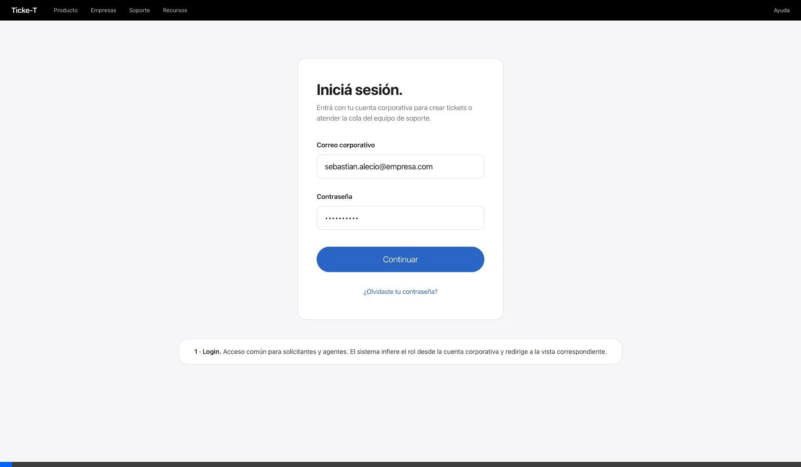
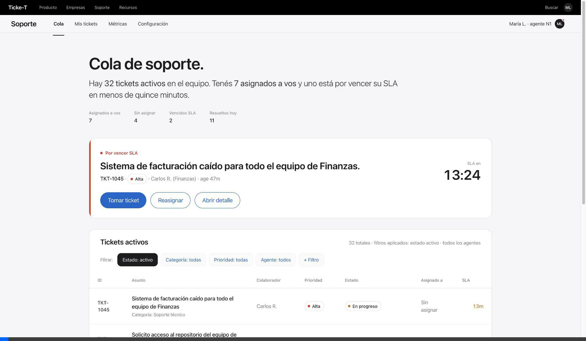
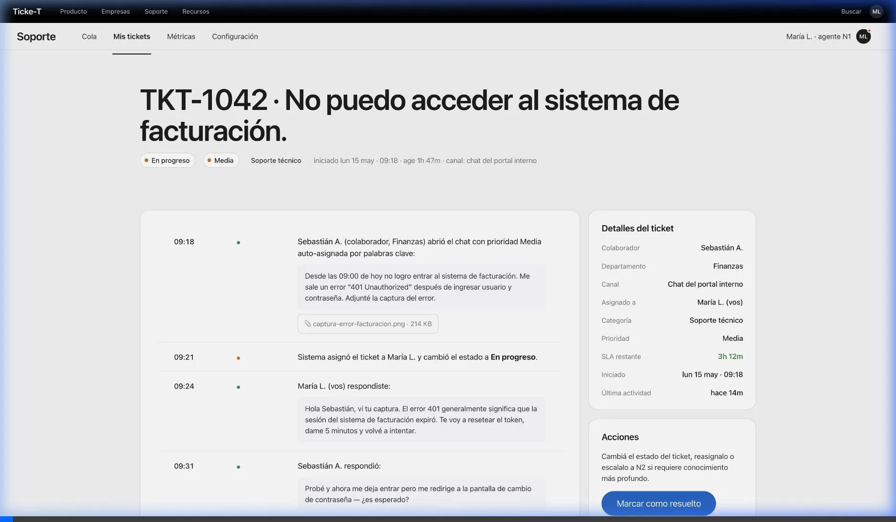
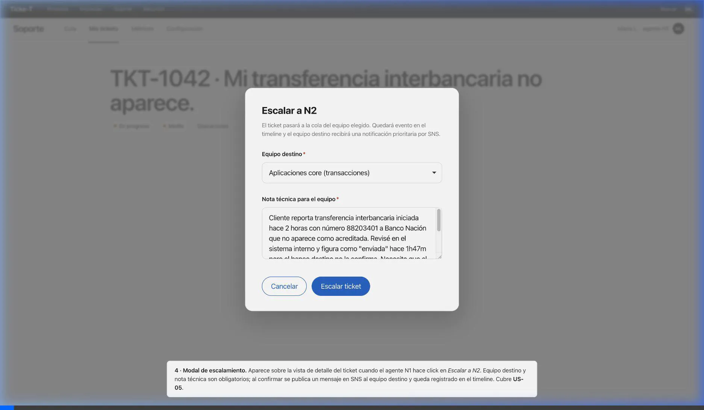
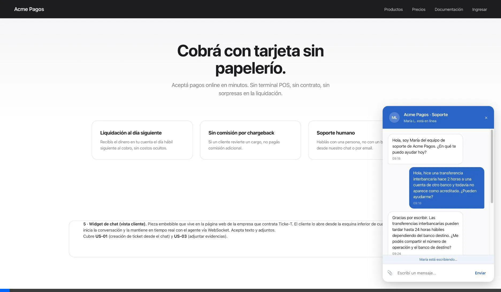
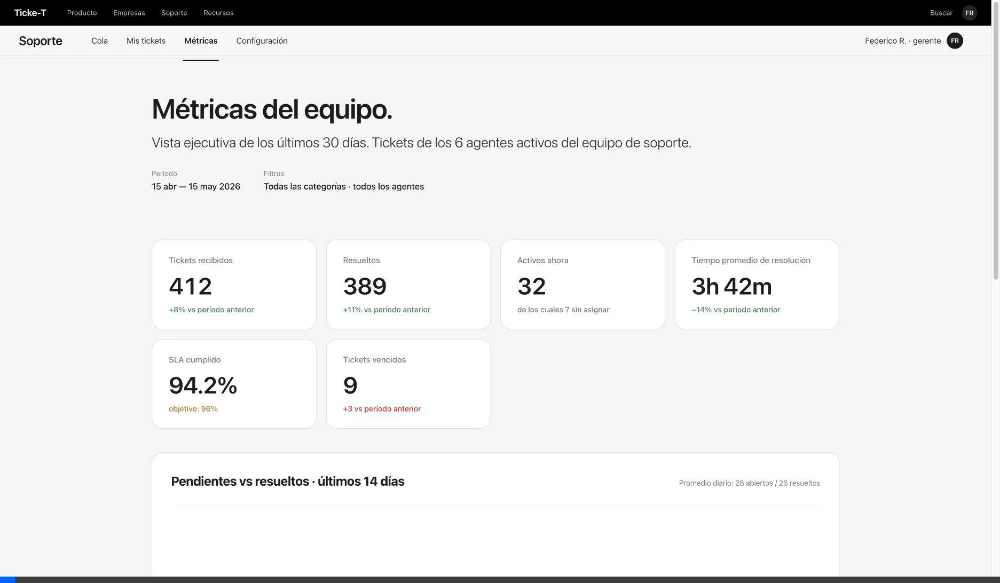
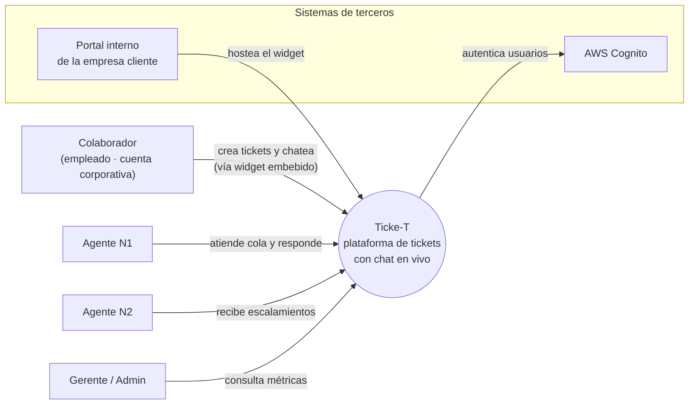

# Ticke-T — Plataforma de tickets con chat en vivo propio

> **Curso:** Infraestructura en la Nube · Postgrado en Diseño y Desarrollo de Software · Universidad Galileo · ciclo Mayo–Junio 2026
> **Entregas:**
> - 1 — Pitch, scope y mockups · dom 17 may 2026
> - 2 — Cómputo y datos · jue 21 may 2026
>
> **Equipo:** Alessandro Alecio · David Garcia · Joaquin Marroquin

---

## Resumen de cambios E1 → E2

Documento iterado sobre la E1; lo agregado/movido en esta entrega:

- **Decisiones técnicas cerradas.** Cómputo: **AWS Lambda** (§ 9). Base de datos: **DynamoDB** con *single-table design* y 4 GSIs (§ 10). Almacenamiento de archivos: **Amazon S3** con lifecycle a `STANDARD_IA` a 30 días (§ 10.3). Sin caché en el MVP, con DAX / ElastiCache reconocidos como evolución posible (§ 10.4).
- **Secciones nuevas.** § 3 Diagrama de contexto · § 9 Decisión de cómputo · § 10 Modelo de datos.
- **Renumeración.** Las secciones de Niveles de prioridad, Casos de uso, Funcionalidades, Mockups y Mapeo corrieron una posición (eran § 3..§ 7 → ahora § 4..§ 8). Scope, Preguntas abiertas y Anexo IA corrieron dos posiciones (eran § 8..§ 10 → ahora § 11..§ 13). El cambio mantiene el flujo *Negocio → Técnico → Reflexión*.
- **Preguntas abiertas (§ 12).** Se **cerró** la pregunta de BD (Postgres vs DynamoDB → DynamoDB) y se **agregaron** las que el rubric espera abiertas en esta etapa: red, asíncrono, seguridad y observabilidad.
- **Anexo IA (§ 13).** Bloque nuevo *"E2 — Decisiones técnicas exploradas con IA"* listando qué se discutió con IA al cerrar cómputo, single-table y diseño de GSIs.

---

## 1. Resumen ejecutivo

### El problema  
Las empresas medianas y grandes manejan un alto volumen de solicitudes internas entre distintas áreas corporativas. En muchas organizaciones, estas solicitudes todavía se gestionan por medios informales como correos electrónicos, mensajes directos o herramientas de mensajería corporativa. Eso fragmenta la comunicación, dificulta el seguimiento de los casos y limita la trazabilidad de las respuestas y tiempos de atención.

Además, cuando las solicitudes no se centralizan, los colaboradores no tienen visibilidad del estado de sus requerimientos y los equipos pierden control sobre la priorización, el cumplimiento de SLA y los procesos de escalamiento. Contar con una plataforma interna de tickets permite estandarizar la atención, mejorar la comunicación entre áreas y mantener un historial auditable de cada caso.

### La solución  
Ticke-T es una plataforma de gestión de tickets basada en la nube orientada a la atención de solicitudes internas dentro de una organización. Los colaboradores pueden crear tickets desde un portal web mediante formularios o interactuar en tiempo real con los equipos responsables a través de un chat integrado.

Cada solicitud se convierte automáticamente en un ticket auditable con categorización, prioridad y seguimiento de SLA. Los equipos responsables trabajan desde una bandeja compartida donde pueden asignar casos, escalar incidentes y responder solicitudes desde un panel centralizado. La comunicación entre el colaborador y el agente se sincroniza en tiempo real mediante WebSockets, permitiendo actualizar conversaciones y estados sin recargar la página.

### Cómo funciona  
1. El colaborador ingresa al portal interno y crea una solicitud mediante un formulario o inicia una conversación desde el chat integrado.

2. El sistema crea automáticamente el ticket con una categoría y prioridad según el tipo de solicitud seleccionada.

3. El ticket aparece en la cola del equipo responsable. Si la prioridad es Alta, además se publica una notificación al canal de alertas correspondiente.

4. Un agente toma el ticket desde el panel de gestión y responde. La actualización se refleja en tiempo real para el colaborador.

5. La conversación y cada cambio de estado quedan registrados como eventos dentro del timeline del ticket para mantener trazabilidad completa del caso.

6. De ser necesario, el ticket puede ser escalado por el agente hacia agentes de nivel 2 o puede ser reasignado hacia otra área.

7. Cuando la solicitud se resuelve, el agente cierra el ticket con una resolución documentada. Si el SLA de atención es excedido, el sistema marca el ticket como Vencido y genera una alerta al responsable correspondiente.

### A quién sirve  
A empresas medianas y grandes que necesitan centralizar y controlar la gestión de solicitudes internas entre colaboradores y áreas corporativas.

El usuario primario del lado operativo es el agente encargado de atender solicitudes; el usuario primario del lado solicitante es el colaborador que necesita asistencia o gestión por parte de otra área interna.

### Glosario rápido

Términos que aparecen a lo largo del documento. Sirve como referencia.

| Término | Qué es |
|---|---|
| **Widget de chat** | Pieza de UI flotante (típicamente en la esquina inferior derecha) embebida en el portal interno de la empresa cliente. Permite al colaborador conversar con el área de soporte responsable sin salir del portal. |
| **Colaborador** | Empleado de la empresa cliente que crea tickets y conversa con el área de soporte responsable. Tiene cuenta corporativa. |
| **Agente** | Persona del equipo de soporte interno que atiende los tickets desde el panel web. Puede ser N1 (primera línea) o N2 (especialista). |
| **N1 / N2** | Niveles de soporte. **N1** es el primer contacto y resuelve la mayoría de los casos básicos; **N2** es el equipo especializado al que se escalan los casos que N1 no puede resolver. |
| **Cola de tickets** | Lista de todos los tickets activos que el equipo tiene pendientes de atender. Ordenada por prioridad y antigüedad. |
| **SLA** | *Service Level Agreement.* Compromiso de tiempo en el que el equipo se compromete a responder o resolver. Ej.: "tickets de prioridad alta se responden en máx. 1 hora hábil". |
| **Escalamiento** | Pasar el ticket al siguiente nivel (de N1 a N2, eventualmente al gerente) cuando el nivel actual no puede o no debe resolverlo. |
| **WebSocket** | Conexión persistente bidireccional entre navegador y servidor que permite empujar mensajes en tiempo real sin que el cliente del navegador tenga que estar preguntando "¿hay algo nuevo?". |
| **SSE** | *Server-Sent Events.* Mecanismo alternativo a WebSocket para que el servidor empuje mensajes al navegador, pero unidireccional (server → client). Más simple, menos potente. |
| **Timeline** | Secuencia ordenada de eventos del ticket (mensaje del colaborador, respuesta del agente, cambio de estado, adjunto, escalamiento). |
| **Watchdog** | Trabajo automático en segundo plano que revisa periódicamente si un ticket excedió su SLA sin respuesta y lo marca como *Vencido*. |
| **Adjunto** | Archivo (imagen, documento) que el colaborador o el agente sube al ticket para dar contexto. Se guarda en un almacenamiento de objetos, no en la base de datos. |

---

## 2. Actores

### Humanos

- **Colaborador** *(actor primario)* — miembro de la empresa que crea el ticket por medio del formulario o inicia conversación desde el chat integrado para pedir ayuda. Sus solicitudes quedan ligadas a su cuenta interna para que pueda retomarlas después.
- **Agente de soporte N1** *(actor primario)* — miembro del equipo de soporte que atiende la cola de tickets de primera línea. Lee la cola, toma tickets, responde por chat, cambia estados, resuelve, o escala a N2 si lo amerita.
- **Agente N2 / Especialista** *(actor secundario)* — recibe tickets escalados por N1 cuando requieren conocimiento más profundo (problemas de infraestructura, casos legales, excepciones financieras).
- **Administrador / Gerente** *(actor secundario)* — supervisa al equipo. Ve métricas agregadas (tickets abiertos, tiempo promedio de resolución, distribución por categoría), gestiona accesos del equipo y audita los tickets vencidos.

---

## 3. Niveles de prioridad

Clasificación asignada al ticket según el impacto y urgencia de la solicitud reportada. La prioridad puede ser definida al momento de crear el ticket y posteriormente ajustada por el agente responsable. La prioridad determina el SLA de atención y el orden en la cola de trabajo.

| Prioridad | Cuándo aplica | SLA de primera respuesta |
|---|---|---|
| **Alta** | La solicitud bloquea una operación importante o afecta a múltiples usuarios. Ej.: caída de un sistema interno, problemas de acceso generalizados, incidentes críticos de operación. | 1 hora hábil |
| **Media** | Existe un problema funcional con impacto limitado o con una alternativa temporal de trabajo. Ej.: errores puntuales en una funcionalidad, solicitudes de validación o seguimiento de casos. | 4 horas hábiles |
| **Baja** | Solicitudes administrativas, consultas generales o requerimientos no urgentes. Ej.: solicitudes de información, cambios menores o consultas operativas. | 1 día hábil |

Si el SLA se vence sin respuesta, el sistema marca el ticket como **Vencido** en la cola y genera una alerta al responsable correspondiente.

---

## 4. Casos de uso priorizados

User stories en formato *"Como X, quiero Y, para Z"* con criterio de éxito explícito y prioridad **P0** (crítica para el MVP), **P1** (importante pero no bloqueante) o **P2** (deseable).

| # | Prioridad | User story | Criterio de éxito |
|---|---|---|---|
| US-01 | **P0** | Como **colaborador**, quiero **crear un ticket mediante un formulario en el portal interno**, para registrar una solicitud y dar seguimiento a su atención. | El ticket queda registrado en la base de datos y aparece en la cola del área responsable en ≤ 3 s. |
| US-02 | **P0** | Como **colaborador**, quiero **iniciar una conversación desde el chat integrado**, para comunicarme en tiempo real con el área responsable. | El mensaje enviado aparece en el panel del agente en ≤ 3 s y queda asociado a un ticket. |
| US-03 | **P0** | Como **agente**, quiero **responder desde el panel de gestión**, para que el colaborador reciba actualizaciones en tiempo real sobre su solicitud. | La respuesta aparece en la vista del colaborador en ≤ 2 s y el ticket actualiza su estado correctamente. |
| US-04 | **P1** | Como **colaborador**, quiero **adjuntar archivos o imágenes** a un ticket, para proporcionar evidencia o información adicional relacionada con mi solicitud. | El archivo se almacena en Amazon S3 y queda disponible desde la vista del ticket. |
| US-05 | **P1** | Como **administrador**, quiero **configurar reglas de SLA y vencimiento de tickets**, para identificar solicitudes que no han sido atendidas dentro del tiempo esperado. | Un ticket sin respuesta dentro del SLA cambia su estado a *Vencido* y genera una alerta al responsable correspondiente. |
| US-06 | **P1** | Como **administrador**, quiero **visualizar métricas y el estado general de los tickets**, para supervisar la carga operativa, el cumplimiento de SLA y el desempeño de las áreas responsables. | El sistema muestra indicadores actualizados de tickets abiertos, vencidos, resueltos y tiempos promedio de atención mediante un panel de monitoreo. |
| US-07 | **P2** | Como **agente N1**, quiero **presionar *Escalar*** para que el ticket pase a Nivel 2, enviando una alerta prioritaria al equipo técnico, para no quedarme bloqueado y para que el caso llegue al equipo correcto. | El equipo N2 recibe la notificación vía SNS y asume la propiedad del ticket; queda evento en el timeline con la nota técnica del N1. |

---

## 5. Funcionalidades específicas

Lo que diferencia a Ticke-T de un email genérico o un chat embebido de terceros:

1. **Widget de chat en vivo propio.** Pieza embebible en el portal interno de la empresa cliente, optimizada para cargar rápido y mantener la conversación en tiempo real vía WebSocket. Diseño minimal, sin frames de terceros, sin trackers externos.
2. **Manejo seguro de anexos.** Las imágenes y archivos que el colaborador sube desde el formulario o el chat viajan a S3 con URLs firmadas, desvinculando la base de datos del peso de los archivos. La BD solo guarda el puntero y la metadata.
3. **Priorización por metadatos.** Asignación automática de severidad (Alta / Media / Baja) según palabras clave del primer mensaje (*"bloqueado", "no funciona", "urgente"*) o según la categoría que el colaborador elige antes de crear el ticket o iniciar el chat. El agente puede ajustarla.
4. **Temporizadores de inactividad (watchdogs).** Jobs de fondo que revisan constantemente si un agente dejó un ticket desatendido más allá del SLA. Afectan métricas individuales del agente y disparan alertas al gerente.

---

## 6. Mockups

6 mockups *low-fi* de las pantallas principales del MVP. Los archivos `.html` están en `mockups/` (abren en cualquier navegador); las grabaciones `.webp` se embeben a continuación.

### 6.1 · Login

Acceso al portal para todos los roles del sistema: colaboradores (que crean tickets y conversan con soporte) y agentes/administradores (que atienden la cola). La autenticación es vía cuenta corporativa de la empresa cliente.
**Cubre:** entrada al sistema; prerrequisito para todas las demás US.

### 6.2 · Cola de tickets (vista agente)

Pantalla principal del agente al iniciar sesión: tabla tipo bandeja de entrada con ID, colaborador, asunto (último mensaje), tiempo transcurrido, estado y prioridad con código de colores. Card de atención arriba con el ticket por vencer SLA. Filtros por estado, categoría, prioridad y agente.
**Cubre:** US-05 (visualización de tickets vencidos) y soporta a todas las demás US del agente como pantalla de entrada.

### 6.3 · Detalle del ticket (vista agente, split-view)

Vista split del ticket: a la izquierda, el historial completo de la conversación con el colaborador en formato timeline; a la derecha, panel de metadatos (colaborador, asignado a, categoría, prioridad, SLA restante) y botones de acción (responder, reasignar, escalar a N2, cerrar).
**Cubre:** US-03 (respuesta desde el panel).

### 6.4 · Modal de escalamiento

Ventana modal que aparece sobre la vista de detalle al hacer click en *Escalar a N2*. Pide al agente elegir el equipo destino (Aplicaciones core, Infraestructura, Bases de datos, Seguridad, Cumplimiento) y agregar una nota técnica obligatoria. Al confirmar, el ticket pasa a la cola del equipo destino y se publica una notificación al canal de alertas correspondiente.
**Cubre:** US-07.

### 6.5 · Widget de chat (vista colaborador)

Pieza embebible que vive en el portal interno de la empresa cliente que contrata Ticke-T. El colaborador la abre desde la esquina inferior, escribe su mensaje y mantiene la conversación con el agente en tiempo real. Acepta texto y adjuntos (imagen, PDF). Muestra el estado *"María está escribiendo…"* mientras el agente compone su respuesta.
**Cubre:** US-02 (iniciar conversación desde el chat) y US-04 (adjuntar archivos).

### 6.6 · Dashboard de métricas (gerente)

Vista ejecutiva con KPIs del período (tickets recibidos, resueltos, tiempo promedio de resolución, SLA cumplido), gráfico de pendientes vs resueltos para detectar picos, y desgloses por categoría y por agente. Filtros por categoría y agente cambian todos los gráficos a la vez.
**Cubre:** US-06 (visualización de métricas y estado general).

---

## 7. Mapeo funcionalidad → componente del curso

Cómo cada funcionalidad de Ticke-T ejercita los siete componentes que el curso evalúa en las entregas siguientes. La columna *Cómo lo ejercita este proyecto* describe el comportamiento funcional, no la elección de servicio cloud — esa decisión llega en las entregas técnicas (E2 en adelante).

| Componente del curso | Cómo lo ejercita este proyecto (ejemplos) |
|---|---|
| **Cómputo (API)** | El endpoint que recibe los mensajes del widget de chat crea el ticket en la base de datos y lo empuja al panel del agente en tiempo real. |
| **Base de datos** | Tickets con estado, prioridad, agente asignado y categoría; mensajes ligados al ticket en orden cronológico; queries por cola del agente, historial del colaborador y métricas agregadas del gerente. |
| **Almacenamiento de archivos** | Imágenes y PDFs que el colaborador o el agente sube desde el formulario o el chat, separados de la metadata del ticket. |
| **Red** | Capa pública (con autenticación) para el portal interno del colaborador y el panel del agente; capa privada para la base de datos y los workers de notificación. |
| **Procesamiento asíncrono** | Watchdog que revisa cada pocos minutos los tickets sin respuesta y marca como *Vencido* los que excedieron su SLA; notificación al equipo N2 cuando un agente N1 escala un ticket. |
| **Seguridad** | Solo el agente asignado (o uno con rol superior) puede ver y responder el ticket; auditoría de quién cambió el estado de qué ticket y cuándo. |
| **Observabilidad** | Métrica: cantidad de tickets vencidos por SLA y tiempo promedio de primera respuesta por categoría. Alarma: si la tasa de errores del chat supera un umbral o si la cola de tickets sin asignar crece sostenidamente. |

---

## 8. Decisión de cómputo

**Enfoque elegido:** AWS Lambda, estructurado como microservicios orientados a eventos. Cada Lambda tiene un *execution role* de IAM con el principio de menor privilegio.

### Por qué Lambda

Cuatro razones, ordenadas por peso para Ticke-T:

1. **Workload con picos puntuales sobre baseline bajo.** Una empresa que usa Ticke-T internamente recibe decenas de tickets al día, no miles. La mayor parte del horario laboral las cosas están tranquilas; los picos llegan en momentos específicos — lunes a la mañana cuando se abren tickets acumulados del fin de semana, un despliegue que rompe un sistema interno y dispara reportes en cadena, o el primer día del mes cuando RRHH habilita un trámite nuevo. Lambda paga **solo por request**: en los espacios libres no cuesta nada y en los picos absorbe la demanda sin pre-aprovisionar.
2. **Operacionalmente managed.** AWS se ocupa del runtime, el parcheo del SO, el balanceo de carga y la alta disponibilidad. El equipo dedica el tiempo a la lógica del dominio, no a operar VMs.
3. **Escalado instantáneo para WebSocket.** El widget de chat mantiene una conexión persistente vía API Gateway WebSocket; API Gateway invoca un Lambda por cada mensaje entrante y los Lambdas escalan a miles de invocaciones concurrentes sin pre-aprovisionar, lo cual es crítico cuando la caída de un sistema interno dispara cientos de reportes en pocos minutos.
4. **Combinación canónica con DynamoDB.** El stack de datos elegido es DynamoDB. Lambda + DynamoDB es la combinación natural en AWS: el SDK de DynamoDB es stateless, no requiere connection pool y no necesita VPC. Una arquitectura equivalente sobre RDS hubiera exigido RDS Proxy para evitar el *connection storm* clásico de Lambda → RDBMS — complejidad que en este combo desaparece.

### Trade-offs explícitos

- **EC2 con Auto Scaling (descartado).** Obliga a pagar por VMs ociosas durante la mayor parte del día y agrega carga operacional (gestión de AMIs, autoscaling groups, patching del SO) que no aporta valor al dominio. Solo se justifica si el workload es sostenido y predecible — no es el caso de Ticke-T.
- **ECS Fargate task always-on (descartado).** Es el punto intermedio entre EC2 y Lambda: el runtime sigue siendo managed pero se sigue pagando por tasks vivas mientras estén corriendo. El *scale-to-zero* es complicado (requiere alarmas de CloudWatch y aceptar latencia al re-arrancar) y agrega un componente más al stack respecto de Lambda.

### Desventaja reconocida

El modelo *pay-per-invocation* de Lambda es ventajoso a volumen bajo y medio (el target del MVP de Ticke-T) pero **se vuelve más caro que una instancia EC2 o un task de Fargate always-on cuando el volumen sostenido supera cierto umbral** — en órdenes de millones de invocaciones al mes. Para los tipos de empresa donde se puede implementar Ticke-T (startups y mid-market con docenas a cientos de chats al día) estamos muy lejos de ese umbral, así que el trade-off no impacta hoy. Si en el futuro la facturación de Lambda supera un techo predefinido, se evaluaría migrar el handler crítico a Fargate sin tocar el modelo de datos ni el resto del sistema.

---

## 9. Diagrama de contexto

Vista C4 de nivel 1: Ticke-T como una sola caja, los actores humanos que lo usan, los sistemas de terceros con los que se integra y el **límite** entre lo que el equipo construye y lo que es responsabilidad de otros.

**Límite del sistema.** Dentro de Ticke-T: el formulario web de creación de tickets, el widget de chat embebible, el panel multi-agente, la API que persiste tickets y mensajes, la BD y el almacenamiento de archivos. Fuera del sistema: el portal interno corporativo de cada empresa cliente (Ticke-T solo expone una pieza para embeber en él), el proveedor de identidad/SSO (delegado el login a una aplicación externa), el navegador del usuario final y todos los canales externos de mensajería (WhatsApp, email, redes) que están explícitamente OUT-of-scope.

---

## 10. Modelo de datos

### 10.1 Estructura de los datos del dominio (single-table en DynamoDB)

La base de datos es una **única tabla** de DynamoDB (`SoporteTickets-<env>`) que aloja los tres tipos de items del ticket bajo el mismo `PK`. Esto permite traer un ticket completo (metadata + mensajes + eventos) con una **sola** `Query(PK = TICKET#<id>)` ordenada por `SK`.

| Tipo de item | `PK` | `SK` | Estado actual |
|---|---|---|---|
| Metadata del ticket | `TICKET#<uuid>` | `METADATA` | **Implementado** en `infra/modules/compute/src/index.js` (Lambda de creación) |
| Mensaje del chat | `TICKET#<uuid>` | `MSG#<iso-ts>#<msg_id>` | Planeado para E3 (US-02, US-03) |
| Evento del timeline | `TICKET#<uuid>` | `EVT#<iso-ts>` | Planeado para E3 (cambios de estado, escalamientos, asignaciones) |

**Atributos del item `METADATA`** (ya en producción en el handler Lambda):

- **Negocio (español):** `titulo`, `categoria` (`incidente` / `solicitud` / `mejora`), `area` (`RRHH` / `IT` / `Legal` / `Finanzas`), `prioridad` (`alta` / `media` / `baja`), `descripcion`, `estado` (default `Abierto`), `responsable` (default `Sin asignar`), `sla_etiqueta`, `fecha_limite`.
- **Timestamps:** `created_at`, `updated_at`, `fecha_inicio` (ISO-8601; también es range key de los GSIs).
- **Solicitante (objeto anidado):** `nombre`, `correo`, `area`, `user_id`.
- **Adjuntos:** `adjuntos[]` — array de objetos puntero al archivo en S3.

**Multi-tenancy.** El MVP es **mono-tenant por deploy**: cada empresa cliente que contrata Ticke-T recibe su propio stack (Lambda + tabla + bucket). Los `PK` no llevan prefijo de tenant. Trade-off reconocido: este modelo no escala a muchos clientes muy chicos en un único deploy compartido — si el negocio evoluciona hacia un SaaS multi-tenant real, los `PK` y los `GSI-PK` tendrían que prefijarse con `TENANT#<id>#...` y los 4 índices se reescribirían.

### 10.2 Patrones de acceso principales

Cada patrón de acceso del dominio se mapea a una `Query` sobre la base table o sobre uno de los 4 GSIs. Los nombres técnicos (`GSI1`..`GSI4`) son los del código (`infra/modules/database/main.tf:67-103`); aquí se referencian por propósito para mantener legibilidad.

| # | Patrón de acceso (negocio) | Query | Hash key | Range key | Índice |
|---|---|---|---|---|---|
| 1 | Traer ticket completo (metadata + mensajes + eventos) | `Query(PK = TICKET#<id>)` ordenado por `SK` | `PK` | `SK` | Base table |
| 2 | "Mis tickets" del colaborador, por fecha | `Query(GSI1-PK = USER#<id>)` | `GSI1-PK` | `fecha_inicio` | **GSI1** *(projection ALL)* |
| 3 | Cola del agente asignado *(sparse)* | `Query(GSI2-PK = AGENT#<id>)` | `GSI2-PK` | `fecha_inicio` | **GSI2** *(projection ALL)* |
| 4 | Feed global de tickets (reporte del gerente) | `Query(GSI3-PK = "TICKETS")` | `GSI3-PK` | `fecha_inicio` | **GSI3** *(projection INCLUDE: `titulo`, `estado`)* |
| 5 | Feed global de mensajes (auditoría / actividad) | `Query(GSI3-PK = "MENSAJES")` | `GSI3-PK` | `fecha_inicio` | **GSI3** |
| 6 | Filtro estado + prioridad (ej. "abiertos de alta") | `Query(GSI4-PK = STATUS#<estado>, begins_with(SK, "PRIO#
"))` | `GSI4-PK` | `GSI4-SK = PRIO#
#<fecha>` | **GSI4** *(projection ALL)* |

**Sparse index pattern.** `GSI2` aprovecha que en DynamoDB un item entra al índice solo si tiene seteado su atributo de hash key. El handler Lambda **no** setea `GSI2-PK` al crear el ticket — solo se popula cuando un agente lo toma. Resultado: el índice solo contiene tickets asignados y la cola del agente queda barata de consultar.

**Proyección selectiva en GSI3.** El reporte del gerente lista muchos tickets pero rara vez necesita todos los atributos pesados (`descripcion` de 2000 caracteres, `adjuntos[]`). `GSI3` proyecta solo `titulo` y `estado` para que cada query del listado consuma fracción del costo de leer la base table.

### 10.3 BD vs almacenamiento de objetos

Regla simple: **bytes pesados a S3, punteros y metadata en DynamoDB.**

| Va en DynamoDB | Va en S3 |
|---|---|
| Estructura del ticket (metadata, atributos de negocio) | Imágenes (PNG, JPEG, GIF, WEBP) |
| Mensajes del chat (texto) | PDFs |
| Eventos del timeline (cambios de estado) | Documentos Office (DOCX, XLSX, DOC, XLS) |
| Datos del solicitante (embebidos en `METADATA`) | Texto plano / CSV |
| Punteros a los adjuntos (`s3_key` + metadata) | El archivo en sí |

El bucket de adjuntos lo provisiona el módulo Terraform `modules/storage`: privado (los cuatro switches de Block Public Access en `true`), SSE-S3 obligatorio, *bucket policy* que rechaza `aws:SecureTransport = false`, versioning activado, y una **lifecycle rule scoped** al prefix `attachments/` que transiciona objetos a `STANDARD_IA` a los 30 días y expira versiones no-current a los 90 días.

El frontend (`app/src/features/tickets/presentation/schema.ts`) valida hasta **10 adjuntos de hasta 25 MB cada uno**, con MIME types restringidos a la lista de la tabla. En BD se guarda únicamente el **puntero** al objeto en S3, con `s3_key`, `filename` original, `mime_type`, `size_bytes`, `uploaded_by` y `uploaded_at`. Hoy (E2) el handler Lambda recibe el array de adjuntos como metadata del File API del navegador (`{id, name, type, size}`) y lo persiste tal cual; la subida real a S3 con URLs firmadas se cablea en E3.

**¿Por qué no guardar el archivo en BD?** DynamoDB limita cada item a 400 KB. Un PDF de 5 MB simplemente no entra. Y aunque entrara, leer una `Query` que devuelve 50 mensajes con sus adjuntos embebidos consumiría muchísimas RCUs por consulta y aumentaría la latencia. Servir los adjuntos vía URL firmada de S3 evita además que Lambda se vuelva un proxy de descarga.

### 10.4 Decisión de caché

**No se usa caché en el MVP.** Tres razones:

1. **Latencia suficiente.** Lambda + DynamoDB on-demand entregan single-digit ms para los access patterns dominantes (`GetItem`, `Query` por PK). Para el caso de uso del agente y del colaborador, no hay un cuello de botella que justifique invalidación de caché.
2. **El panel se refresca por push, no por polling.** La cola del agente y el chat se mantienen vivos con WebSocket — los clientes reciben actualizaciones empujadas, no piden lo mismo N veces. El caso clásico que la caché resuelve (varios clientes leyendo idéntico recurso) no aplica.
3. **Costo fijo no se amortiza.** DAX y ElastiCache cobran por nodo/hora del cluster — costo fijo que no se justifica al volumen del MVP. Agregan además el ítem operativo de la invalidación.

**Reconocido como evolución futura.** Si el dashboard del gerente crece a queries más caras (agregaciones sobre meses, breakdowns por categoría × agente), **DAX** sería la primera opción: es transparente para el SDK de DynamoDB, no requiere reescribir queries y se prende sin tocar el modelo de datos. Si la capa de chat necesita estado efímero compartido entre Lambdas (lista de conexiones WebSocket activas, indicador *"María está escribiendo…"*), el candidato es **ElastiCache (Redis)** — pero esa decisión pertenece a E3 (red y asíncrono), no al modelo de datos del dominio.

---

## 11. Scope (in / out)

### IN — lo que el sistema SÍ hace

- API REST + WebSocket para la creación de tickets vía formulario y la comunicación en tiempo real vía chat.
- Formulario web y widget de chat en vivo propio embebidos en el portal interno de la empresa cliente.
- Panel de agentes con cola filtrable, detalle split-view y conversación tipo timeline.
- Almacenamiento seguro de imágenes y archivos adjuntos en S3.
- Escalamiento asíncrono de casos de N1 a N2 con notificación prioritaria al equipo destino.
- SLAs por nivel de prioridad con watchdog automático que marca tickets vencidos.
- Roles diferenciados: colaborador (con cuenta corporativa), agente N1, agente N2, gerente/administrador.
- Métricas básicas del equipo y alarmas de infraestructura.

### OUT — lo que el sistema NO hace

- **Integración con WhatsApp, redes sociales u otros canales de mensajería externa.** Los canales únicos son el formulario y el widget de chat del portal interno.
- **Chatbot de IA conversacional complejo.** El sistema puede inferir categoría/prioridad por palabras clave, pero no responde automáticamente al colaborador — siempre lo hace un agente humano.
- **Integraciones de facturación.** Cobrar a la empresa cliente que contrata Ticke-T queda fuera del scope del MVP.

---

## 12. Preguntas abiertas

Decisiones técnicas que aún no tomamos.

> **Cerrado en E2:** la pregunta de Base de datos (RDS Postgres vs DynamoDB) quedó resuelta en favor de **DynamoDB single-table**.

### Red (decisión en E3)
- **API HTTP frente al frontend.** ¿API Gateway **HTTP API** (más simple, más barata, suficiente para REST plano) o **REST API** (más features — request validators, modelos, throttling per-route — pero más costosa)? El handler de creación de tickets ya está listo para detrás de cualquiera.
- **Conexión persistente del chat.** ¿**WebSocket** (vía API Gateway WebSocket API) o **Server-Sent Events** (SSE)? WebSocket es bidireccional y permite *"agente está escribiendo…"*; SSE es más simple si solo el servidor empuja al navegador.
- **Ubicación de los Lambdas.** Como DynamoDB y S3 se acceden por API IAM-signed, no requieren VPC. Pero si en el futuro aparece RDS para alguna pieza (analítica, reportes), los Lambdas que lo consuman sí necesitarán VPC y eso cambia el cold-start.
- **CDN para el frontend.** ¿CloudFront delante del bucket que sirve el panel del agente y el widget? Probablemente sí — definir caché, invalidación y dominio custom.

### Asíncrono (decisión en E3)
- **Watchdog del SLA.** ¿**EventBridge scheduled rule** + Lambda corriendo cada N minutos para marcar tickets vencidos, o **Step Functions** con un esquema de timeout-per-ticket? Scheduled rule es más simple; Step Functions escala mejor si los SLAs por ticket varían mucho.
- **Notificaciones de escalamiento.** ¿Un **SNS topic por área** responsable (suscripciones distintas por equipo N2) o un **único topic con message filtering** por atributos? Trade-off: granularidad operativa vs. costo de mantenimiento.

### Seguridad (decisión en E4)
- **Autenticación de colaboradores.** ¿**SSO** con el directorio corporativo de cada cliente (AD / Okta / Google Workspace) o **cuentas propias** dentro de Ticke-T? SSO reduce fricción y centraliza offboarding pero acopla la implementación al modelo de identidad de cada cliente.
- **Autorización fine-grained.** "Solo el agente asignado puede ver el ticket" — ¿se aplica con **IAM-based access** (políticas que evalúan attributes del request) o con **claims en JWT custom** verificados en cada handler? Lo segundo es lo más simple para arrancar.
- **Cifrado en reposo.** Hoy la tabla y el bucket usan claves **AWS-owned** (gratuito, sin features adicionales). ¿Migramos a **AWS-managed KMS** (logs en CloudTrail, rotación automática) o **Customer-managed KMS** (control total de la rotación y el uso, pero costo por mes y por request)? Depende de los requisitos de auditoría del cliente.

### Observabilidad (decisión en E5)
- **Stack base.** CloudWatch Logs + Metrics + Alarms estándar cubre el MVP. ¿Sumamos **X-Ray** para trazas distribuidas Lambda → DynamoDB? Útil cuando aparecen cuellos de botella entre múltiples Lambdas.
- **Alarmas iniciales.** ¿Qué disparos consideramos críticos? Candidatas obvias: tasa de errores del handler de creación > umbral, cola de tickets sin asignar creciendo, latencia P99 del WebSocket en ventana móvil, throttles en DynamoDB.

---

## 13. Anexo IA

### Qué le pedimos a la IA

Trabajamos con **Claude Code (Opus 4.7)** durante una sesión iterativa de definición del sub-dominio del proyecto. El proceso no fue lineal: pivoteamos varias veces antes de llegar a Ticke-T con widget de chat propio.

1. **Primera dirección — sistema de incidentes SRE.** La IA inicialmente nos sugirió un *sistema de gestión de incidentes de producción para equipos SRE/DevOps*. Lo descartamos porque exigía mucho conocimiento previo del rol SRE para entender el problema.
2. **Segunda dirección — helpdesk empresarial enterprise.** La IA propuso un helpdesk corporativo con integraciones a AD/Okta, AI para auto-categorización, SSO complejo. Lo descartamos por estar sobreingenierado para un proyecto académico.
3. **Tercera dirección — WhatsApp como canal de ingesta.** Diseñamos una versión que ingiere mensajes desde la API de WhatsApp Business de Meta vía webhooks. La descartamos por feasibility: la WhatsApp Cloud API requiere Business Verification, número WhatsApp Business y onboarding con Meta que no es viable con cuenta personal de AWS.
4. **Cuarta dirección — formulario web + email.** Diseñamos una versión donde el solicitante creaba tickets desde un formulario web y la conversación viajaba por email. La descartamos porque perdía el atractivo de "experiencia controlada por la empresa" — el email es un canal genérico y rompe la sensación de soporte interactivo.
5. **Versión final — Ticke-T como SaaS interno con formulario + chat.** Convergimos en un sistema autocontenido: una plataforma de tickets internos con formulario y widget de chat embebidos en el portal corporativo de la empresa cliente, comunicación en tiempo real vía WebSocket, sin canales externos, sin AI generativa, sin dependencias de terceros. Mantiene la simplicidad pedagógica del MVP y le da un argumento de venta concreto: "centralizá las solicitudes internas, controlá la trazabilidad y los tiempos de respuesta del soporte".

### Aprendizaje sobre colaboración con IA

La IA tuvo el reflejo correcto de aceptar pivotes cuando un dominio no funcionaba, en lugar de doblar la apuesta a la dirección original. Cada iteración cerró posibilidades que sabíamos no servían y nos acercó al diseño final. **La fricción útil de la IA es cuando te ofrece alternativas concretas en vez de insistir con la dirección inicial.** El descarte explícito de las versiones intermedias también nos enseñó qué evitar en el siguiente intento.

### E2 — Decisiones técnicas exploradas con IA (cómputo y datos)

1. **Cómputo (Lambda vs Fargate vs EC2).** Discutimos con la IA el perfil de carga real de Ticke-T (picos puntuales sobre baseline bajo) y la combinación con la BD que íbamos a elegir. La IA reforzó dos argumentos que terminaron de inclinar la balanza: el problema del *connection storm* Lambda → RDBMS (que volvía RDS poco amigable sin RDS Proxy) y el costo de tener un task de Fargate always-on cuando el baseline es bajo. Eso nos permitió cerrar a Lambda sin re-explorar más.

2. **Modelo de datos (single-table vs multi-table en DynamoDB).** Exploramos con la IA el trade-off entre simplicidad de queries (single-table gana en *"traer el ticket + todos sus mensajes con una sola `Query`"*) y limpieza del schema (multi-table es más SQL-like). La IA propuso el patrón concreto `PK = TICKET#<id>` + `SK = METADATA | MSG#<ts>#<msg_id> | EVT#<ts>` que adoptamos sin cambios. El argumento decisivo fue que el access pattern dominante del agente (*"abrime el ticket"*) se resuelve en una sola llamada.

3. **Decisión de caché.** Le pedimos a la IA evaluar si valía la pena meter DAX o ElastiCache en el MVP. Concluimos juntos que no: Lambda + DynamoDB on-demand ya entregan latencia single-digit ms para los access patterns dominantes, y el panel se refresca por WebSocket push (no por polling repetido que sería el caso clásico donde la caché ayuda). Quedaron documentadas como evolución futura las dos opciones concretas — DAX si crece el dashboard de métricas, ElastiCache si aparece estado efímero del chat (presence/typing).

*(pendiente: ampliar con observaciones de las próximas entregas)*

---
