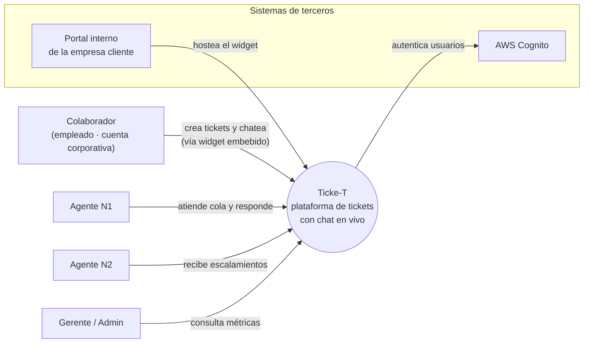
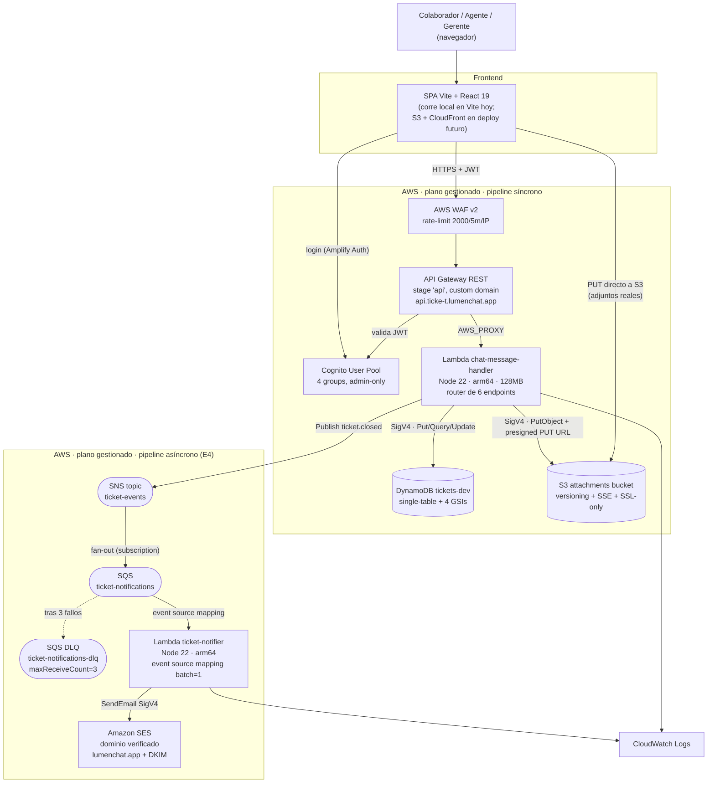
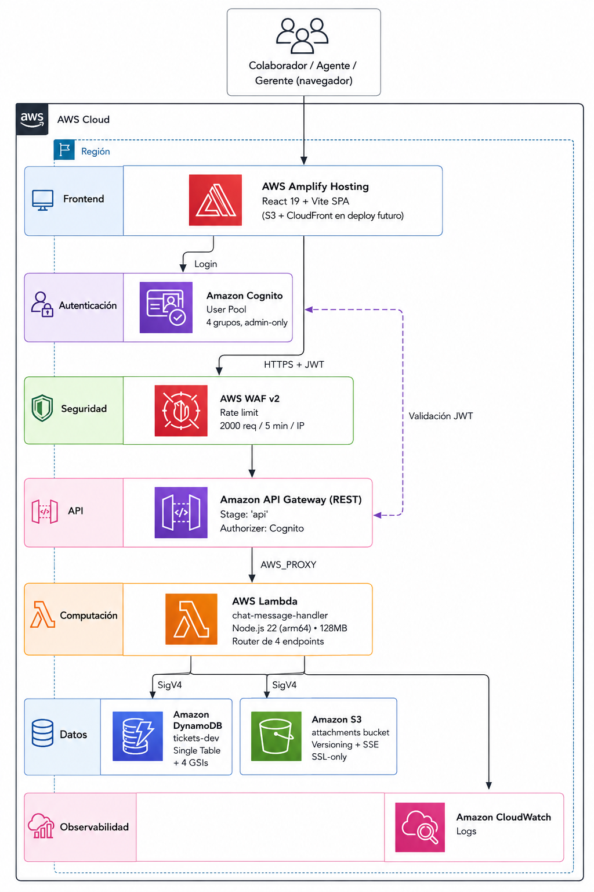

# Ticke-T — Plataforma de tickets con chat en vivo propio

> **Curso:** Infraestructura en la Nube · Postgrado en Diseño y Desarrollo de Software · Universidad Galileo · ciclo Mayo–Junio 2026
> **Entregas:**
> - 1 — Pitch, scope y mockups · dom 17 may 2026
> - 2 — Cómputo y datos · jue 21 may 2026
> - 3 — Red, ingreso y seguridad perimetral · dom 31 may 2026
> - 4 — Procesamiento asíncrono (SNS · SQS · DLQ · notifier Lambda) · dom 7 jun 2026
>
> **Equipo:** Alessandro Alecio · David Garcia · Joaquin Marroquin

---

## Resumen de cambios E3 → E4

Documento iterado sobre la E3; lo agregado/movido en esta entrega:

- **Capa asíncrona introducida.** Sumamos un pipeline **SNS → SQS → Lambda → SES** que desacopla el envío de correos del request principal del usuario. El primer evento que viaja por este pipeline es `ticket.closed`: cuando un agente cierra un ticket, la Lambda síncrona publica el evento al topic, la SQS suscriptora lo entrega al *notifier* Lambda, y este último manda un correo de notificación al colaborador solicitante vía Amazon SES.
- **Secciones nuevas.** § 15 Procesamiento asíncrono (pipeline `ticket.closed`, formato de payload, idempotencia, manejo de fallos con DLQ).
- **Diagrama de contenedores actualizado a v2.** Incluye ahora el SNS topic `ticket-events`, la cola principal `ticket-notifications`, la DLQ, y el *notifier* Lambda. La separación de la Lambda síncrona (`chat-message-handler-dev`, dominio tickets) y la Lambda asíncrona (`ticket-notifier-dev`, dominio notificaciones) sigue el principio "una Lambda por bounded context".
- **Renumeración.** Scope, Preguntas abiertas y Anexo IA corrieron una posición (eran § 15..§ 17 → ahora § 16..§ 18). Se mantiene el flujo *Negocio → Técnico → Reflexión*.
- **Implementación que respalda el diseño.** Se construyó la cadena entera con Terraform: nuevo módulo `infra/modules/notifications/` (SNS topic + SQS queue principal + DLQ + subscription + queue policy), segunda instancia del módulo `compute/` para el *notifier* Lambda con event source mapping desde la SQS, e IAM least-privilege para `sns:Publish` (en la Lambda síncrona) y `ses:SendEmail` con condition `ses:FromAddress = soporte@lumenchat.app` (en el *notifier*). Para el envío real desde el dominio propio, agregamos verificación de dominio SES con DKIM (3 CNAMEs + TXT) al módulo `dns/` existente. Endpoint nuevo `PUT /tickets/{id}/status` con `ConditionExpression` que solo permite cerrar al agente asignado (`GSI2-PK = AGENT#<sub>`). Frontend: botón "Cerrar ticket" en la cola del agente, con modal de confirmación e indicación explícita de que el cierre dispara una notificación irreversible.
- **Preguntas abiertas (§ 17).** Se **cerraron** las preguntas de Asíncrono (notificaciones de escalamiento → un topic único `ticket-events` con shape genérica `{event, payload}` que permite filter policies a futuro · upload real de adjuntos → presigned PUT URLs, cabladas desde E3 ya integradas). Se **mantienen abiertas** Watchdog del SLA (todavía no implementado) y la conexión persistente del chat (WebSocket / SSE — pospuesta).
- **Anexo IA (§ 18).** Bloque nuevo *"E4 — Decisiones técnicas exploradas con IA"* listando la discusión sobre SNS+SQS vs SQS directa vs EventBridge, el manejo de idempotencia, y la elección de SES sobre proveedores externos.

---

## Resumen de cambios E2 → E3

Documento iterado sobre la E2; lo agregado/movido en esta entrega:

- **Decisión central de red.** El sistema **no provisiona VPC**. Cómputo, base de datos, almacenamiento y autenticación viven en el plano gestionado de AWS y se comunican por endpoints públicos firmados con SigV4 o autenticados con JWT. La justificación completa está en § 12.
- **Secciones nuevas.** § 11 Diagrama de contenedores (v1) · § 12 Diseño del plano de comunicación · § 13 Capas de seguridad en el ingreso · § 14 VPC contingente.
- **Renumeración.** Scope, Preguntas abiertas y Anexo IA corrieron cuatro posiciones (eran § 11..§ 13 → ahora § 15..§ 17). El cambio respeta el flujo *Negocio → Técnico → Reflexión*.
- **Implementación que respalda el diseño.** Se cabló el ingreso real: **API Gateway REST API regional** delante de la Lambda, con **authorizer Cognito User Pools** (4 grupos: `colaborador`, `agente-n1`, `agente-n2`, `gerente`), CORS por path (OPTIONS + MOCK integration), gateway responses con headers CORS para que los errores del authorizer no rompan al browser, y **AWS WAF v2** con regla de rate-limit por IP asociado al stage. El frontend React se cableó al API real (sustituyendo el repository de `localStorage`), se agregaron las pantallas de Login, Mis Tickets y Cola del Agente, y la Lambda escribe metadata de adjuntos a S3 al crear el ticket (`s3_key` bajo `attachments/{ticket_id}/{att_id}.json`). El frontend está construido pero **no desplegado a S3 + CloudFront todavía** — corre local en Vite hasta que el dominio custom y el CDN se monten en una entrega siguiente.
- **Preguntas abiertas (§ 16).** Se **cerraron** las preguntas de Red (API HTTP vs REST → REST · NAT vs VPC Endpoints → no aplica). Se **agregaron** las nuevas decisiones que dejan abiertas WAF, CloudFront y dominio custom para entregas siguientes.
- **Anexo IA (§ 17).** Bloque nuevo *"E3 — Decisiones técnicas exploradas con IA"* listando los descartes de HTTP API por incompatibilidad con WAF, el trade-off REST API vs CloudFront, y la decisión de no implementar VPC.

---

## Resumen de cambios E1 → E2

Documento iterado sobre la E1; lo agregado/movido en esta entrega:

- **Decisiones técnicas cerradas.** Cómputo: **AWS Lambda** (§ 9). Base de datos: **DynamoDB** con *single-table design* y 4 GSIs (§ 10). Almacenamiento de archivos: **Amazon S3** con lifecycle a `STANDARD_IA` a 30 días (§ 10.3). Sin caché en el MVP, con DAX / ElastiCache reconocidos como evolución posible (§ 10.4).
- **Secciones nuevas.** § 3 Diagrama de contexto · § 9 Decisión de cómputo · § 10 Modelo de datos.
- **Renumeración.** Las secciones de Niveles de prioridad, Casos de uso, Funcionalidades, Mockups y Mapeo corrieron una posición (eran § 3..§ 7 → ahora § 4..§ 8). Scope, Preguntas abiertas y Anexo IA corrieron dos posiciones (eran § 8..§ 10 → ahora § 11..§ 13). El cambio mantiene el flujo *Negocio → Técnico → Reflexión*.
- **Preguntas abiertas (§ 12).** Se **cerró** la pregunta de BD (Postgres vs DynamoDB → DynamoDB) y se **agregaron** las que el rubric espera abiertas en esta etapa: red, asíncrono, seguridad y observabilidad.
- **Anexo IA (§ 13).** Bloque nuevo *"E2 — Decisiones técnicas exploradas con IA"* listando qué se discutió con IA al cerrar cómputo, single-table y diseño de GSIs.

---

## 1. Resumen ejecutivo

### El problema  
Las empresas medianas y grandes manejan un alto volumen de solicitudes internas entre distintas áreas corporativas. En muchas organizaciones, estas solicitudes todavía se gestionan por medios informales como correos electrónicos, mensajes directos o herramientas de mensajería corporativa. Eso fragmenta la comunicación, dificulta el seguimiento de los casos y limita la trazabilidad de las respuestas y tiempos de atención.

Además, cuando las solicitudes no se centralizan, los colaboradores no tienen visibilidad del estado de sus requerimientos y los equipos pierden control sobre la priorización, el cumplimiento de SLA y los procesos de escalamiento. Contar con una plataforma interna de tickets permite estandarizar la atención, mejorar la comunicación entre áreas y mantener un historial auditable de cada caso.

### La solución  
Ticke-T es una plataforma de gestión de tickets basada en la nube orientada a la atención de solicitudes internas dentro de una organización. Los colaboradores pueden crear tickets desde un portal web mediante formularios o interactuar en tiempo real con los equipos responsables a través de un chat integrado.

Cada solicitud se convierte automáticamente en un ticket auditable con categorización, prioridad y seguimiento de SLA. Los equipos responsables trabajan desde una bandeja compartida donde pueden asignar casos, escalar incidentes y responder solicitudes desde un panel centralizado. La comunicación entre el colaborador y el agente se sincroniza en tiempo real mediante WebSockets, permitiendo actualizar conversaciones y estados sin recargar la página.

### Cómo funciona  
1. El colaborador ingresa al portal interno y crea una solicitud mediante un formulario o inicia una conversación desde el chat integrado.

2. El sistema crea automáticamente el ticket con una categoría y prioridad según el tipo de solicitud seleccionada.

3. El ticket aparece en la cola del equipo responsable. Si la prioridad es Alta, además se publica una notificación al canal de alertas correspondiente.

4. Un agente toma el ticket desde el panel de gestión y responde. La actualización se refleja en tiempo real para el colaborador.

5. La conversación y cada cambio de estado quedan registrados como eventos dentro del timeline del ticket para mantener trazabilidad completa del caso.

6. De ser necesario, el ticket puede ser escalado por el agente hacia agentes de nivel 2 o puede ser reasignado hacia otra área.

7. Cuando la solicitud se resuelve, el agente cierra el ticket con una resolución documentada. Si el SLA de atención es excedido, el sistema marca el ticket como Vencido y genera una alerta al responsable correspondiente.

### A quién sirve  
A empresas medianas y grandes que necesitan centralizar y controlar la gestión de solicitudes internas entre colaboradores y áreas corporativas.

El usuario primario del lado operativo es el agente encargado de atender solicitudes; el usuario primario del lado solicitante es el colaborador que necesita asistencia o gestión por parte de otra área interna.

### Glosario rápido

Términos que aparecen a lo largo del documento. Sirve como referencia.

| Término | Qué es |
|---|---|
| **Widget de chat** | Pieza de UI flotante (típicamente en la esquina inferior derecha) embebida en el portal interno de la empresa cliente. Permite al colaborador conversar con el área de soporte responsable sin salir del portal. |
| **Colaborador** | Empleado de la empresa cliente que crea tickets y conversa con el área de soporte responsable. Tiene cuenta corporativa. |
| **Agente** | Persona del equipo de soporte interno que atiende los tickets desde el panel web. Puede ser N1 (primera línea) o N2 (especialista). |
| **N1 / N2** | Niveles de soporte. **N1** es el primer contacto y resuelve la mayoría de los casos básicos; **N2** es el equipo especializado al que se escalan los casos que N1 no puede resolver. |
| **Cola de tickets** | Lista de todos los tickets activos que el equipo tiene pendientes de atender. Ordenada por prioridad y antigüedad. |
| **SLA** | *Service Level Agreement.* Compromiso de tiempo en el que el equipo se compromete a responder o resolver. Ej.: "tickets de prioridad alta se responden en máx. 1 hora hábil". |
| **Escalamiento** | Pasar el ticket al siguiente nivel (de N1 a N2, eventualmente al gerente) cuando el nivel actual no puede o no debe resolverlo. |
| **WebSocket** | Conexión persistente bidireccional entre navegador y servidor que permite empujar mensajes en tiempo real sin que el cliente del navegador tenga que estar preguntando "¿hay algo nuevo?". |
| **SSE** | *Server-Sent Events.* Mecanismo alternativo a WebSocket para que el servidor empuje mensajes al navegador, pero unidireccional (server → client). Más simple, menos potente. |
| **Timeline** | Secuencia ordenada de eventos del ticket (mensaje del colaborador, respuesta del agente, cambio de estado, adjunto, escalamiento). |
| **Watchdog** | Trabajo automático en segundo plano que revisa periódicamente si un ticket excedió su SLA sin respuesta y lo marca como *Vencido*. |
| **Adjunto** | Archivo (imagen, documento) que el colaborador o el agente sube al ticket para dar contexto. Se guarda en un almacenamiento de objetos, no en la base de datos. |

---

## 2. Actores

### Humanos

- **Colaborador** *(actor primario)* — miembro de la empresa que crea el ticket por medio del formulario o inicia conversación desde el chat integrado para pedir ayuda. Sus solicitudes quedan ligadas a su cuenta interna para que pueda retomarlas después.
- **Agente de soporte N1** *(actor primario)* — miembro del equipo de soporte que atiende la cola de tickets de primera línea. Lee la cola, toma tickets, responde por chat, cambia estados, resuelve, o escala a N2 si lo amerita.
- **Agente N2 / Especialista** *(actor secundario)* — recibe tickets escalados por N1 cuando requieren conocimiento más profundo (problemas de infraestructura, casos legales, excepciones financieras).
- **Administrador / Gerente** *(actor secundario)* — supervisa al equipo. Ve métricas agregadas (tickets abiertos, tiempo promedio de resolución, distribución por categoría), gestiona accesos del equipo y audita los tickets vencidos.

---

## 3. Niveles de prioridad

Clasificación asignada al ticket según el impacto y urgencia de la solicitud reportada. La prioridad puede ser definida al momento de crear el ticket y posteriormente ajustada por el agente responsable. La prioridad determina el SLA de atención y el orden en la cola de trabajo.

| Prioridad | Cuándo aplica | SLA de primera respuesta |
|---|---|---|
| **Alta** | La solicitud bloquea una operación importante o afecta a múltiples usuarios. Ej.: caída de un sistema interno, problemas de acceso generalizados, incidentes críticos de operación. | 1 hora hábil |
| **Media** | Existe un problema funcional con impacto limitado o con una alternativa temporal de trabajo. Ej.: errores puntuales en una funcionalidad, solicitudes de validación o seguimiento de casos. | 4 horas hábiles |
| **Baja** | Solicitudes administrativas, consultas generales o requerimientos no urgentes. Ej.: solicitudes de información, cambios menores o consultas operativas. | 1 día hábil |

Si el SLA se vence sin respuesta, el sistema marca el ticket como **Vencido** en la cola y genera una alerta al responsable correspondiente.

---

## 4. Casos de uso priorizados

User stories en formato *"Como X, quiero Y, para Z"* con criterio de éxito explícito y prioridad **P0** (crítica para el MVP), **P1** (importante pero no bloqueante) o **P2** (deseable).

| # | Prioridad | User story | Criterio de éxito |
|---|---|---|---|
| US-01 | **P0** | Como **colaborador**, quiero **crear un ticket mediante un formulario en el portal interno**, para registrar una solicitud y dar seguimiento a su atención. | El ticket queda registrado en la base de datos y aparece en la cola del área responsable en ≤ 3 s. |
| US-02 | **P0** | Como **colaborador**, quiero **iniciar una conversación desde el chat integrado**, para comunicarme en tiempo real con el área responsable. | El mensaje enviado aparece en el panel del agente en ≤ 3 s y queda asociado a un ticket. |
| US-03 | **P0** | Como **agente**, quiero **responder desde el panel de gestión**, para que el colaborador reciba actualizaciones en tiempo real sobre su solicitud. | La respuesta aparece en la vista del colaborador en ≤ 2 s y el ticket actualiza su estado correctamente. |
| US-04 | **P1** | Como **colaborador**, quiero **adjuntar archivos o imágenes** a un ticket, para proporcionar evidencia o información adicional relacionada con mi solicitud. | El archivo se almacena en Amazon S3 y queda disponible desde la vista del ticket. |
| US-05 | **P1** | Como **administrador**, quiero **configurar reglas de SLA y vencimiento de tickets**, para identificar solicitudes que no han sido atendidas dentro del tiempo esperado. | Un ticket sin respuesta dentro del SLA cambia su estado a *Vencido* y genera una alerta al responsable correspondiente. |
| US-06 | **P1** | Como **administrador**, quiero **visualizar métricas y el estado general de los tickets**, para supervisar la carga operativa, el cumplimiento de SLA y el desempeño de las áreas responsables. | El sistema muestra indicadores actualizados de tickets abiertos, vencidos, resueltos y tiempos promedio de atención mediante un panel de monitoreo. |
| US-07 | **P2** | Como **agente N1**, quiero **presionar *Escalar*** para que el ticket pase a Nivel 2, enviando una alerta prioritaria al equipo técnico, para no quedarme bloqueado y para que el caso llegue al equipo correcto. | El equipo N2 recibe la notificación vía SNS y asume la propiedad del ticket; queda evento en el timeline con la nota técnica del N1. |

---

## 5. Funcionalidades específicas

Lo que diferencia a Ticke-T de un email genérico o un chat embebido de terceros:

1. **Widget de chat en vivo propio.** Pieza embebible en el portal interno de la empresa cliente, optimizada para cargar rápido y mantener la conversación en tiempo real vía WebSocket. Diseño minimal, sin frames de terceros, sin trackers externos.
2. **Manejo seguro de anexos.** Las imágenes y archivos que el colaborador sube desde el formulario o el chat viajan a S3 con URLs firmadas, desvinculando la base de datos del peso de los archivos. La BD solo guarda el puntero y la metadata.
3. **Priorización por metadatos.** Asignación automática de severidad (Alta / Media / Baja) según palabras clave del primer mensaje (*"bloqueado", "no funciona", "urgente"*) o según la categoría que el colaborador elige antes de crear el ticket o iniciar el chat. El agente puede ajustarla.
4. **Temporizadores de inactividad (watchdogs).** Jobs de fondo que revisan constantemente si un agente dejó un ticket desatendido más allá del SLA. Afectan métricas individuales del agente y disparan alertas al gerente.

---

## 6. Mockups

6 mockups *low-fi* de las pantallas principales del MVP. Los archivos `.html` están en `mockups/` (abren en cualquier navegador); las grabaciones `.webp` se embeben a continuación.

### 6.1 · Login


Acceso al portal para todos los roles del sistema: colaboradores (que crean tickets y conversan con soporte) y agentes/administradores (que atienden la cola). La autenticación es vía cuenta corporativa de la empresa cliente.
**Cubre:** entrada al sistema; prerrequisito para todas las demás US.

### 6.2 · Cola de tickets (vista agente)


Pantalla principal del agente al iniciar sesión: tabla tipo bandeja de entrada con ID, colaborador, asunto (último mensaje), tiempo transcurrido, estado y prioridad con código de colores. Card de atención arriba con el ticket por vencer SLA. Filtros por estado, categoría, prioridad y agente.
**Cubre:** US-05 (visualización de tickets vencidos) y soporta a todas las demás US del agente como pantalla de entrada.

### 6.3 · Detalle del ticket (vista agente, split-view)


Vista split del ticket: a la izquierda, el historial completo de la conversación con el colaborador en formato timeline; a la derecha, panel de metadatos (colaborador, asignado a, categoría, prioridad, SLA restante) y botones de acción (responder, reasignar, escalar a N2, cerrar).
**Cubre:** US-03 (respuesta desde el panel).

### 6.4 · Modal de escalamiento


Ventana modal que aparece sobre la vista de detalle al hacer click en *Escalar a N2*. Pide al agente elegir el equipo destino (Aplicaciones core, Infraestructura, Bases de datos, Seguridad, Cumplimiento) y agregar una nota técnica obligatoria. Al confirmar, el ticket pasa a la cola del equipo destino y se publica una notificación al canal de alertas correspondiente.
**Cubre:** US-07.

### 6.5 · Widget de chat (vista colaborador)


Pieza embebible que vive en el portal interno de la empresa cliente que contrata Ticke-T. El colaborador la abre desde la esquina inferior, escribe su mensaje y mantiene la conversación con el agente en tiempo real. Acepta texto y adjuntos (imagen, PDF). Muestra el estado *"María está escribiendo…"* mientras el agente compone su respuesta.
**Cubre:** US-02 (iniciar conversación desde el chat) y US-04 (adjuntar archivos).

### 6.6 · Dashboard de métricas (gerente)


Vista ejecutiva con KPIs del período (tickets recibidos, resueltos, tiempo promedio de resolución, SLA cumplido), gráfico de pendientes vs resueltos para detectar picos, y desgloses por categoría y por agente. Filtros por categoría y agente cambian todos los gráficos a la vez.
**Cubre:** US-06 (visualización de métricas y estado general).

---

## 7. Mapeo funcionalidad → componente del curso

Cómo cada funcionalidad de Ticke-T ejercita los siete componentes que el curso evalúa en las entregas siguientes. La columna *Cómo lo ejercita este proyecto* describe el comportamiento funcional, no la elección de servicio cloud — esa decisión llega en las entregas técnicas (E2 en adelante).

| Componente del curso | Cómo lo ejercita este proyecto (ejemplos) |
|---|---|
| **Cómputo (API)** | El endpoint que recibe los mensajes del widget de chat crea el ticket en la base de datos y lo empuja al panel del agente en tiempo real. |
| **Base de datos** | Tickets con estado, prioridad, agente asignado y categoría; mensajes ligados al ticket en orden cronológico; queries por cola del agente, historial del colaborador y métricas agregadas del gerente. |
| **Almacenamiento de archivos** | Imágenes y PDFs que el colaborador o el agente sube desde el formulario o el chat, separados de la metadata del ticket. |
| **Red** | Capa pública (con autenticación) para el portal interno del colaborador y el panel del agente; capa privada para la base de datos y los workers de notificación. |
| **Procesamiento asíncrono** | Watchdog que revisa cada pocos minutos los tickets sin respuesta y marca como *Vencido* los que excedieron su SLA; notificación al equipo N2 cuando un agente N1 escala un ticket. |
| **Seguridad** | Solo el agente asignado (o uno con rol superior) puede ver y responder el ticket; auditoría de quién cambió el estado de qué ticket y cuándo. |
| **Observabilidad** | Métrica: cantidad de tickets vencidos por SLA y tiempo promedio de primera respuesta por categoría. Alarma: si la tasa de errores del chat supera un umbral o si la cola de tickets sin asignar crece sostenidamente. |

---

## 8. Decisión de cómputo

**Enfoque elegido:** AWS Lambda, estructurado como microservicios orientados a eventos. Cada Lambda tiene un *execution role* de IAM con el principio de menor privilegio.

### Por qué Lambda

Cuatro razones, ordenadas por peso para Ticke-T:

1. **Workload con picos puntuales sobre baseline bajo.** Una empresa que usa Ticke-T internamente recibe decenas de tickets al día, no miles. La mayor parte del horario laboral las cosas están tranquilas; los picos llegan en momentos específicos — lunes a la mañana cuando se abren tickets acumulados del fin de semana, un despliegue que rompe un sistema interno y dispara reportes en cadena, o el primer día del mes cuando RRHH habilita un trámite nuevo. Lambda paga **solo por request**: en los espacios libres no cuesta nada y en los picos absorbe la demanda sin pre-aprovisionar.
2. **Operacionalmente managed.** AWS se ocupa del runtime, el parcheo del SO, el balanceo de carga y la alta disponibilidad. El equipo dedica el tiempo a la lógica del dominio, no a operar VMs.
3. **Escalado instantáneo para WebSocket.** El widget de chat mantiene una conexión persistente vía API Gateway WebSocket; API Gateway invoca un Lambda por cada mensaje entrante y los Lambdas escalan a miles de invocaciones concurrentes sin pre-aprovisionar, lo cual es crítico cuando la caída de un sistema interno dispara cientos de reportes en pocos minutos.
4. **Combinación canónica con DynamoDB.** El stack de datos elegido es DynamoDB. Lambda + DynamoDB es la combinación natural en AWS: el SDK de DynamoDB es stateless, no requiere connection pool y no necesita VPC. Una arquitectura equivalente sobre RDS hubiera exigido RDS Proxy para evitar el *connection storm* clásico de Lambda → RDBMS — complejidad que en este combo desaparece.

### Trade-offs explícitos

- **EC2 con Auto Scaling (descartado).** Obliga a pagar por VMs ociosas durante la mayor parte del día y agrega carga operacional (gestión de AMIs, autoscaling groups, patching del SO) que no aporta valor al dominio. Solo se justifica si el workload es sostenido y predecible — no es el caso de Ticke-T.
- **ECS Fargate task always-on (descartado).** Es el punto intermedio entre EC2 y Lambda: el runtime sigue siendo managed pero se sigue pagando por tasks vivas mientras estén corriendo. El *scale-to-zero* es complicado (requiere alarmas de CloudWatch y aceptar latencia al re-arrancar) y agrega un componente más al stack respecto de Lambda.

### Desventaja reconocida

El modelo *pay-per-invocation* de Lambda es ventajoso a volumen bajo y medio (el target del MVP de Ticke-T) pero **se vuelve más caro que una instancia EC2 o un task de Fargate always-on cuando el volumen sostenido supera cierto umbral** — en órdenes de millones de invocaciones al mes. Para los tipos de empresa donde se puede implementar Ticke-T (startups y mid-market con docenas a cientos de chats al día) estamos muy lejos de ese umbral, así que el trade-off no impacta hoy. Si en el futuro la facturación de Lambda supera un techo predefinido, se evaluaría migrar el handler crítico a Fargate sin tocar el modelo de datos ni el resto del sistema.

---

## 9. Diagrama de contexto

Vista C4 de nivel 1: Ticke-T como una sola caja, los actores humanos que lo usan, los sistemas de terceros con los que se integra y el **límite** entre lo que el equipo construye y lo que es responsabilidad de otros.



**Límite del sistema.** Dentro de Ticke-T: el formulario web de creación de tickets, el widget de chat embebible, el panel multi-agente, la API que persiste tickets y mensajes, la BD y el almacenamiento de archivos. Fuera del sistema: el portal interno corporativo de cada empresa cliente (Ticke-T solo expone una pieza para embeber en él), el proveedor de identidad/SSO (delegado el login a una aplicación externa), el navegador del usuario final y todos los canales externos de mensajería (WhatsApp, email, redes) que están explícitamente OUT-of-scope.

---

## 10. Modelo de datos

### 10.1 Estructura de los datos del dominio (single-table en DynamoDB)

La base de datos es una **única tabla** de DynamoDB (`SoporteTickets-<env>`) que aloja los tres tipos de items del ticket bajo el mismo `PK`. Esto permite traer un ticket completo (metadata + mensajes + eventos) con una **sola** `Query(PK = TICKET#<id>)` ordenada por `SK`.

| Tipo de item | `PK` | `SK` | Estado actual |
|---|---|---|---|
| Metadata del ticket | `TICKET#<uuid>` | `METADATA` | **Implementado** en `infra/modules/compute/src/index.js` (Lambda de creación) |
| Mensaje del chat | `TICKET#<uuid>` | `MSG#<iso-ts>#<msg_id>` | Planeado para E3 (US-02, US-03) |
| Evento del timeline | `TICKET#<uuid>` | `EVT#<iso-ts>` | Planeado para E3 (cambios de estado, escalamientos, asignaciones) |

**Atributos del item `METADATA`** (ya en producción en el handler Lambda):

- **Negocio (español):** `titulo`, `categoria` (`incidente` / `solicitud` / `mejora`), `area` (`RRHH` / `IT` / `Legal` / `Finanzas`), `prioridad` (`alta` / `media` / `baja`), `descripcion`, `estado` (default `Abierto`), `responsable` (default `Sin asignar`), `sla_etiqueta`, `fecha_limite`.
- **Timestamps:** `created_at`, `updated_at`, `fecha_inicio` (ISO-8601; también es range key de los GSIs).
- **Solicitante (objeto anidado):** `nombre`, `correo`, `area`, `user_id`.
- **Adjuntos:** `adjuntos[]` — array de objetos puntero al archivo en S3.

**Multi-tenancy.** El MVP es **mono-tenant por deploy**: cada empresa cliente que contrata Ticke-T recibe su propio stack (Lambda + tabla + bucket). Los `PK` no llevan prefijo de tenant. Trade-off reconocido: este modelo no escala a muchos clientes muy chicos en un único deploy compartido — si el negocio evoluciona hacia un SaaS multi-tenant real, los `PK` y los `GSI-PK` tendrían que prefijarse con `TENANT#<id>#...` y los 4 índices se reescribirían.

### 10.2 Patrones de acceso principales

Cada patrón de acceso del dominio se mapea a una `Query` sobre la base table o sobre uno de los 4 GSIs. Los nombres técnicos (`GSI1`..`GSI4`) son los del código (`infra/modules/database/main.tf:67-103`); aquí se referencian por propósito para mantener legibilidad.

| # | Patrón de acceso (negocio) | Query | Hash key | Range key | Índice |
|---|---|---|---|---|---|
| 1 | Traer ticket completo (metadata + mensajes + eventos) | `Query(PK = TICKET#<id>)` ordenado por `SK` | `PK` | `SK` | Base table |
| 2 | "Mis tickets" del colaborador, por fecha | `Query(GSI1-PK = USER#<id>)` | `GSI1-PK` | `fecha_inicio` | **GSI1** *(projection ALL)* |
| 3 | Cola del agente asignado *(sparse)* | `Query(GSI2-PK = AGENT#<id>)` | `GSI2-PK` | `fecha_inicio` | **GSI2** *(projection ALL)* |
| 4 | Feed global de tickets (reporte del gerente) | `Query(GSI3-PK = "TICKETS")` | `GSI3-PK` | `fecha_inicio` | **GSI3** *(projection INCLUDE: `titulo`, `estado`)* |
| 5 | Feed global de mensajes (auditoría / actividad) | `Query(GSI3-PK = "MENSAJES")` | `GSI3-PK` | `fecha_inicio` | **GSI3** |
| 6 | Filtro estado + prioridad (ej. "abiertos de alta") | `Query(GSI4-PK = STATUS#<estado>, begins_with(SK, "PRIO#<p>"))` | `GSI4-PK` | `GSI4-SK = PRIO#<p>#<fecha>` | **GSI4** *(projection ALL)* |

**Sparse index pattern.** `GSI2` aprovecha que en DynamoDB un item entra al índice solo si tiene seteado su atributo de hash key. El handler Lambda **no** setea `GSI2-PK` al crear el ticket — solo se popula cuando un agente lo toma. Resultado: el índice solo contiene tickets asignados y la cola del agente queda barata de consultar.

**Proyección selectiva en GSI3.** El reporte del gerente lista muchos tickets pero rara vez necesita todos los atributos pesados (`descripcion` de 2000 caracteres, `adjuntos[]`). `GSI3` proyecta solo `titulo` y `estado` para que cada query del listado consuma fracción del costo de leer la base table.

### 10.3 BD vs almacenamiento de objetos

Regla simple: **bytes pesados a S3, punteros y metadata en DynamoDB.**

| Va en DynamoDB | Va en S3 |
|---|---|
| Estructura del ticket (metadata, atributos de negocio) | Imágenes (PNG, JPEG, GIF, WEBP) |
| Mensajes del chat (texto) | PDFs |
| Eventos del timeline (cambios de estado) | Documentos Office (DOCX, XLSX, DOC, XLS) |
| Datos del solicitante (embebidos en `METADATA`) | Texto plano / CSV |
| Punteros a los adjuntos (`s3_key` + metadata) | El archivo en sí |

El bucket de adjuntos lo provisiona el módulo Terraform `modules/storage`: privado (los cuatro switches de Block Public Access en `true`), SSE-S3 obligatorio, *bucket policy* que rechaza `aws:SecureTransport = false`, versioning activado, y una **lifecycle rule scoped** al prefix `attachments/` que transiciona objetos a `STANDARD_IA` a los 30 días y expira versiones no-current a los 90 días.

El frontend (`app/src/features/tickets/presentation/schema.ts`) valida hasta **10 adjuntos de hasta 25 MB cada uno**, con MIME types restringidos a la lista de la tabla. En BD se guarda únicamente el **puntero** al objeto en S3, con `s3_key`, `filename` original, `mime_type`, `size_bytes`, `uploaded_by` y `uploaded_at`. Hoy (E2) el handler Lambda recibe el array de adjuntos como metadata del File API del navegador (`{id, name, type, size}`) y lo persiste tal cual; la subida real a S3 con URLs firmadas se cablea en E3.

**¿Por qué no guardar el archivo en BD?** DynamoDB limita cada item a 400 KB. Un PDF de 5 MB simplemente no entra. Y aunque entrara, leer una `Query` que devuelve 50 mensajes con sus adjuntos embebidos consumiría muchísimas RCUs por consulta y aumentaría la latencia. Servir los adjuntos vía URL firmada de S3 evita además que Lambda se vuelva un proxy de descarga.

### 10.4 Decisión de caché

**No se usa caché en el MVP.** Tres razones:

1. **Latencia suficiente.** Lambda + DynamoDB on-demand entregan single-digit ms para los access patterns dominantes (`GetItem`, `Query` por PK). Para el caso de uso del agente y del colaborador, no hay un cuello de botella que justifique invalidación de caché.
2. **El panel se refresca por push, no por polling.** La cola del agente y el chat se mantienen vivos con WebSocket — los clientes reciben actualizaciones empujadas, no piden lo mismo N veces. El caso clásico que la caché resuelve (varios clientes leyendo idéntico recurso) no aplica.
3. **Costo fijo no se amortiza.** DAX y ElastiCache cobran por nodo/hora del cluster — costo fijo que no se justifica al volumen del MVP. Agregan además el ítem operativo de la invalidación.

**Reconocido como evolución futura.** Si el dashboard del gerente crece a queries más caras (agregaciones sobre meses, breakdowns por categoría × agente), **DAX** sería la primera opción: es transparente para el SDK de DynamoDB, no requiere reescribir queries y se prende sin tocar el modelo de datos. Si la capa de chat necesita estado efímero compartido entre Lambdas (lista de conexiones WebSocket activas, indicador *"María está escribiendo…"*), el candidato es **ElastiCache (Redis)** — pero esa decisión pertenece a E3 (red y asíncrono), no al modelo de datos del dominio.

---

## 11. Diagrama de contenedores (v2)

Vista C4 de nivel 2: cada caja es un contenedor desplegable (Lambda, tabla, bucket, queue, topic, servicio gestionado) y las flechas son llamadas reales entre ellos. La **v2** suma sobre la v1 (E3) el pipeline asíncrono: SNS topic, SQS principal, DLQ, y el *notifier* Lambda que manda emails vía SES.



Hay cuatro planos:

- **Frontend.** SPA de Vite/React 19 que conoce dos endpoints: el de Cognito (para login y refresh) y el de API Gateway (para llamadas de negocio). Para subir adjuntos, hace `PUT` directo a S3 usando los presigned URLs que devuelve el `POST /tickets`. Cuando se despliegue a producción vivirá en S3 servido por CloudFront.
- **Ingreso a AWS (síncrono).** Tres capas en el orden estricto en que las atraviesa un request: WAF → API Gateway → Cognito authorizer → Lambda. Cada capa rechaza requests inválidas antes que la siguiente las procese. La Lambda síncrona orquesta dominio tickets (crear, listar, asignar, cerrar, gerencia de usuarios) — devuelve respuesta al cliente y, cuando aplica, publica un evento al pipeline asíncrono.
- **Procesamiento asíncrono (E4).** El SNS topic `ticket-events` recibe eventos del dominio tickets (hoy solo `ticket.closed`). La SQS suscriptora `ticket-notifications` los entrega al *notifier* Lambda vía event source mapping (batch size 1). El *notifier* manda emails vía SES. Si SES rechaza (recipient no verificado en sandbox, throttling, etc.) y el mensaje falla 3 veces, SQS lo mueve a la DLQ para inspección manual.
- **Datos.** Tickets en DynamoDB, adjuntos en S3. Ambas llamadas se firman con SigV4 desde el execution role de la Lambda; no hay credenciales en código.

### 11.1 Diagrama de componentes de AWS (v1 — pendiente regenerar con piezas de E4)



> El diagrama de íconos AWS arriba corresponde a la v1 (E3) y todavía no muestra los recursos del pipeline asíncrono (SNS topic, SQS + DLQ, *notifier* Lambda, SES domain identity). La v2 con esos elementos queda pendiente para próxima iteración del diagrama de íconos. La Mermaid de arriba sí refleja v2.

---

## 12. Diseño de red (plano de comunicación)


### 12.1 Decisión: no se provisiona VPC

**El stack es 100% serverless gestionado.** Cinco servicios componen el sistema — Lambda, DynamoDB, S3, Cognito, API Gateway — y todos exponen endpoints públicos firmados con IAM o autenticados con JWT. **Ninguno requiere ENIs, security groups, NAT Gateway, ni route tables.**

Cuatro razones, ordenadas por peso:

1. **No hay un servidor con IP que aislar.** La autenticación no es por red (origin IP, security group) sino por identidad (SigV4 / JWT). Una VPC en este stack solo añadiría infraestructura inerte alrededor de servicios que ya se autentican solos.
2. **Costo evitado.** Un NAT Gateway por AZ cuesta ~$32/mes + $0.045/GB de tráfico saliente. Con 2 AZs son ~$64/mes fijos solo en NAT. Cero en nuestro stack.
3. **Cold start ~30% menor.** Lambda dentro de VPC inicializa una ENI por concurrencia inicial — agrega entre 100 ms y 300 ms al primer request por concurrencia (Hyperplane mitiga pero no elimina). Sin VPC, este overhead desaparece.
4. **Superficie operacional mínima.** Sin VPC no hay tablas de ruteo que mantener, ni VPC peering, ni endpoints que rotar, ni NACLs que debuggear. Menos piezas que pueden romperse.

**Lo que perdemos:** si en algún momento el sistema necesita RDS, ElastiCache, EC2, o cualquier recurso con interfaz de red privada, hay que replantear y meter VPC.

### 12.2 Cómo se comunican los componentes

Tabla de origen → destino, con protocolo, autenticación y cifrado:

| Origen → Destino | Protocolo | Autenticación | Cifrado | Notas |
|---|---|---|---|---|
| Navegador → Cognito | HTTPS | Email + password → JWT | TLS 1.2+ | Vía Amplify Auth SDK (`USER_PASSWORD_AUTH` o `USER_SRP_AUTH`). Cognito devuelve `idToken` (1h), `accessToken` (1h), `refreshToken` (30d). |
| Navegador → API Gateway | HTTPS | JWT (`idToken` Cognito) en header `Authorization: Bearer …` | TLS 1.2+ | Preflight CORS resuelto por OPTIONS con MOCK integration en cada path público. |
| API Gateway → Lambda | AWS internal | Resource-based policy en la Lambda (`aws_lambda_permission` scoped a `source_arn`) | TLS interno AWS | El authorizer Cognito valida el JWT *antes* de invocar la Lambda; tokens inválidos devuelven 401 sin gastar invocación. |
| Lambda → DynamoDB | HTTPS | SigV4 con execution role de la Lambda | TLS 1.2+ | Policy IAM scoped al ARN de la tabla `tickets-dev` y sus 4 GSIs (`/index/*`). |
| Lambda → S3 | HTTPS | SigV4 con execution role de la Lambda | TLS 1.2+ | Policy IAM scoped a `arn:aws:s3:::pdds-oyd-attachments-dev-*/attachments/*`. Bucket policy adicional rechaza cualquier request con `aws:SecureTransport = false`. |
| Lambda → CloudWatch Logs | HTTPS | SigV4 con execution role | TLS 1.2+ | Log group dedicado `/aws/lambda/chat-message-handler-dev`, retención 30 días. |

### 12.3 IAM y separación de responsabilidades

El execution role de la Lambda (`chat-message-handler-dev-exec`) tiene tres policies attached, cada una scoped al recurso mínimo necesario:

| Policy | Acciones | Recursos |
|---|---|---|
| `…-logs` | `logs:CreateLogStream`, `logs:PutLogEvents` | Su propio log group |
| `…-dynamodb` | `PutItem`, `Query`, `GetItem`, `UpdateItem` | `arn:aws:dynamodb:…:table/tickets-dev` y `/index/*` |
| `…-attachments-bucket` | `s3:PutObject` | `arn:aws:s3:…:pdds-oyd-attachments-dev-*/attachments/*` |

Sin `DeleteItem` (los tickets no se borran), sin `Scan` (forzamos a usar las queries del modelo de datos), sin permisos sobre otras tablas o buckets, sin wildcards de recurso. La premisa: la Lambda debe poder hacer exactamente lo que su contrato declara, ni más.

---

## 13. Capas de seguridad en el ingreso

Cada request al sistema atraviesa cuatro capas de control antes de tocar la lógica de negocio. Cada capa rechaza requests inválidas *antes* de pagar el costo de la siguiente.

### Capa 1 — AWS WAF (perimetral)

**Regla activa:** rate limit por IP, configurable vía variable Terraform. Default: 2000 requests por IP en ventana móvil de 5 minutos. Acción al exceder: `BLOCK`. Scope `REGIONAL`, asociado al stage del REST API.

**Qué cubre.** Ataques volumétricos: brute-force al endpoint de login Cognito, scraping del API, intentos automatizados de descubrir endpoints. **No cubre** ataques contra usuarios autenticados (eso requiere rate limit por sub, que se implementa después).

**Por qué solo una regla.** Las managed rules OWASP (SQL injection, XSS, path traversal) agregan capacidad facturable y ruido sin valor concreto en nuestro caso: no servimos HTML, no usamos SQL, y el authorizer JWT filtra el 100% de las invocaciones a rutas protegidas. Si la app crece (chat con upload de imágenes, panel administrativo HTML), se reevalúa.

### Capa 2 — API Gateway (protocolo HTTP)

**Qué hace.** Valida el método HTTP, la existencia de la ruta, headers básicos. Responde con 404 a rutas no definidas, 405 a métodos no permitidos en una ruta válida, y 415 a content-types no aceptados. Maneja CORS preflight por su cuenta (vía OPTIONS con MOCK integration por cada ruta pública) sin invocar Lambda.

### Capa 3 — Cognito Authorizer (identidad)

**Tipo:** `COGNITO_USER_POOLS` apuntando al User Pool de Ticke-T. Valida en cada request:
- Firma del JWT (con la clave pública del pool, cacheada por API Gateway).
- Issuer (`https://cognito-idp.us-east-1.amazonaws.com/<user_pool_id>`).
- Audience (`token_use = id`, `aud = <user_pool_client_id>`).
- Vencimiento (`exp`).

Si cualquiera falla, responde con 401 y los headers CORS configurados en el `gateway_response` `DEFAULT_4XX`. **La Lambda no se invoca.**

**Cuentas y grupos.** El User Pool tiene `admin_create_user_config.allow_admin_create_user_only = true`: solo un admin (consola AWS o CLI) crea usuarios. Cada usuario se agrega a uno de los 4 grupos del dominio: `colaborador`, `agente-n1`, `agente-n2`, `gerente`. El claim `cognito:groups` viaja en el `idToken` y se usa en la capa 4 para autorizar.

### Capa 4 — Lambda handler (autorización por rol)

La Lambda lee `event.requestContext.authorizer.claims["cognito:groups"]` y, en cada handler de ruta, llama `requireGroup(claims, [...])` con los grupos permitidos. Si el rol no califica, responde 403 sin tocar la BD.

Matriz actual de autorización:

| Ruta | Grupos permitidos |
|---|---|
| `POST /tickets` | `colaborador` |
| `GET /tickets/me` | `colaborador` |
| `GET /tickets/queue` | `agente-n1`, `agente-n2`, `gerente` |
| `PUT /tickets/{id}/assign` | `agente-n1`, `agente-n2` |

### Por qué esta arquitectura

- **Cada capa filtra antes de que la siguiente gaste recursos.** WAF rechaza por IP gratis. API Gateway rechaza por protocolo sin invocar Lambda. Cognito rechaza por identidad sin invocar Lambda. Solo las requests con token válido pagan invocación; solo las del rol correcto leen DynamoDB.
- **El blast radius está acotado a IAM.** Si un atacante consigue un `idToken` válido (ej. phishing), solo puede hacer lo que la combinación grupo+endpoint le permite — no puede borrar tickets ni leer la BD completa.
- **No hay credenciales en código ni en `.env`.** El frontend autentica con email/password; el SDK guarda los tokens. La Lambda usa su execution role; nunca tocamos AWS keys.

---

## 14. VPC contingente

### 14.1 Trigger para meter VPC

La decisión de no usar VPC se revierte solo si aparece **al menos uno** de estos componentes:

- **RDS o Aurora** para analítica o reportes que no escalan bien en DynamoDB.
- **ElastiCache (Redis)** para presencia/typing del chat o caché del dashboard del gerente (alternativa a DAX si necesitamos estructuras más ricas que key-value).
- **EC2 o ECS Fargate** para un workload con perfil sostenido que ya no encaja en Lambda.
- **Requisito regulatorio** que prohíba que el tráfico backend salga al internet público — caso teórico.

### 14.2 Diseño propuesto

| Parámetro | Valor |
|---|---|
| CIDR de la VPC | `10.0.0.0/16` (65k IPs disponibles, espacio cómodo para varias capas) |
| Availability Zones | 2 (`us-east-1a`, `us-east-1b`) — equilibrio entre HA y costo |
| Subnets por AZ | Pública (`/24`) — NAT y eventual ALB · Privada-app (`/24`) — Lambdas en VPC · Privada-data (`/24`) — RDS / ElastiCache |
| Internet Gateway | 1, enlazada a la VPC, con ruta `0.0.0.0/0` desde las subnets públicas |
| Conectividad saliente desde subnets privadas | **VPC Endpoints Gateway** para DynamoDB y S3 (no NAT) |

### 14.3 NAT Gateway vs VPC Endpoints

La decisión central es cómo las subnets privadas alcanzan AWS APIs (DynamoDB, S3) y APIs externas.

| | NAT Gateway | VPC Endpoints (Gateway) |
|---|---|---|
| Servicios soportados | Cualquier destino (AWS y externos) | Solo DynamoDB y S3 (en variante Gateway, que es gratuita). El resto usa Interface Endpoints, que cuestan ~$7/mes por endpoint y por AZ. |
| Costo | ~$32/mes/AZ + $0.045/GB de tráfico saliente | $0/mes para Gateway endpoints, sin cargo por GB |
| Performance | Tráfico sale a internet, entra de nuevo a AWS | Tráfico privado dentro de AWS (más rápido y predecible) |
| Cuándo conviene | Cuando hay que llamar APIs externas o muchos servicios AWS distintos | Cuando todo el tráfico saliente va a DynamoDB y S3 |

**Decisión para nuestro caso:** **VPC Endpoints Gateway para DynamoDB y S3**, sin NAT. Razones:

1. Los únicos destinos AWS que la Lambda necesita son DynamoDB y S3 — ambos tienen Gateway endpoints gratuitos.
2. Cognito, API Gateway y CloudWatch son llamados *hacia* la VPC (no desde), o desde la Lambda al servicio sin requerir conectividad saliente private-subnet.
3. Si en el futuro aparece una integración con un servicio externo (envío de email vía SES, webhook a Slack), agregamos NAT en ese momento o usamos un Interface Endpoint específico (SES tiene uno).

**Resultado:** la VPC contingente cuesta ~$0 de overhead operativo de red, contra los ~$64/mes de un setup con NAT por AZ. Esa es la decisión que un equipo con experiencia toma.

---

## 15. Procesamiento asíncrono

Esta sección documenta el pipeline asíncrono introducido en E4. Cubre la distinción evento/comando, el catálogo de mensajes con producer/consumer/payload, el manejo de fallos con DLQ y threshold de reintentos, y la estrategia de idempotencia.

### 15.1 Evento vs comando — convención del proyecto

| | **Evento (notificación)** | **Comando (instrucción)** |
|---|---|---|
| **Significado** | "Algo pasó, podés reaccionar si querés" | "Hacé esto" |
| **Producer** | No conoce ni le importa quién consume | Espera un consumer específico |
| **Convención de nombre** | Past tense: `ticket.closed`, `ticket.created` | Imperativo: `send.notification`, `escalate.ticket` |
| **Fan-out** | Sí (muchos suscriptores posibles) | No (un único destinatario lógico) |
| **Transporte natural** | SNS topic (pub/sub) | SQS queue directa (point-to-point) |

**En esta entrega solo usamos eventos.** El único mensaje que viaja es `ticket.closed`, publicado por la Lambda síncrona al cerrar un ticket. El *notifier* Lambda lo consume y manda el email — pero conceptualmente "mandar el email" es una **reacción al evento**, no un comando ordenado al *notifier*. Si mañana sumamos un segundo consumer (por ejemplo, un Lambda que actualice un dashboard en tiempo real), simplemente se suscribe al mismo topic sin que la Lambda síncrona se entere.

Comandos no se usan todavía. Cuando aparezcan (ej. una operación pesada que el front quiere disparar y olvidarse), van a una SQS directa, no a un SNS topic.

### 15.2 Pipeline `ticket.closed`

```
[1] Lambda chat-message-handler  ──Publish──▶  [2] SNS topic ticket-events
                                                        │ subscription (SQS)
                                                        ▼
[5] DLQ  ◀──redrive (3 fallos)──  [3] SQS ticket-notifications
                                          │ event source mapping (batch=1)
                                          ▼
                                  [4] Lambda ticket-notifier  ──SendEmail──▶  Amazon SES
```

**[1] Producer — Lambda síncrona (`chat-message-handler-dev`):**
- Trigger: `PUT /tickets/{id}/status` con body `{"status":"Cerrado"}`, autenticado con JWT de un agente (grupo `agente-n1` o `agente-n2`).
- Pre-condición: `ConditionExpression` del `UpdateItem` exige que el caller sea el agente asignado (`GSI2-PK = AGENT#<sub>`) y que el ticket no esté ya cerrado. Si falla, retorna 403 sin publicar nada.
- Acción: `SNS PublishCommand` al topic `ticket-events`. La publicación es **best-effort**: si SNS falla, el ticket queda cerrado en DynamoDB y el error se loggea — no rollback. La consecuencia es que el colaborador no recibe el email; mitigación futura: outbox pattern (persistir el evento en DDB y un sweeper lo publica).

**[2] SNS topic — `ticket-events`:**
- Nombre: `ticket-notifications-dev` (parametrizado vía `var.notifications_name_prefix`).
- Shape genérica `{event, payload}` para que sumar otros eventos (`ticket.created`, `ticket.assigned`) en futuras iteraciones no requiera recrear el recurso ni cambiar la signature de los consumers.
- Política de acceso: solo este topic puede escribir a la SQS suscriptora (queue policy con condition `aws:SourceArn = topic_arn`).

**[3] SQS `ticket-notifications`:**
- `visibility_timeout_seconds = 60` (mayor o igual al timeout de la Lambda consumer para evitar reentregas mientras se procesa).
- `message_retention_seconds = 4 días` (cubre fin de semana sin perder mensajes si el consumer estuviera caído).
- `redrive_policy` con `deadLetterTargetArn` apuntando a la DLQ y `maxReceiveCount = 3`.

**[4] Consumer — Lambda `ticket-notifier-dev`:**
- Event source mapping con `batch_size = 1` (un mensaje por invocación: facilita debug y retry granular por mensaje individual).
- Acción: parsea el wrapper de SNS notification (el campo `body.Message` contiene el payload original), extrae `solicitante.correo` y manda email vía `SES SendEmail` desde `soporte@lumenchat.app`.
- Idempotencia: ver § 15.4.
- Si `SES SendEmail` tira, el handler hace `throw` → SQS no borra el mensaje → reentrega tras `visibility_timeout`. La cuenta de re-recepciones llega a 3 → mensaje a DLQ.

**[5] DLQ `ticket-notifications-dlq`:**
- `message_retention_seconds = 14 días` (máximo de SQS, ventana de inspección amplia).
- Sin consumer suscripto: el monitoring es manual (consola SQS muestra count > 0) o vía CloudWatch metric `ApproximateNumberOfMessagesVisible`. Alarmas dedicadas quedan para E5.

### 15.3 Formato del payload — `ticket.closed`

```json
{
  "event": "ticket.closed",
  "ticket_id": "ab5d7e63-f9b6-472d-9e46-e97d74a06394",
  "titulo": "No puedo entrar al portal",
  "solicitante": {
    "nombre": "Sebastian Alecio",
    "correo": "sebastianalecio@gmail.com",
    "area": "IT",
    "user_id": "943804e8-f0e1-709d-484e-f3e509922baf"
  },
  "closed_by": {
    "sub": "24d8a418-8061-7082-cd22-1b5a0c0aab1f",
    "nombre": "David Garcia"
  },
  "closed_at": "2026-06-07T05:17:19.372Z"
}
```

**Campos críticos** (lo que el consumer necesita para hacer su trabajo):
- `event` — discriminator. El consumer hace `if (payload.event !== "ticket.closed") return;` para ignorar eventos que todavía no maneja.
- `ticket_id` — referencia trazable a DDB; útil para logging y reconciliación.
- `solicitante.correo` — destinatario del email. Sin esto el consumer falla y termina en DLQ.
- `titulo` — para el subject del email.
- `closed_by.nombre` — para el cuerpo del email ("fue cerrado por …").
- `closed_at` — timestamp ISO para el cuerpo del email.

Campos NO críticos pero incluidos: `solicitante.nombre`, `solicitante.area`, `closed_by.sub`. Se incluyen porque el payload es chico (~500 bytes) y permite a futuros consumers usarlos sin requerir queries adicionales contra DDB.

### 15.4 Idempotencia

**Garantía actual: at-least-once.** SQS puede entregar un mensaje más de una vez (es la garantía estándar de SQS standard queues). Hoy el consumer **no es idempotente**: si SES acepta el primer SendEmail y después el handler tira (por una excepción no relacionada antes de retornar), SQS reentrega y el colaborador recibe **dos emails iguales**.

**Por qué es aceptable para esta entrega.** El peor caso es un email duplicado al colaborador notificándole que su ticket se cerró. No causa daño irreversible. La probabilidad real es baja: SES SendEmail es la última operación del handler, y los únicos fallos posibles después son issues de red entre Lambda y el servicio SQS (raros).

**Mitigación futura (E5 o más adelante):**
1. **Idempotency key.** El producer genera un `message_id` único por evento (ej. `${ticket_id}#${closed_at}`) y el consumer lo registra en una tabla DDB con TTL corto (24h). Antes de procesar, chequea si ya está registrado. Si sí, skip.
2. **SQS FIFO con `MessageDeduplicationId`.** Garantiza exactly-once dentro de una ventana de 5 minutos, sin código adicional. Costo: throughput limitado a 3000 msg/s/group.

Adoptamos (1) cuando los duplicados se vuelvan un problema real (reportes de usuarios, métrica). No antes.

### 15.5 Idempotencia del producer

La Lambda síncrona NO tiene mecanismo de retry sobre el `SNS Publish`. Si falla, loggea y retorna 200 al cliente (el cambio de estado ya pasó). Esto significa:

- **0 emails enviados** en el caso patológico de un `Publish` fallido.
- **No hay duplicación** desde el producer.

Trade-off consciente: priorizamos no bloquear el response al cliente sobre garantizar la notificación. El usuario ya tuvo confirmación visual de que el ticket se cerró; el email es nice-to-have.

### 15.6 Permisos IAM least-privilege

| Lambda | Action añadida | Resource | Condition |
|---|---|---|---|
| `chat-message-handler-dev` | `sns:Publish` | `arn:aws:sns:…:ticket-notifications-dev` (ARN exacto) | n/a |
| `ticket-notifier-dev` | `sqs:ReceiveMessage`, `DeleteMessage`, `GetQueueAttributes`, `ChangeMessageVisibility` | ARN exacto de la cola principal | n/a |
| `ticket-notifier-dev` | `ses:SendEmail`, `ses:SendRawEmail` | `*` (acción IAM requiere wildcard) | `ses:FromAddress = soporte@lumenchat.app` |

La condition `ses:FromAddress` es importante: aunque el dominio entero `lumenchat.app` está verificado en SES (cualquier `*@lumenchat.app` podría usarse), la policy del *notifier* lo restringe a una sola address. Si mañana otra Lambda necesita mandar desde `notificaciones@lumenchat.app`, requiere su propia policy.

---

## 16. Scope (in / out)

### IN — lo que el sistema SÍ hace

- API REST + WebSocket para la creación de tickets vía formulario y la comunicación en tiempo real vía chat.
- Formulario web y widget de chat en vivo propio embebidos en el portal interno de la empresa cliente.
- Panel de agentes con cola filtrable, detalle split-view y conversación tipo timeline.
- Almacenamiento seguro de imágenes y archivos adjuntos en S3.
- Escalamiento asíncrono de casos de N1 a N2 con notificación prioritaria al equipo destino.
- SLAs por nivel de prioridad con watchdog automático que marca tickets vencidos.
- Roles diferenciados: colaborador (con cuenta corporativa), agente N1, agente N2, gerente/administrador.
- Métricas básicas del equipo y alarmas de infraestructura.

### OUT — lo que el sistema NO hace

- **Integración con WhatsApp, redes sociales u otros canales de mensajería externa.** Los canales únicos son el formulario y el widget de chat del portal interno.
- **Chatbot de IA conversacional complejo.** El sistema puede inferir categoría/prioridad por palabras clave, pero no responde automáticamente al colaborador — siempre lo hace un agente humano.
- **Integraciones de facturación.** Cobrar a la empresa cliente que contrata Ticke-T queda fuera del scope del MVP.

---

## 17. Preguntas abiertas

Decisiones técnicas que aún no tomamos.

> **Cerrado en E2:** la pregunta de Base de datos (RDS Postgres vs DynamoDB) quedó resuelta en favor de **DynamoDB single-table**.
>
> **Cerrado en E3:**
> - **Ubicación de los Lambdas** → **fuera de VPC**, todas las comunicaciones a DynamoDB y S3 son SigV4 sobre HTTPS público.
> - **Capa perimetral** → **AWS WAF v2** con regla de rate limit (2000 req/5m/IP), asociada al stage del REST API.
> - **Dominio custom** → `api.ticke-t.lumenchat.app` con ACM cert wildcard, hosted zone Route 53, custom domain regional en API Gateway.
>
> **Cerrado en E4:**
> - **Notificaciones de escalamiento (topic-per-area vs único)** → **un único topic** `ticket-events` con shape genérica `{event, payload}`. Filter policies por atributo de mensaje quedan disponibles si en el futuro un consumer quiere solo eventos de un área. Trade-off elegido: simplicidad operativa sobre granularidad de suscripción.
> - **Upload real de adjuntos** → **presigned PUT URLs** desde el `POST /tickets`. La Lambda devuelve un URL firmado por adjunto y el frontend hace `PUT` directo a S3, evitando el límite de 6 MB del payload de API Gateway. Permite archivos de hasta 25 MB sin pasar bytes por Lambda.
> - **Pipeline asíncrono** → **SNS → SQS → Lambda → SES** con DLQ tras 3 fallos. Documentado en § 15.

### Red y entrega (parcialmente abierto)
- **CDN delante del frontend.** ¿CloudFront delante del bucket que sirva el frontend? El frontend hoy corre local en Vite; cuando se despliegue queda abierto si va a S3 directo, S3 + CloudFront, o algún proveedor externo. Decisión esperada al final del MVP, cuando se monte el deploy real del frontend.
- **Conexión persistente del chat.** ¿**WebSocket** (vía API Gateway WebSocket API) o **Server-Sent Events** (SSE)? WebSocket es bidireccional y permite *"agente está escribiendo…"*; SSE es más simple si solo el servidor empuja al navegador. Decisión pospuesta hasta que el chat sea prioridad — la base de presigned URLs y notificaciones por email cubre el flujo MVP sin chat en vivo.

### Asíncrono (parcialmente abierto)
- **Watchdog del SLA.** ¿**EventBridge scheduled rule** + Lambda corriendo cada N minutos para marcar tickets vencidos, o **Step Functions** con un esquema de timeout-per-ticket? Scheduled rule es más simple; Step Functions escala mejor si los SLAs por ticket varían mucho. No implementado hoy.
- **Idempotencia del consumer.** Documentada en § 15.4 como abierta. Hoy el *notifier* es at-least-once; un email duplicado al colaborador es aceptable para el MVP. Cuando reportes de usuarios indiquen molestia, se implementa idempotency key (probable solución) o se migra a SQS FIFO con `MessageDeduplicationId`.

### Seguridad (decisión en E5)
- **Autorización fine-grained.** "Solo el agente asignado puede ver el ticket" — hoy se aplica con `requireGroup` por endpoint. ¿Se ajusta a verificación de ownership por item (la Lambda lee el ticket y compara `responsable` con el `sub` del token)? Más granular pero más caro por request.
- **Cifrado en reposo.** Hoy la tabla y el bucket usan claves **AWS-owned** (gratuito, sin features adicionales). ¿Migramos a **AWS-managed KMS** (logs en CloudTrail, rotación automática) o **Customer-managed KMS** (control total de la rotación y el uso, pero costo por mes y por request)? Depende de los requisitos de auditoría del cliente.

### Observabilidad (decisión en E5)
- **Stack base.** CloudWatch Logs + Metrics + Alarms estándar cubre el MVP. ¿Sumamos **X-Ray** para trazas distribuidas Lambda → DynamoDB → S3? Útil cuando aparecen cuellos de botella entre múltiples Lambdas.
- **Alarmas iniciales.** ¿Qué disparos consideramos críticos? Candidatas obvias: tasa de errores del handler > umbral, throttles en DynamoDB, rate limit del WAF disparado sostenidamente, latencia P99 del API gateway en ventana móvil.

---

## 18. Anexo IA

### Qué le pedimos a la IA

Trabajamos con **Claude Code (Opus 4.7)** durante una sesión iterativa de definición del sub-dominio del proyecto. El proceso no fue lineal: pivoteamos varias veces antes de llegar a Ticke-T con widget de chat propio.

1. **Primera dirección — sistema de incidentes SRE.** La IA inicialmente nos sugirió un *sistema de gestión de incidentes de producción para equipos SRE/DevOps*. Lo descartamos porque exigía mucho conocimiento previo del rol SRE para entender el problema.
2. **Segunda dirección — helpdesk empresarial enterprise.** La IA propuso un helpdesk corporativo con integraciones a AD/Okta, AI para auto-categorización, SSO complejo. Lo descartamos por estar sobreingenierado para un proyecto académico.
3. **Tercera dirección — WhatsApp como canal de ingesta.** Diseñamos una versión que ingiere mensajes desde la API de WhatsApp Business de Meta vía webhooks. La descartamos por feasibility: la WhatsApp Cloud API requiere Business Verification, número WhatsApp Business y onboarding con Meta que no es viable con cuenta personal de AWS.
4. **Cuarta dirección — formulario web + email.** Diseñamos una versión donde el solicitante creaba tickets desde un formulario web y la conversación viajaba por email. La descartamos porque perdía el atractivo de "experiencia controlada por la empresa" — el email es un canal genérico y rompe la sensación de soporte interactivo.
5. **Versión final — Ticke-T como SaaS interno con formulario + chat.** Convergimos en un sistema autocontenido: una plataforma de tickets internos con formulario y widget de chat embebidos en el portal corporativo de la empresa cliente, comunicación en tiempo real vía WebSocket, sin canales externos, sin AI generativa, sin dependencias de terceros. Mantiene la simplicidad pedagógica del MVP y le da un argumento de venta concreto: "centralizá las solicitudes internas, controlá la trazabilidad y los tiempos de respuesta del soporte".

### Aprendizaje sobre colaboración con IA

La IA tuvo el reflejo correcto de aceptar pivotes cuando un dominio no funcionaba, en lugar de doblar la apuesta a la dirección original. Cada iteración cerró posibilidades que sabíamos no servían y nos acercó al diseño final. **La fricción útil de la IA es cuando te ofrece alternativas concretas en vez de insistir con la dirección inicial.** El descarte explícito de las versiones intermedias también nos enseñó qué evitar en el siguiente intento.

### E2 — Decisiones técnicas exploradas con IA (cómputo y datos)

1. **Cómputo (Lambda vs Fargate vs EC2).** Discutimos con la IA el perfil de carga real de Ticke-T (picos puntuales sobre baseline bajo) y la combinación con la BD que íbamos a elegir. La IA reforzó dos argumentos que terminaron de inclinar la balanza: el problema del *connection storm* Lambda → RDBMS (que volvía RDS poco amigable sin RDS Proxy) y el costo de tener un task de Fargate always-on cuando el baseline es bajo. Eso nos permitió cerrar a Lambda sin re-explorar más.

2. **Modelo de datos (single-table vs multi-table en DynamoDB).** Exploramos con la IA el trade-off entre simplicidad de queries (single-table gana en *"traer el ticket + todos sus mensajes con una sola `Query`"*) y limpieza del schema (multi-table es más SQL-like). La IA propuso el patrón concreto `PK = TICKET#<id>` + `SK = METADATA | MSG#<ts>#<msg_id> | EVT#<ts>` que adoptamos sin cambios. El argumento decisivo fue que el access pattern dominante del agente (*"abrime el ticket"*) se resuelve en una sola llamada.

3. **Decisión de caché.** Le pedimos a la IA evaluar si valía la pena meter DAX o ElastiCache en el MVP. Concluimos juntos que no: Lambda + DynamoDB on-demand ya entregan latencia single-digit ms para los access patterns dominantes, y el panel se refresca por WebSocket push (no por polling repetido que sería el caso clásico donde la caché ayuda). Quedaron documentadas como evolución futura las dos opciones concretas — DAX si crece el dashboard de métricas, ElastiCache si aparece estado efímero del chat (presence/typing).

### E3 — Decisiones técnicas exploradas con IA (red, ingreso y seguridad perimetral)

1. **No-VPC para arquitectura serverless.** Discutimos con la IA la justificación de no provisionar VPC con un stack 100% gestionado (Lambda, DynamoDB, S3, Cognito, API Gateway). La IA aportó dos argumentos cuantitativos que terminaron de cerrar la decisión: el costo evitado del NAT Gateway (~$32/mes/AZ + tráfico saliente) y el overhead de cold-start de Lambda dentro de VPC (entre 100 ms y 300 ms por concurrencia inicial). Eso nos permitió encuadrar la decisión como un trade-off objetivo en lugar de defendernos de "no implementamos VPC porque no quisimos".

2. **CORS en REST API con AWS_PROXY integration.** REST API no maneja CORS declarativamente como HTTP API. La IA nos guió a la solución de dos partes: (i) método `OPTIONS` con `MOCK` integration por cada path público que devuelve los headers CORS al preflight, (ii) `aws_api_gateway_gateway_response` de tipo `DEFAULT_4XX` y `DEFAULT_5XX` para que los errores del authorizer (401, 403) también lleven los headers CORS — sin esto el browser bloquea con "Failed to fetch" antes de mostrar el mensaje real.

3. **Modelo de roles en Cognito.** Exploramos con la IA dos formas de representar los 4 roles del dominio: (a) Cognito Groups con `cognito:groups` en el JWT — flexible, un usuario puede pertenecer a varios — o (b) `custom:role` como atributo de string único. La IA nos mostró que Groups es lo estándar para multi-rol y permite usar la `precedence` para resolver el "rol principal" cuando un usuario pertenece a varios. Adoptamos Groups con precedence configurada (gerente=0 > agente-n2=10 > agente-n1=20 > colaborador=40).

### E4 — Decisiones técnicas exploradas con IA (procesamiento asíncrono)

1. **SNS+SQS vs SQS directa vs EventBridge.** Pedimos a la IA que aclarara cuándo usar cada uno. La discusión cerró tres puntos: (a) **SQS directa** es para *comandos* point-to-point (un único consumer lógico) — encaja para "procesar este archivo" pero no para "se cerró un ticket" donde podrían sumarse más consumers; (b) **EventBridge** es overkill para una sola integración intra-cuenta y suma costo de bus + reglas + complejidad de routing rules; (c) **SNS → SQS** es el patrón canónico para *eventos* con fan-out porque deja la puerta abierta a múltiples consumers (cada uno con su propia SQS suscriptora) sin tocar al producer. Adoptamos SNS+SQS aún sabiendo que hoy hay un único consumer — la inversión amortiza la primera vez que sumemos un segundo subscriber (ej. webhook a Slack, métricas en tiempo real).

2. **Idempotencia: implementarla ya vs aceptar at-least-once.** La IA nos mostró las dos vertientes: (a) idempotency key con tabla DDB + TTL corto (~30 líneas de código en el consumer, costo despreciable); (b) SQS FIFO con `MessageDeduplicationId` (gratis pero throughput limitado y se necesita pensar `MessageGroupId`). Discutimos el peor caso real: un email duplicado al colaborador. Concluimos que para el MVP no vale la pena el código extra — el daño máximo es bajo (no es un pago duplicado, no es un cambio de estado) y la probabilidad real es chica. Documentamos honestamente la decisión en § 15.4 con el plan de migración cuando duplicados se vuelvan problema medible.

3. **SES vs proveedor externo (SendGrid/Mailgun).** Evaluamos con la IA si meter SendGrid era razonable. Ventajas externas: deliverability mejor "out of the box", sandbox menos restrictivo. Contras: cuenta nueva, API key como secret rotable, otro vendor en la cadena. SES tiene la fricción del sandbox (recipients tienen que verificarse hasta que AWS apruebe salir), pero sumando el dominio `lumenchat.app` con DKIM (gestionado por el mismo módulo `dns/` de Terraform), la deliverability es razonable y el costo cae a $0.10 por 1000 emails. Adoptamos SES por mantener el stack 100% AWS y porque el flujo es internal (notificaciones a colaboradores ya conocidos), no marketing. Para producción real se reevaluaría.

4. **Domain del notifier Lambda — separado vs mismo Lambda con router.** Discutimos si el código de mandar emails iba en la Lambda síncrona existente (router con un case nuevo) o en una Lambda separada. La IA nos mostró que separar es la posición correcta porque: (a) los triggers son distintos (API Gateway sync vs SQS event source mapping); (b) los permisos IAM son distintos (DDB+S3 vs SES); (c) los perfiles de carga son distintos (bursty HTTP vs steady processing). Adoptamos dos Lambdas — `chat-message-handler-dev` (dominio tickets) y `ticket-notifier-dev` (dominio notificaciones) — reutilizando el mismo módulo Terraform `compute/` con dos instances y flags IAM distintos.

*(pendiente: ampliar con observaciones de las próximas entregas)*

---
