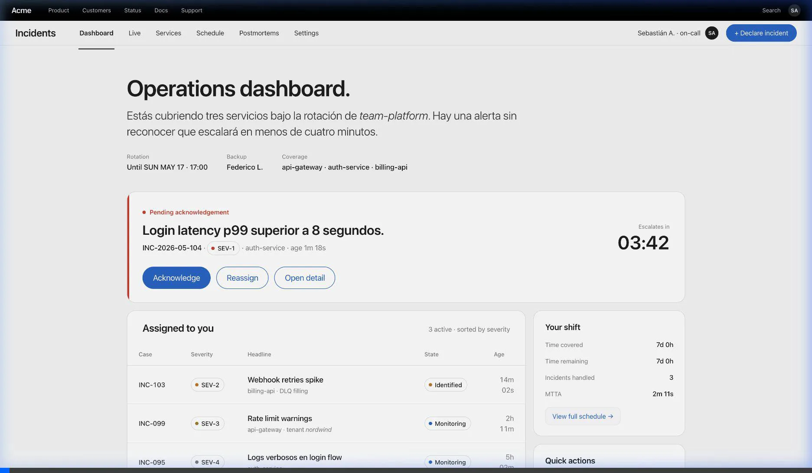
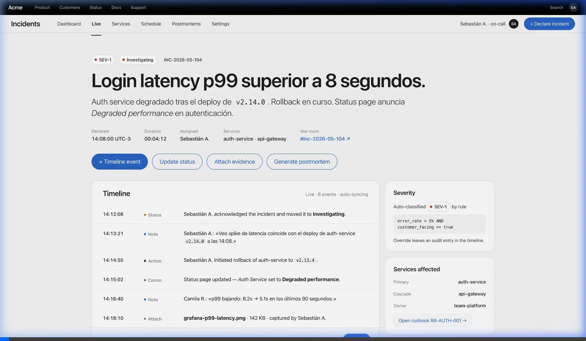
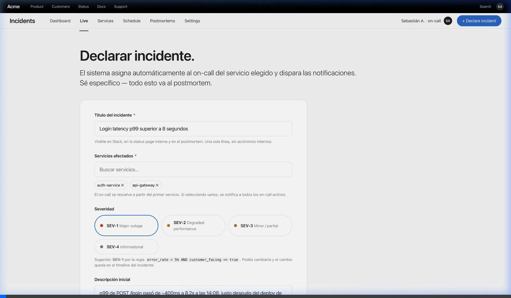
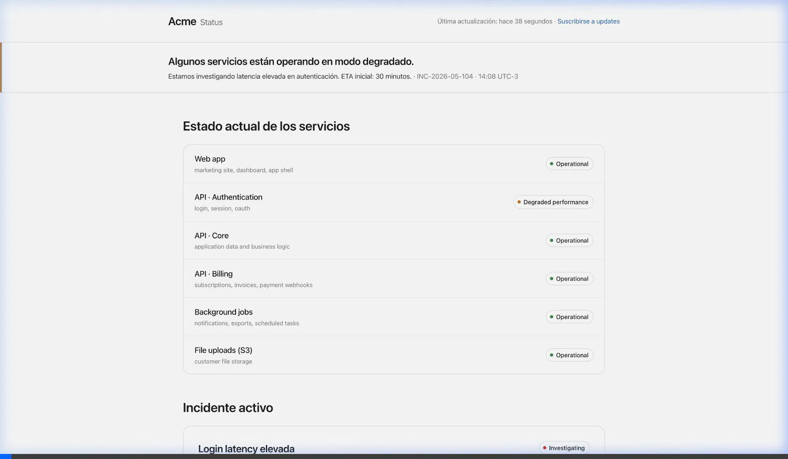
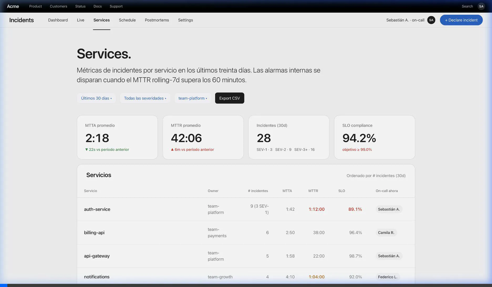
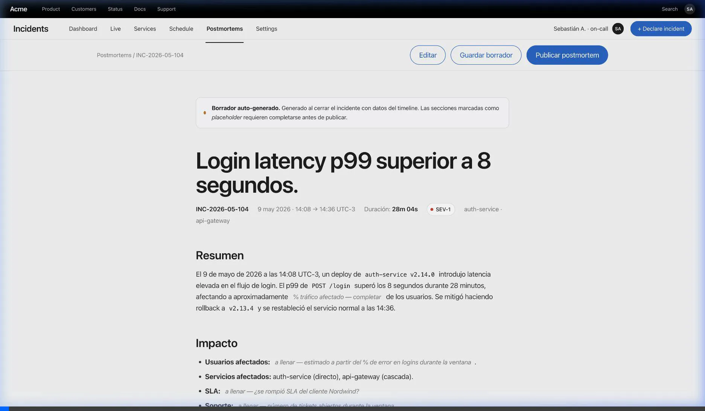
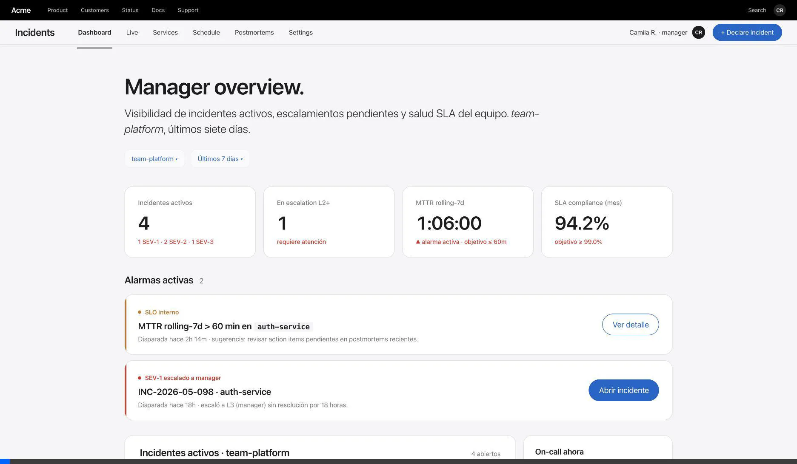

# Sistema de Gestión de Incidentes de Producción

> **Curso:** Infraestructura en la Nube · Postgrado en Diseño y Desarrollo de Software · Universidad Galileo · ciclo Mayo–Junio 2026
> **Entrega:** 1 — Pitch, scope y mockups · dom 17 may 2026
> **Equipo:** Alessandro Alecio · David Garcia · Joaquin Marroquin

---

## 1. Resumen ejecutivo

### El problema

Imaginá un servicio de software en producción — Netflix, un banco digital, una app de delivery. A las 3 AM una pieza crítica se rompe: el sistema de pagos deja de procesar. ¿Qué pasa hoy en la mayoría de las empresas? Caos coordinado por chat. Alguien ve el error en un dashboard, escribe en un grupo de Slack, otra persona abre un Google Doc para anotar acciones, una hoja de cálculo para llevar el tracking. El cliente se entera por Twitter antes de que la empresa publique nada oficial. Al día siguiente nadie recuerda con precisión qué se hizo, en qué orden, ni por qué.

### La solución

Una plataforma única que **centraliza todo el ciclo de vida del incidente** — desde la detección hasta el informe final — y automatiza las partes que hoy dependen de que alguien se acuerde de hacerlas. Cuando un incidente arranca (manual o automáticamente desde un sistema de monitoreo), el sistema:

1. **Clasifica la severidad** (SEV1 crítico → SEV4 menor; detalle en §3) y arranca el flujo correspondiente.
2. **Notifica a quien le toca** — la persona del equipo que está "de guardia" esa semana para ese servicio.
3. **Registra todo en vivo** — cada acción, observación o cambio de estado queda en una línea de tiempo persistente.
4. **Escala automáticamente** si nadie responde en X minutos, sin que alguien se acuerde de hacerlo a mano.
5. **Informa al cliente** vía una página pública de estado (*status page*) que se actualiza sola.
6. **Genera el informe post-incidente** (*postmortem*) a partir de la línea de tiempo, listo para que el equipo lo complete con análisis humano.

### A quién sirve

A equipos de ingeniería que operan servicios en producción 24×7 con compromisos contractuales sobre disponibilidad — empresas SaaS medianas (50–500 ingenieros) donde la caída de un servicio se mide en plata perdida por minuto. El usuario primario es el **ingeniero de guardia** (presentado en §2). Los secundarios: el jefe del equipo (métricas y validación de postmortems) y el cliente final (consulta la página pública para saber si el problema lo afecta).

### Glosario rápido

Términos de la industria que aparecen a lo largo del documento. Sirve como referencia — no hace falta leerlo de corrido.

| Término | Qué es |
|---|---|
| **SRE** | *Site Reliability Engineer.* Ingeniero responsable de que un servicio en producción esté disponible, sea rápido, y no se caiga. Rol inventado por Google; hoy estándar en empresas tech (Netflix, Spotify, Stripe, etc.). |
| **DevOps** | Concepto más amplio que combina desarrollo y operaciones. Para este proyecto, considerá SRE y DevOps intercambiables. |
| **On-call / de guardia** | Estar disponible para responder a incidentes en este momento, 24/7. Rota entre los integrantes del equipo (típicamente una semana al mes por persona). |
| **Paging** | El acto de "despertar" a alguien con una notificación urgente que rompe el silencio (push de Slack, llamada, SMS). |
| **War room** | Canal de Slack que el sistema crea para coordinar la respuesta a un incidente específico. Se archiva cuando el incidente cierra. |
| **Timeline** | Línea de tiempo del incidente — secuencia ordenada de eventos. Es el material crudo con el que se arma el postmortem. |
| **Postmortem** | Informe escrito después de resolver un incidente. Documenta qué pasó, la causa raíz, qué se hizo bien, qué se hizo mal, y qué *action items* quedan para que no vuelva a pasar. |
| **Escalation** | Pasar el incidente al siguiente nivel de la cadena (de guardia → respaldo → manager → VP) cuando el nivel actual no responde a tiempo. |
| **MTTA** | *Mean Time To Acknowledge.* Tiempo promedio desde que un incidente arranca hasta que alguien reconoce que está trabajando en él. |
| **MTTR** | *Mean Time To Resolve.* Tiempo promedio para resolver el incidente desde que arranca. |
| **SLA / SLO** | *Service Level Agreement* (compromiso contractual con el cliente sobre disponibilidad) y *Service Level Objective* (objetivo interno del equipo, suele ser más estricto que el SLA). |
| **Status page** | Página pública donde el cliente consulta el estado del servicio en tiempo real. Ejemplos: `status.notion.so`, `status.github.com`, `status.stripe.com`. |
| **Webhook** | Endpoint HTTP que un sistema externo llama para notificar un evento. Ej.: Datadog llama a nuestro webhook cuando dispara una alerta. |
| **SEV1 / SEV2 / SEV3 / SEV4** | Niveles de severidad del incidente. Detalle en §3. |

---

## 2. Actores

### Humanos

- **Ingeniero de guardia** *(SRE on-call — actor primario)* — el miembro del equipo que esta semana tiene la responsabilidad de responder a alertas críticas 24/7. La guardia rota entre los integrantes (típicamente una semana al mes por persona). Durante un incidente: recibe el aviso, reconoce que está trabajando en él, investiga la causa, documenta acciones, resuelve.
- **Ingeniero de respaldo** *(SRE escalation / segundo nivel)* — el siguiente en la cadena. Recibe el incidente automáticamente cuando vence el *timer* de escalation del de guardia (típicamente 5–10 minutos sin respuesta), o cuando la severidad lo amerita desde el inicio.
- **Jefe del equipo de ingeniería** *(Engineering Manager)* — supervisa los incidentes activos del equipo, revisa métricas agregadas (MTTA, MTTR), valida los postmortems. Recibe los SEV1 que escalaron hasta el final de la cadena sin respuesta.
- **Otro ingeniero del equipo** *(Engineer no-on-call)* — colabora puntualmente cuando lo invitan al *war room*. Consulta postmortems pasados como material de aprendizaje sobre incidentes en los que no participó.
- **Cliente final** *(Customer)* — consulta la *status page* pública para saber si una caída del servicio lo afecta antes de abrir un ticket de soporte.

### Sistemas externos
- **Sistema de monitoreo** (Datadog / Grafana / Prometheus Alertmanager) — emite *webhooks* al sistema cuando se dispara una alerta.
- **Slack workspace de la empresa** — canal de notificaciones del incidente y *war room* virtual.
- **Status page pública** — endpoint público que clientes consultan; se actualiza desde el sistema.
- **Repositorio de runbooks** (Confluence / Notion / GitHub) — el *on-call* consulta runbooks vinculados al servicio afectado.
- **Servicio de email transaccional** — para notificaciones que no van por Slack (ej. resumen diario al manager).

---

## 3. Niveles de severidad

Clasificación que el sistema asigna al incidente al momento de declararlo. La severidad determina si se dispara el flujo de *paging* y escalation automático, o si el incidente entra al backlog normal del equipo. La asignación inicial es automática por reglas declarativas (§5, funcionalidad 1) y puede ser revisada por el *on-call* antes de confirmar la declaración.

| Severidad | Impacto | Ejemplo | Comportamiento del sistema |
|---|---|---|---|
| **SEV1** | Crítico — producto inoperable o riesgo de pérdida de datos | El checkout no procesa ningún pago; la API devuelve 500 a todos los requests | Notifica al on-call por Slack + email; crea *war room*; arranca *escalation timer* (5 min) |
| **SEV2** | Mayor — funcionalidad clave rota o degradación grave | Latencia de la API duplicada para >30% de usuarios; un servicio core falla en 5–30% de los casos | Notifica al on-call por Slack + email; crea *war room*; arranca *escalation timer* (5 min) |
| **SEV3** | Moderado — degradación visible que no bloquea el flujo principal | La búsqueda tarda 3× lo normal; un endpoint secundario devuelve datos *stale* | Notifica al on-call por Slack; sin *war room* ni escalation automática |
| **SEV4** | Menor — bug aislado, cosmético o de baja prioridad | Falta una imagen en un help text; warning de log irrelevante | Queda en el backlog del equipo; sin paging |

US-01 y US-03 disparan únicamente para SEV1/SEV2 — es la regla que evita despertar al on-call a las 3 AM por incidentes que pueden esperar al horario hábil.

---

## 4. Casos de uso priorizados

User stories en formato *"Como X, quiero Y, para Z"* con criterio de éxito explícito y prioridad **P0** (crítica para el MVP), **P1** (importante pero no bloqueante) o **P2** (deseable).

| # | Prioridad | User story | Criterio de éxito |
|---|---|---|---|
| US-01 | **P0** | Como **on-call**, quiero **recibir una notificación inmediata por Slack y email** cuando se crea un incidente SEV1/SEV2 asignado a un servicio bajo mi rotación, para minimizar el MTTA. | Notificación entregada en ≤ 30 s desde la creación; incluye link directo al incidente, severidad y servicio. |
| US-02 | **P0** | Como **on-call**, quiero **registrar acciones tomadas en un *timeline* en vivo** del incidente, para que mi equipo y los stakeholders vean el progreso sin tener que preguntar. | Cada acción aparece con autor, timestamp y tipo (acción / observación / cambio de estado) en ≤ 2 s tras enviarla. |
| US-03 | **P0** | Como **engineering manager**, quiero que un **SEV1 sin reconocer durante 5 minutos sea escalado automáticamente** al segundo nivel y, si sigue sin reconocer otros 5 minutos, a mí, para garantizar respuesta. | Escalamiento ejecutado en ≤ 5 s tras vencer el timer; queda evento en el *timeline*; notificación enviada al siguiente nivel. |
| US-04 | **P0** | Como **customer**, quiero **ver una *status page* pública actualizada** que indique qué servicios están degradados, para saber si el problema es del proveedor antes de abrir ticket. | La página refleja el estado del incidente en ≤ 60 s tras un cambio de estado interno; soporta *components* con estados (operational / degraded / outage). |
| US-05 | **P1** | Como **SRE**, quiero **generar el postmortem automáticamente desde el *timeline*** del incidente, con secciones predefinidas (resumen, impacto, *root cause*, *action items*), para no perder información ni partir desde cero. | Al cerrar el incidente, el sistema crea un *draft* de postmortem con timeline embebido y plantilla; queda *Markdown* editable. |
| US-06 | **P1** | Como **engineering manager**, quiero **ver un dashboard con MTTA, MTTR y *count* de incidentes por servicio en la última semana / mes**, para identificar áreas problemáticas. | Dashboard carga en ≤ 3 s con datos de hasta 90 días; filtra por severidad y servicio. |
| US-07 | **P2** | Como **sistema de monitoreo**, quiero **crear incidentes vía webhook firmado**, para que las alertas automáticas se conviertan en incidentes sin intervención humana. | Endpoint acepta JSON, valida firma HMAC, crea incidente con severidad mapeada y dispara US-01; rechaza payloads inválidos con 4xx. |
| US-08 | **P2** | Como **SRE**, quiero **adjuntar evidencias** (capturas de Grafana, fragmentos de log, traces) al *timeline*, para documentar el diagnóstico. | Soporta archivos hasta 10 MB; cada adjunto queda asociado a un evento del *timeline* con preview en la UI. |

---

## 5. Funcionalidades específicas

Lo que diferencia este sistema del enunciado genérico de "tickets e incidentes":

1. **Severidad SEV1–SEV4 con auto-priorización por reglas.** Reglas declarativas tipo `if affected_traffic > 30% then SEV1` o `if customer_facing && error_rate > 1% then SEV2`. La regla aplica al crear el incidente y puede ser revisada por el *on-call*.
2. **Asignación automática al on-call activo del servicio afectado.** Cada servicio tiene una rotación; el sistema resuelve quién está *on-call* en este momento y le asigna el incidente sin intervención humana.
3. **Escalation policies configurables.** Política por servicio o por severidad: *N1 → N2 → Manager → VP*, con timers de 5/10/30 min entre niveles.
4. **War room virtual.** Al declarar un incidente, el sistema crea un canal de Slack `#inc-2026-05-XYZ` dedicado y postea el contexto inicial; cuando el incidente cierra, archiva el canal.
5. **Timeline estructurado con tipos de evento.** Eventos categorizados (`action`, `observation`, `status_change`, `comm_sent`, `attachment_added`); facilita el postmortem y el análisis post-hoc.
6. **Status page con *components*.** Servicios visibles públicamente como *components* con estado (Operational / Degraded / Partial Outage / Major Outage). Estado se infiere del incidente activo de mayor severidad sobre ese componente.
7. **Postmortem template auto-generado.** Al cerrar el incidente, se genera un *draft* en Markdown con secciones canónicas (Summary, Impact, Timeline, Root Cause, What went well, What went poorly, Action Items) pre-llenando lo que ya está en el sistema.
8. **Métricas SLO/SLA propias.** El sistema mide su propio MTTA y MTTR como *meta-métrica*; expone dashboard y emite alarma si MTTR rolling-7d > 60 min.

---

## 6. Mockups

7 mockups *low-fi* de las pantallas principales. Los archivos `.html` están en `mockups/` (abren en cualquier navegador); las grabaciones `.webp` se embebenan a continuación.

### 5.1 · Dashboard del on-call

Incidentes asignados, alerta pendiente con countdown de escalation, actividad del equipo en los últimos 60 minutos.
**Cubre:** US-01, US-03.

### 5.2 · Detalle del incidente con timeline en vivo

Header con severity / state / case ID, timeline central en vivo, sidebar con severity rule, services, escalation ladder y war room.
**Cubre:** US-02, US-08.

### 5.3 · Declarar incidente

Form con severidad auto-sugerida por regla, asignación automática al on-call resuelto, notificaciones configurables.
**Cubre:** creación manual (alternativa a US-07); ejercita las funcionalidades 1 (auto-priorización) y 2 (asignación automática) de §5.

### 5.4 · Status page pública

Vista pública sin autenticación. Banner con el estado actual, lista de componentes con estado semántico, incidente activo con timeline de updates, historial reciente.
**Cubre:** US-04.

### 5.5 · Servicios con métricas

KPIs de MTTA, MTTR, SLO compliance e incidentes (30 días). Tabla de servicios con celdas resaltadas cuando MTTR/SLO está fuera de objetivo. Chart MTTR rolling-7d.
**Cubre:** US-06.

### 5.6 · Postmortem auto-generado

Documento editorial single-column. Pre-llena timeline, duración, métricas de respuesta; secciones que requieren análisis humano (causa raíz, impacto cuantitativo) quedan marcadas como *pendiente*.
**Cubre:** US-05.

### 5.7 · Vista del Engineering Manager

KPIs del equipo, alarmas activas como cards (ámbar = SLO breach, rojo = SEV-1 escalado a manager), tabla de incidentes con filas resaltadas en escalation L2+, postmortems pendientes con flag si >7 días.
**Cubre:** US-06, US-03 (lado manager).

---

## 7. Mapeo funcionalidad → componente del curso

Cómo cada funcionalidad del sistema ejercita los siete componentes que el curso evaluará en las entregas siguientes.

| Componente del curso | Cómo lo ejercita este proyecto |
|---|---|
| **Cómputo (API)** | Endpoints REST: `POST /incidents` (crea con auto-priorización + auto-asignación), `PATCH /incidents/{id}` (cambio de estado), `POST /incidents/{id}/timeline` (agregar evento), `POST /webhooks/monitoring` (receptor de alertas externas firmado), `GET /status` (status page pública). Workers asíncronos para escalamiento, notificaciones y generación de postmortem. |
| **Base de datos** | Tablas / colecciones: `incidents`, `timeline_events`, `services`, `users`, `on_call_schedule`, `escalation_policies`, `notifications`, `postmortems`. Patrones de acceso principales: lectura por `incident_id` con timeline, query de incidentes activos por on-call, query histórico para métricas. |
| **Almacenamiento de archivos** | Adjuntos del timeline (PNG/JPG de gráficos, fragmentos de log en `.txt`/`.log`), postmortems exportados a PDF, snapshots de la status page para auditoría. Separados de la BD para que el costo de storage no infle el costo de la BD. |
| **Red** | Capa pública: ALB con FE web, API y receptor de webhooks. Capa privada-app: cómputo y workers. Capa privada-data: BD y caché. Status page servida desde CDN para resistir picos sin tocar el origen. |
| **Procesamiento asíncrono** | Notificaciones (Slack, email) desacopladas vía cola; *escalation timers* implementados como mensajes diferidos; generación de postmortem como job pesado; publicación a status page como evento. Idempotencia en notificaciones (no duplicar pagos al on-call si la API se reintenta). |
| **Seguridad** | Roles: `on_call`, `manager`, `viewer`, `customer` (público, solo status page). Autenticación de webhook por firma HMAC con secret rotable. Auditoría de quién cambió estado de qué incidente y cuándo. |
| **Observabilidad** | Logs estructurados con `incident_id` como correlation ID. Métricas RED por endpoint. Métricas de negocio: MTTA, MTTR, # incidentes activos. Alarmas: si nuestro MTTR rolling-7d > 60 min, si la cola de notificaciones crece sostenidamente, si la status page no se actualiza > 5 min. |

---

## 8. Scope (in / out)

### IN — lo que el sistema SÍ hace
- Ciclo de vida completo del incidente: detección → reconocimiento → investigación → mitigación → resolución → postmortem.
- Asignación automática al *on-call* activo del servicio afectado.
- Escalamiento automático según política configurable.
- War room virtual en Slack (creación y archivado del canal).
- Status page pública con *components* y estados.
- Postmortem auto-generado como *draft* editable.
- Métricas de SLA / MTTA / MTTR por servicio y agregadas.
- Webhook receiver firmado para integración con sistemas de monitoreo.
- Adjuntos al timeline (capturas, logs).
- Roles diferenciados: on-call, manager, viewer, customer (público).

### OUT — lo que el sistema NO hace
- **Integración con PagerDuty / Opsgenie.** Asumimos rotación on-call interna gestionada en el sistema.
- **Correlación automática de alertas con ML / detección de incidentes duplicados.** Cada alerta = un incidente; la deduplicación queda a cargo del *on-call*.
- **Auto-ejecución de runbooks.** El sistema enlaza al runbook; no lo ejecuta.
- **Integración con sistemas de ticketing externos** (Jira, ServiceNow, Zendesk).
- **Comunicación bidireccional con el cliente** desde la status page (ni comments, ni subscripciones por email — solo lectura pública).
- **Voice paging (llamadas telefónicas).** Solo Slack + email.
- **Análisis predictivo o detección de anomalías.** Es un sistema reactivo, no proactivo.
- **Mobile app nativa.** Web responsive es suficiente para el MVP.

---

## 9. Preguntas abiertas

Decisiones técnicas que aún no tomamos. Conscientes y honestas — se cierran en las entregas correspondientes:

- **Cómputo:** ¿Lambda con API Gateway, ECS Fargate detrás de ALB, o EC2 con Auto Scaling? Trade-off: Lambda escala a cero pero tiene cold starts que pueden impactar US-01; Fargate da control sobre el runtime pero cuesta más en idle.
- **Base de datos:** ¿BD relacional (RDS Postgres) para el modelo principal, o documental (DynamoDB) por los patrones de timeline append-only? Trade-off: el timeline es append-heavy y pide DynamoDB; los joins de métricas piden Postgres. Posible solución híbrida.
- **State machine del incidente:** ¿estados explícitos en BD o derivados del último timeline event? Implica decisiones sobre concurrencia y consistencia.
- **Verificación de webhooks:** ¿HMAC compartido con cada origen, o JWT firmado por un IdP intermedio?
- **SLO propios objetivo:** ¿qué MTTA/MTTR nos comprometemos a cumplir como sistema? Necesario para definir alarmas.
- **¿Multi-tenant o single-tenant?** Para el alcance del curso asumimos single-tenant (una sola empresa lo opera para sí misma); multi-tenant agrega complejidad de seguridad significativa.
- **Persistencia del war room en Slack:** ¿qué pasa si Slack está caído cuando declaramos un incidente?

---

## 10. Anexo IA

### Qué le pedimos a la IA

Trabajamos con **Claude Code (Opus 4.7)** durante una sesión de planificación + redacción asistida. Pedidos concretos:

1. **Lectura completa del rubric (PDF) y separación entre requisitos vs. elecciones.** Específicamente, le pedimos que detectara si la entrega 1 requería implementación de aplicación o sólo documentación.
2. **Brainstorm del sub-dominio específico** dentro de "sistema de tickets e incidentes" — partiendo del enunciado genérico del rubric.
3. **Estructura completa del documento** según las secciones que el rubric exige para E1.
4. **Generación de las user stories priorizadas** (P0/P1/P2) con criterio de éxito explícito.
5. **Diseño de los 7 mockups *low-fi*** en HTML estático.

### Qué aceptamos sin cambios sustanciales

- La **separación crítica** entre requisitos del rubric y elecciones nuestras: la IA detectó que la página 1 dice *"No se requiere implementación en código ni despliegue real"* y que la página 10 dice *"Un equipo puede sacar puntaje completo sin haber tocado un servicio cloud"*. La decisión final fue nuestra de no implementar código para esta primer entrega, sino que hasta la segunda.
- **Diseño y composición de los 7 mockups HTML**, incluyendo el sistema de badges semánticos (SEV1–4, estados) y la coherencia narrativa entre ellos (el mismo `INC-2026-05-104` atraviesa varias pantallas).

### Qué editamos

1. **Estética de los mockups.** El primer rumbo que tomó la IA con los mockups fue un estilo "informe operacional" sobrio tipo *NASA mission control* — IBM Plex Mono, papel cálido, hairlines duras, todo con esquinas cuadradas. Lo descartamos porque se sentía genérico y muy "técnico", y pedimos rediseñar todo con un lenguaje **Apple-inspired** utilizando un design.md para guiar el estilo. Rehicimos los 7 mockups y el `styles.css` desde cero. La razón: queríamos que el sistema se viera *cuidado* aún siendo low-fi — un producto que un on-call usaría con gusto a las 3 AM, no una herramienta hostil más.

2. **Sub-dominio específico del sistema.** La IA nos ofreció varias opciones para encarar el enunciado genérico de "sistema de tickets e incidentes": helpdesk TI corporativo, soporte SaaS B2B, gestión de incidentes de producción para SRE, tickets de servicios públicos. Elegimos **incidentes de producción para equipos SRE/DevOps** porque ejercita los siete componentes del curso de forma más natural que las otras opciones — escalamiento automático ejercita procesamiento asíncrono, timeline append-heavy ejercita patrones de BD distintos al CRUD clásico, status page ejercita CDN, postmortems ejercitan storage de objetos.

3. **Estructura del entregable.** Originalmente la IA armó la entrega como **cuatro archivos separados**: `project.md` (doc maestro), `delivery-1-summary.md` (resumen de la entrega), `anexo-ia.md` (reflexión sobre uso de IA) y `mockups/README.md` (índice de mockups). Decidimos consolidar todo en **un único documento** (este `project.md`) porque el rubric del curso pide un solo documento que crece de E1 a E5 — partirlo en cuatro pierde esa coherencia y hace más difícil para el ingeniero al momento de evaluar, seguir el hilo. Eliminamos los otros tres archivos y movimos el contenido relevante acá.

### Qué descartamos y por qué

1. **Integración con PagerDuty / Opsgenie.** La IA inicialmente la consideró *in scope*. La descartamos porque metía un servicio externo que aumentaba la complejidad del modelo de seguridad (autenticación cruzada, secretos rotables) sin sumar valor pedagógico al curso. Decidimos que la rotación on-call vive dentro del sistema.
2. **Correlación automática de alertas con ML.** Sugerida por la IA como *"funcionalidad específica avanzada"*. La descartamos porque el rubric premia simplicidad bien justificada (p. 19: *"Un sistema simple bien justificado supera a uno complejo sin razón"*). ML era complejidad sin justificación.
3. **Mobile app nativa.** Descartada porque web responsive cumple el caso de uso del *on-call* sin agregar costo de mantener dos plataformas.

### Cómo verificamos cada parte

Como exige la política del curso, **cada miembro del equipo puede explicar cualquier parte del documento sin la IA presente**. Para asegurarlo:

- Revisamos cada user story preguntándonos *"¿qué métrica usamos para verificar que se cumplió?"* — cualquier respuesta vaga la editamos.
- Cada mockup tiene una *caption* al final del HTML explicando qué cubre y por qué se ve así; si no podemos defender esa caption, rehacemos el mockup.

### Aprendizaje sobre colaboración con IA

La IA tuvo el reflejo correcto de leer el rubric primero y flaggear la diferencia entre lo que pedíamos ("construir la app") y lo que el curso pedía ("documento de diseño"). Sin esa fricción, hubiéramos perdido tiempo en código que el rubric no evalúa en E1. **La fricción útil de la IA es cuando dice "esperá" en vez de ejecutar lo pedido sin chequear.**

*(pendiente: ampliar con observaciones de las próximas entregas)*
