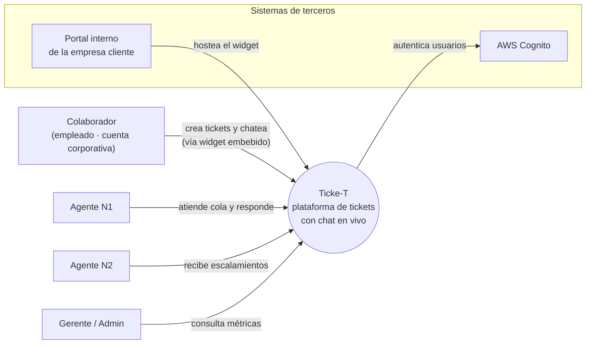

# Ticke-T — Plataforma de tickets con chat en vivo propio

> **Curso:** Infraestructura en la Nube · Postgrado en Diseño y Desarrollo de Software · Universidad Galileo · ciclo Mayo–Junio 2026
> **Entregas:**
> - 1 — Pitch, scope y mockups · dom 17 may 2026
> - 2 — Cómputo y datos · jue 21 may 2026
> - 3 — Red, ingreso y seguridad perimetral · dom 31 may 2026
> - 4 — Procesamiento asíncrono (SNS · SQS · DLQ · notifier Lambda) · dom 7 jun 2026
> - 5 — Integración: seguridad detallada, observabilidad, costo · jue 11 jun 2026
>
> **Equipo:** Alessandro Alecio · David Garcia · Joaquin Marroquin

---

## Resumen de cambios E4 → E5

La entrega **E5** completa el documento de diseño incorporando las capas de **seguridad detallada**, **observabilidad** y **estimación de costos**, además de ampliar la documentación operativa y arquitectónica de los componentes críticos del sistema.

### Incorporaciones principales

- **§ 16 — Procesos asíncronos** Se documenta de extremo a extremo el pipeline asíncrono `ticket.closed`, incluyendo estados, transiciones, dependencias, mecanismos de recuperación y comportamiento ante fallos en cada etapa del flujo. Este proceso representa el flujo más interconectado de la solución al combinar interacciones síncronas, procesamiento asíncrono e integración con servicios externos.

- **§ 17 — API Surface** Se incorpora el inventario completo de endpoints REST y rutas WebSocket, detallando método HTTP, requisitos de autenticación, estructura de payloads, códigos de respuesta y estrategia de escalabilidad y limitación de tráfico (*throttling*) por capa.

- **§ 18 — Modelo de seguridad detallado** Se formaliza la arquitectura de seguridad mediante la definición de roles IAM con privilegios mínimos (*least privilege*) para cada servicio, eliminando el uso de `AdministratorAccess` en componentes de ejecución. Se incluye el inventario de secretos, la justificación de su gestión, el uso de KMS con claves administradas por el cliente (*Customer Managed Keys*) para cifrado en reposo de S3 y DynamoDB, y la aplicación de TLS 1.2+ en todos los endpoints públicos.

- **§ 19 — Plan de observabilidad** Se define la estrategia de observabilidad basada en logs estructurados con propagación de `correlation_id` a lo largo del ciclo completo de una solicitud. Se incorporan métricas RED por servicio, ocho alarmas operativas con umbrales, acciones y responsables definidos, así como el comportamiento esperado ante degradación de dependencias.

- **§ 20 — Estimación de costos** Se presenta una línea base de costos para el entorno de desarrollo, con un gasto actual inferior a 1 USD por mes, complementada con proyecciones para tres escenarios de carga.

- **§ 21 — Riesgos y decisiones pendientes** Se documentan los riesgos identificados y las decisiones arquitectónicas que permanecen abiertas, incluyendo los aspectos que requerirían validación adicional o mayor disponibilidad de información.

- **§ 12.4 — Capas de seguridad por flujo de tráfico** Se incorpora una vista end-to-end del recorrido de una solicitud, desde el navegador hasta los servicios de persistencia (`DynamoDB` y `S3`), identificando los mecanismos de filtrado, validación y protección aplicados en cada salto, así como el impacto de costo asociado.

### Actualización de preguntas abiertas (§ 23)

Durante esta entrega se cerraron los siguientes temas previamente identificados:

- **Seguridad:** cerrada mediante la definición de autorización *fine-grained* y mecanismos de cifrado en reposo.
- **Observabilidad:** cerrada mediante la definición del stack base de monitoreo y del conjunto inicial de alarmas operativas.

Los elementos pendientes fueron reclasificados como actividades del backlog posterior al MVP.

---

## Resumen de cambios E3 → E4

Documento iterado sobre la E3; lo agregado/movido en esta entrega:

- **Capa asíncrona introducida.** Sumamos un pipeline **SNS → SQS → Lambda → SES** que desacopla el envío de correos del request principal del usuario. El primer evento que viaja por este pipeline es `ticket.closed`: cuando un agente cierra un ticket, la Lambda síncrona publica el evento al topic, la SQS suscriptora lo entrega al *notifier* Lambda, y este último manda un correo de notificación al colaborador solicitante vía Amazon SES.
- **Secciones nuevas.** Procesamiento asíncrono (pipeline `ticket.closed`, formato de payload, idempotencia, manejo de fallos con DLQ).
- **Diagrama de contenedores actualizado a v2.** Incluye ahora el SNS topic `ticket-events`, la cola principal `ticket-notifications`, la DLQ, y el *notifier* Lambda. La separación de la Lambda síncrona (`chat-message-handler-dev`, dominio tickets) y la Lambda asíncrona (`ticket-notifier-dev`, dominio notificaciones) sigue el principio "una Lambda por bounded context".
- **Renumeración.** Scope, Preguntas abiertas y Anexo IA corrieron una posición.
- **Preguntas abiertas.** Se **cerraron** las preguntas de Asíncrono (notificaciones de escalamiento → un topic único `ticket-events` genérico `{event, payload}` que permite filter policies a futuro.
- **Anexo IA.** Bloque nuevo *"E4 — Decisiones técnicas exploradas con IA"* listando la discusión sobre SNS+SQS vs SQS directa vs EventBridge, el manejo de idempotencia, y la elección de SES sobre proveedores externos.

---

## Resumen de cambios E2 → E3

Documento iterado sobre la E2; lo agregado/movido en esta entrega:

- **Decisión central de red.** El sistema **no provisiona VPC**. Cómputo, base de datos, almacenamiento y autenticación viven en el plano gestionado de AWS y se comunican por endpoints públicos firmados con SigV4 o autenticados con JWT. La justificación completa está en § 12.
- **Secciones nuevas.** § 11 Diagrama de contenedores (v1) · § 12 Diseño del plano de comunicación · § 13 Capas de seguridad en el ingreso · § 14 VPC contingente.
- **Renumeración.** Scope, Preguntas abiertas y Anexo IA corrieron cuatro posiciones (eran § 11..§ 13 → ahora § 15..§ 17). El cambio respeta el flujo *Negocio → Técnico → Reflexión*.
- **Implementación que respalda el diseño.** Se cabló el ingreso real: **API Gateway REST API regional** delante de la Lambda, con **authorizer Cognito User Pools** (4 grupos: `colaborador`, `agente-n1`, `agente-n2`, `gerente`), CORS por path (OPTIONS + MOCK integration), gateway responses con headers CORS para que los errores del authorizer no rompan al browser, y **AWS WAF v2** con regla de rate-limit por IP asociado al stage. El frontend React se cableó al API real (sustituyendo el repository de `localStorage`), se agregaron las pantallas de Login, Mis Tickets y Cola del Agente, y la Lambda escribe metadata de adjuntos a S3 al crear el ticket (`s3_key` bajo `attachments/{ticket_id}/{att_id}.json`). El frontend está construido pero **no desplegado a S3 + CloudFront todavía** — corre local en Vite hasta que el dominio custom y el CDN se monten en una entrega siguiente.
- **Preguntas abiertas (§ 16).** Se **cerraron** las preguntas de Red (API HTTP vs REST → REST · NAT vs VPC Endpoints → no aplica). Se **agregaron** las nuevas decisiones que dejan abiertas WAF, CloudFront y dominio custom para entregas siguientes.
- **Anexo IA (§ 17).** Bloque nuevo *"E3 — Decisiones técnicas exploradas con IA"* listando los descartes de HTTP API por incompatibilidad con WAF, el trade-off REST API vs CloudFront, y la decisión de no implementar VPC.

---

## Resumen de cambios E1 → E2

Documento iterado sobre la E1; lo agregado/movido en esta entrega:

- **Decisiones técnicas cerradas.** Cómputo: **AWS Lambda** (§ 9). Base de datos: **DynamoDB** con *single-table design* y 4 GSIs (§ 10). Almacenamiento de archivos: **Amazon S3** con lifecycle a `STANDARD_IA` a 30 días (§ 10.3). Sin caché en el MVP, con DAX / ElastiCache reconocidos como evolución posible (§ 10.4).
- **Secciones nuevas.** § 3 Diagrama de contexto · § 9 Decisión de cómputo · § 10 Modelo de datos.
- **Renumeración.** Las secciones de Niveles de prioridad, Casos de uso, Funcionalidades, Mockups y Mapeo corrieron una posición (eran § 3..§ 7 → ahora § 4..§ 8). Scope, Preguntas abiertas y Anexo IA corrieron dos posiciones (eran § 8..§ 10 → ahora § 11..§ 13). El cambio mantiene el flujo *Negocio → Técnico → Reflexión*.
- **Preguntas abiertas (§ 12).** Se **cerró** la pregunta de BD (Postgres vs DynamoDB → DynamoDB) y se **agregaron** las decisiones que quedan abiertas para entregas siguientes: red, asíncrono, seguridad y observabilidad.
- **Anexo IA (§ 13).** Bloque nuevo *"E2 — Decisiones técnicas exploradas con IA"* listando qué se discutió con IA al cerrar cómputo, single-table y diseño de GSIs.

---

## 1. Resumen ejecutivo

### El problema  
Las empresas medianas y grandes manejan un alto volumen de solicitudes internas entre distintas áreas corporativas. En muchas organizaciones, estas solicitudes todavía se gestionan por medios informales como correos electrónicos, mensajes directos o herramientas de mensajería corporativa. Eso fragmenta la comunicación, dificulta el seguimiento de los casos y limita la trazabilidad de las respuestas y tiempos de atención.

Además, cuando las solicitudes no se centralizan, los colaboradores no tienen visibilidad del estado de sus requerimientos y los equipos pierden control sobre la priorización, el cumplimiento de SLA y los procesos de escalamiento. Contar con una plataforma interna de tickets permite estandarizar la atención, mejorar la comunicación entre áreas y mantener un historial auditable de cada caso.

### La solución  
Ticke-T es una plataforma de gestión de tickets basada en la nube orientada a la atención de solicitudes internas dentro de una organización. Los colaboradores pueden crear tickets desde un portal web mediante formularios o interactuar en tiempo real con los equipos responsables a través de un chat integrado.

Cada solicitud se convierte automáticamente en un ticket auditable con categorización, prioridad y seguimiento de SLA. Los equipos responsables trabajan desde una bandeja compartida donde pueden asignar casos, escalar incidentes y responder solicitudes desde un panel centralizado. La comunicación entre el colaborador y el agente se sincroniza en tiempo real mediante WebSockets, permitiendo actualizar conversaciones y estados sin recargar la página.

### Cómo funciona  
1. El colaborador ingresa al portal interno y crea una solicitud mediante un formulario o inicia una conversación desde el chat integrado.

2. El sistema crea automáticamente el ticket con una categoría y prioridad según el tipo de solicitud seleccionada.

3. El ticket aparece en la cola del equipo responsable. Si la prioridad es Alta, además se publica una notificación al canal de alertas correspondiente.

4. Un agente toma el ticket desde el panel de gestión y responde. La actualización se refleja en tiempo real para el colaborador.

5. La conversación y cada cambio de estado quedan registrados como eventos dentro del timeline del ticket para mantener trazabilidad completa del caso.

6. De ser necesario, el ticket puede ser escalado por el agente hacia agentes de nivel 2 o puede ser reasignado hacia otra área.

7. Cuando la solicitud se resuelve, el agente cierra el ticket con una resolución documentada. Si el SLA de atención es excedido, el sistema marca el ticket como Vencido y genera una alerta al responsable correspondiente.

### A quién sirve  
A empresas medianas y grandes que necesitan centralizar y controlar la gestión de solicitudes internas entre colaboradores y áreas corporativas.

El usuario primario del lado operativo es el agente encargado de atender solicitudes; el usuario primario del lado solicitante es el colaborador que necesita asistencia o gestión por parte de otra área interna.

### Glosario rápido

Términos que aparecen a lo largo del documento. Sirve como referencia.

| Término | Qué es |
|---|---|
| **Widget de chat** | Pieza de UI flotante (típicamente en la esquina inferior derecha) embebida en el portal interno de la empresa cliente. Permite al colaborador conversar con el área de soporte responsable sin salir del portal. |
| **Colaborador** | Empleado de la empresa cliente que crea tickets y conversa con el área de soporte responsable. Tiene cuenta corporativa. |
| **Agente** | Persona del equipo de soporte interno que atiende los tickets desde el panel web. Puede ser N1 (primera línea) o N2 (especialista). |
| **N1 / N2** | Niveles de soporte. **N1** es el primer contacto y resuelve la mayoría de los casos básicos; **N2** es el equipo especializado al que se escalan los casos que N1 no puede resolver. |
| **Cola de tickets** | Lista de todos los tickets activos que el equipo tiene pendientes de atender. Ordenada por prioridad y antigüedad. |
| **SLA** | *Service Level Agreement.* Compromiso de tiempo en el que el equipo se compromete a responder o resolver. Ej.: "tickets de prioridad alta se responden en máx. 1 hora hábil". |
| **Escalamiento** | Pasar el ticket al siguiente nivel (de N1 a N2, eventualmente al gerente) cuando el nivel actual no puede o no debe resolverlo. |
| **WebSocket** | Conexión persistente bidireccional entre navegador y servidor que permite empujar mensajes en tiempo real sin que el cliente del navegador tenga que estar preguntando "¿hay algo nuevo?". |
| **SSE** | *Server-Sent Events.* Mecanismo alternativo a WebSocket para que el servidor empuje mensajes al navegador, pero unidireccional (server → client). Más simple, menos potente. |
| **Timeline** | Secuencia ordenada de eventos del ticket (mensaje del colaborador, respuesta del agente, cambio de estado, adjunto, escalamiento). |
| **Watchdog** | Trabajo automático en segundo plano que revisa periódicamente si un ticket excedió su SLA sin respuesta y lo marca como *Vencido*. |
| **Adjunto** | Archivo (imagen, documento) que el colaborador o el agente sube al ticket para dar contexto. Se guarda en un almacenamiento de objetos, no en la base de datos. |

---

## 2. Actores

### Humanos

- **Colaborador** *(actor primario)* — miembro de la empresa que crea el ticket por medio del formulario o inicia conversación desde el chat integrado para pedir ayuda. Sus solicitudes quedan ligadas a su cuenta interna para que pueda retomarlas después.
- **Agente de soporte N1** *(actor primario)* — miembro del equipo de soporte que atiende la cola de tickets de primera línea. Lee la cola, toma tickets, responde por chat, cambia estados, resuelve, o escala a N2 si lo amerita.
- **Agente N2 / Especialista** *(actor secundario)* — recibe tickets escalados por N1 cuando requieren conocimiento más profundo (problemas de infraestructura, casos legales, excepciones financieras).
- **Administrador / Gerente** *(actor secundario)* — supervisa al equipo. Ve métricas agregadas (tickets abiertos, tiempo promedio de resolución, distribución por categoría), gestiona accesos del equipo y audita los tickets vencidos.

---

## 3. Niveles de prioridad

Clasificación asignada al ticket según el impacto y urgencia de la solicitud reportada. La prioridad puede ser definida al momento de crear el ticket y posteriormente ajustada por el agente responsable. La prioridad determina el SLA de atención y el orden en la cola de trabajo.

| Prioridad | Cuándo aplica | SLA de primera respuesta |
|---|---|---|
| **Alta** | La solicitud bloquea una operación importante o afecta a múltiples usuarios. Ej.: caída de un sistema interno, problemas de acceso generalizados, incidentes críticos de operación. | 1 hora hábil |
| **Media** | Existe un problema funcional con impacto limitado o con una alternativa temporal de trabajo. Ej.: errores puntuales en una funcionalidad, solicitudes de validación o seguimiento de casos. | 4 horas hábiles |
| **Baja** | Solicitudes administrativas, consultas generales o requerimientos no urgentes. Ej.: solicitudes de información, cambios menores o consultas operativas. | 1 día hábil |

Si el SLA se vence sin respuesta, el sistema marca el ticket como **Vencido** en la cola y genera una alerta al responsable correspondiente.

---

## 4. Casos de uso priorizados

User stories en formato *"Como X, quiero Y, para Z"* con criterio de éxito explícito y prioridad **P0** (crítica para el MVP), **P1** (importante pero no bloqueante) o **P2** (deseable).

| # | Prioridad | User story | Criterio de éxito |
|---|---|---|---|
| US-01 | **P0** | Como **colaborador**, quiero **crear un ticket mediante un formulario en el portal interno**, para registrar una solicitud y dar seguimiento a su atención. | El ticket queda registrado en la base de datos y aparece en la cola del área responsable en ≤ 3 s. |
| US-02 | **P0** | Como **colaborador**, quiero **iniciar una conversación desde el chat integrado**, para comunicarme en tiempo real con el área responsable. | El mensaje enviado aparece en el panel del agente en ≤ 3 s y queda asociado a un ticket. |
| US-03 | **P0** | Como **agente**, quiero **responder desde el panel de gestión**, para que el colaborador reciba actualizaciones en tiempo real sobre su solicitud. | La respuesta aparece en la vista del colaborador en ≤ 2 s y el ticket actualiza su estado correctamente. |
| US-04 | **P1** | Como **colaborador**, quiero **adjuntar archivos o imágenes** a un ticket, para proporcionar evidencia o información adicional relacionada con mi solicitud. | El archivo se almacena en Amazon S3 y queda disponible desde la vista del ticket. |
| US-05 | **P1** | Como **administrador**, quiero **configurar reglas de SLA y vencimiento de tickets**, para identificar solicitudes que no han sido atendidas dentro del tiempo esperado. | Un ticket sin respuesta dentro del SLA cambia su estado a *Vencido* y genera una alerta al responsable correspondiente. |
| US-06 | **P1** | Como **administrador**, quiero **visualizar métricas y el estado general de los tickets**, para supervisar la carga operativa, el cumplimiento de SLA y el desempeño de las áreas responsables. | El sistema muestra indicadores actualizados de tickets abiertos, vencidos, resueltos y tiempos promedio de atención mediante un panel de monitoreo. |
| US-07 | **P2** | Como **agente N1**, quiero **presionar *Escalar*** para que el ticket pase a Nivel 2, enviando una alerta prioritaria al equipo técnico, para no quedarme bloqueado y para que el caso llegue al equipo correcto. | El equipo N2 recibe la notificación vía SNS y asume la propiedad del ticket; queda evento en el timeline con la nota técnica del N1. |

---

## 5. Funcionalidades específicas

Lo que diferencia a Ticke-T de un email genérico o un chat embebido de terceros:

1. **Widget de chat en vivo propio.** Pieza embebible en el portal interno de la empresa cliente, optimizada para cargar rápido y mantener la conversación en tiempo real vía WebSocket. Diseño minimal, sin frames de terceros, sin trackers externos.
2. **Manejo seguro de anexos.** Las imágenes y archivos que el colaborador sube desde el formulario o el chat viajan a S3 con URLs firmadas, desvinculando la base de datos del peso de los archivos. La BD solo guarda el puntero y la metadata.
3. **Priorización por metadatos.** Asignación automática de severidad (Alta / Media / Baja) según palabras clave del primer mensaje (*"bloqueado", "no funciona", "urgente"*) o según la categoría que el colaborador elige antes de crear el ticket o iniciar el chat. El agente puede ajustarla.
4. **Temporizadores de inactividad (watchdogs).** Jobs de fondo que revisan constantemente si un agente dejó un ticket desatendido más allá del SLA. Afectan métricas individuales del agente y disparan alertas al gerente.

---

## 6. Mockups

6 mockups *low-fi* de las pantallas principales del MVP. Los archivos `.html` están en `mockups/` (abren en cualquier navegador); las grabaciones `.webp` se embeben a continuación.

### 6.1 · Login


Acceso al portal para todos los roles del sistema: colaboradores (que crean tickets y conversan con soporte) y agentes/administradores (que atienden la cola). La autenticación es vía cuenta corporativa de la empresa cliente.
**Cubre:** entrada al sistema; prerrequisito para todas las demás US.

### 6.2 · Cola de tickets (vista agente)


Pantalla principal del agente al iniciar sesión: tabla tipo bandeja de entrada con ID, colaborador, asunto (último mensaje), tiempo transcurrido, estado y prioridad con código de colores. Card de atención arriba con el ticket por vencer SLA. Filtros por estado, categoría, prioridad y agente.
**Cubre:** US-05 (visualización de tickets vencidos) y soporta a todas las demás US del agente como pantalla de entrada.

### 6.3 · Detalle del ticket (vista agente, split-view)


Vista split del ticket: a la izquierda, el historial completo de la conversación con el colaborador en formato timeline; a la derecha, panel de metadatos (colaborador, asignado a, categoría, prioridad, SLA restante) y botones de acción (responder, reasignar, escalar a N2, cerrar).
**Cubre:** US-03 (respuesta desde el panel).

### 6.4 · Modal de escalamiento


Ventana modal que aparece sobre la vista de detalle al hacer click en *Escalar a N2*. Pide al agente elegir el equipo destino (Aplicaciones core, Infraestructura, Bases de datos, Seguridad, Cumplimiento) y agregar una nota técnica obligatoria. Al confirmar, el ticket pasa a la cola del equipo destino y se publica una notificación al canal de alertas correspondiente.
**Cubre:** US-07.

### 6.5 · Widget de chat (vista colaborador)


Pieza embebible que vive en el portal interno de la empresa cliente que contrata Ticke-T. El colaborador la abre desde la esquina inferior, escribe su mensaje y mantiene la conversación con el agente en tiempo real. Acepta texto y adjuntos (imagen, PDF). Muestra el estado *"María está escribiendo…"* mientras el agente compone su respuesta.
**Cubre:** US-02 (iniciar conversación desde el chat) y US-04 (adjuntar archivos).

### 6.6 · Dashboard de métricas (gerente)


Vista ejecutiva con KPIs del período (tickets recibidos, resueltos, tiempo promedio de resolución, SLA cumplido), gráfico de pendientes vs resueltos para detectar picos, y desgloses por categoría y por agente. Filtros por categoría y agente cambian todos los gráficos a la vez.
**Cubre:** US-06 (visualización de métricas y estado general).

---

## 7. Mapeo funcionalidad → componente del curso

Cómo cada funcionalidad de Ticke-T ejercita los siete componentes que el curso evalúa en las entregas siguientes. La columna *Cómo lo ejercita este proyecto* describe el comportamiento funcional, no la elección de servicio cloud — esa decisión llega en las entregas técnicas (E2 en adelante).

| Componente del curso | Cómo lo ejercita este proyecto (ejemplos) |
|---|---|
| **Cómputo (API)** | El endpoint que recibe los mensajes del widget de chat crea el ticket en la base de datos y lo empuja al panel del agente en tiempo real. |
| **Base de datos** | Tickets con estado, prioridad, agente asignado y categoría; mensajes ligados al ticket en orden cronológico; queries por cola del agente, historial del colaborador y métricas agregadas del gerente. |
| **Almacenamiento de archivos** | Imágenes y PDFs que el colaborador o el agente sube desde el formulario o el chat, separados de la metadata del ticket. |
| **Red** | Capa pública (con autenticación) para el portal interno del colaborador y el panel del agente; capa privada para la base de datos y los workers de notificación. |
| **Procesamiento asíncrono** | Watchdog que revisa cada pocos minutos los tickets sin respuesta y marca como *Vencido* los que excedieron su SLA; notificación al equipo N2 cuando un agente N1 escala un ticket. |
| **Seguridad** | Solo el agente asignado (o uno con rol superior) puede ver y responder el ticket; auditoría de quién cambió el estado de qué ticket y cuándo. |
| **Observabilidad** | Métrica: cantidad de tickets vencidos por SLA y tiempo promedio de primera respuesta por categoría. Alarma: si la tasa de errores del chat supera un umbral o si la cola de tickets sin asignar crece sostenidamente. |

---

## 8. Decisión de cómputo

**Enfoque elegido:** AWS Lambda, estructurado como microservicios orientados a eventos. Cada Lambda tiene un *execution role* de IAM con el principio de menor privilegio.

### Por qué Lambda

Cuatro razones, ordenadas por peso para Ticke-T:

1. **Workload con picos puntuales sobre baseline bajo.** Una empresa que usa Ticke-T internamente recibe decenas de tickets al día, no miles. La mayor parte del horario laboral las cosas están tranquilas; los picos llegan en momentos específicos — lunes a la mañana cuando se abren tickets acumulados del fin de semana, un despliegue que rompe un sistema interno y dispara reportes en cadena, o el primer día del mes cuando RRHH habilita un trámite nuevo. Lambda paga **solo por request**: en los espacios libres no cuesta nada y en los picos absorbe la demanda sin pre-aprovisionar.
2. **Operacionalmente managed.** AWS se ocupa del runtime, el parcheo del SO, el balanceo de carga y la alta disponibilidad. El equipo dedica el tiempo a la lógica del dominio, no a operar VMs.
3. **Escalado instantáneo para WebSocket.** El widget de chat mantiene una conexión persistente vía API Gateway WebSocket; API Gateway invoca un Lambda por cada mensaje entrante y los Lambdas escalan a miles de invocaciones concurrentes sin pre-aprovisionar, lo cual es crítico cuando la caída de un sistema interno dispara cientos de reportes en pocos minutos.
4. **Combinación canónica con DynamoDB.** El stack de datos elegido es DynamoDB. Lambda + DynamoDB es la combinación natural en AWS: el SDK de DynamoDB es stateless, no requiere connection pool y no necesita VPC. Una arquitectura equivalente sobre RDS hubiera exigido RDS Proxy para evitar el *connection storm* clásico de Lambda → RDBMS — complejidad que en este combo desaparece.

### Trade-offs explícitos

- **EC2 con Auto Scaling (descartado).** Obliga a pagar por VMs ociosas durante la mayor parte del día y agrega carga operacional (gestión de AMIs, autoscaling groups, patching del SO) que no aporta valor al dominio. Solo se justifica si el workload es sostenido y predecible — no es el caso de Ticke-T.
- **ECS Fargate task always-on (descartado).** Es el punto intermedio entre EC2 y Lambda: el runtime sigue siendo managed pero se sigue pagando por tasks vivas mientras estén corriendo. El *scale-to-zero* es complicado (requiere alarmas de CloudWatch y aceptar latencia al re-arrancar) y agrega un componente más al stack respecto de Lambda.

### Desventaja reconocida

El modelo *pay-per-invocation* de Lambda es ventajoso a volumen bajo y medio (el target del MVP de Ticke-T) pero **se vuelve más caro que una instancia EC2 o un task de Fargate always-on cuando el volumen sostenido supera cierto umbral** — en órdenes de millones de invocaciones al mes. Para los tipos de empresa donde se puede implementar Ticke-T (startups y mid-market con docenas a cientos de chats al día) estamos muy lejos de ese umbral, así que el trade-off no impacta hoy. Si en el futuro la facturación de Lambda supera un techo predefinido, se evaluaría migrar el handler crítico a Fargate sin tocar el modelo de datos ni el resto del sistema.

---

## 9. Diagrama de contexto

Vista C4 de nivel 1: Ticke-T como una sola caja, los actores humanos que lo usan, los sistemas de terceros con los que se integra y el **límite** entre lo que el equipo construye y lo que es responsabilidad de otros.



**Límite del sistema.** Dentro de Ticke-T: el formulario web de creación de tickets, el widget de chat embebible, el panel multi-agente, la API que persiste tickets y mensajes, la BD y el almacenamiento de archivos. Fuera del sistema: el portal interno corporativo de cada empresa cliente (Ticke-T solo expone una pieza para embeber en él), el proveedor de identidad/SSO (delegado el login a una aplicación externa), el navegador del usuario final y todos los canales externos de mensajería (WhatsApp, email, redes) que están explícitamente OUT-of-scope.

---

## 10. Modelo de datos

### 10.1 Estructura de los datos del dominio (single-table en DynamoDB)

La base de datos es una **única tabla** de DynamoDB (`SoporteTickets-<env>`) que aloja los tres tipos de items del ticket bajo el mismo `PK`. Esto permite traer un ticket completo (metadata + mensajes + eventos) con una **sola** `Query(PK = TICKET#<id>)` ordenada por `SK`.

| Tipo de item | `PK` | `SK` | Estado actual |
|---|---|---|---|
| Metadata del ticket | `TICKET#<uuid>` | `METADATA` | **Implementado** en `infra/modules/compute/src/index.js` (Lambda de creación) |
| Mensaje del chat | `TICKET#<uuid>` | `MSG#<iso-ts>#<msg_id>` | Planeado para E3 (US-02, US-03) |
| Evento del timeline | `TICKET#<uuid>` | `EVT#<iso-ts>` | Planeado para E3 (cambios de estado, escalamientos, asignaciones) |

**Atributos del item `METADATA`** (ya en producción en el handler Lambda):

- **Negocio (español):** `titulo`, `categoria` (`incidente` / `solicitud` / `mejora`), `area` (`RRHH` / `IT` / `Legal` / `Finanzas`), `prioridad` (`alta` / `media` / `baja`), `descripcion`, `estado` (default `Abierto`), `responsable` (default `Sin asignar`), `sla_etiqueta`, `fecha_limite`.
- **Timestamps:** `created_at`, `updated_at`, `fecha_inicio` (ISO-8601; también es range key de los GSIs).
- **Solicitante (objeto anidado):** `nombre`, `correo`, `area`, `user_id`.
- **Adjuntos:** `adjuntos[]` — array de objetos puntero al archivo en S3.

**Multi-tenancy.** El MVP es **mono-tenant por deploy**: cada empresa cliente que contrata Ticke-T recibe su propio stack (Lambda + tabla + bucket). Los `PK` no llevan prefijo de tenant. Trade-off reconocido: este modelo no escala a muchos clientes muy chicos en un único deploy compartido — si el negocio evoluciona hacia un SaaS multi-tenant real, los `PK` y los `GSI-PK` tendrían que prefijarse con `TENANT#<id>#...` y los 4 índices se reescribirían.

### 10.2 Patrones de acceso principales

Cada patrón de acceso del dominio se mapea a una `Query` sobre la base table o sobre uno de los 4 GSIs. Los nombres técnicos (`GSI1`..`GSI4`) son los del código (`infra/modules/database/main.tf:67-103`); aquí se referencian por propósito para mantener legibilidad.

| # | Patrón de acceso (negocio) | Query | Hash key | Range key | Índice |
|---|---|---|---|---|---|
| 1 | Traer ticket completo (metadata + mensajes + eventos) | `Query(PK = TICKET#<id>)` ordenado por `SK` | `PK` | `SK` | Base table |
| 2 | "Mis tickets" del colaborador, por fecha | `Query(GSI1-PK = USER#<id>)` | `GSI1-PK` | `fecha_inicio` | **GSI1** *(projection ALL)* |
| 3 | Cola del agente asignado *(sparse)* | `Query(GSI2-PK = AGENT#<id>)` | `GSI2-PK` | `fecha_inicio` | **GSI2** *(projection ALL)* |
| 4 | Feed global de tickets (reporte del gerente) | `Query(GSI3-PK = "TICKETS")` | `GSI3-PK` | `fecha_inicio` | **GSI3** *(projection INCLUDE: `titulo`, `estado`)* |
| 5 | Feed global de mensajes (auditoría / actividad) | `Query(GSI3-PK = "MENSAJES")` | `GSI3-PK` | `fecha_inicio` | **GSI3** |
| 6 | Filtro estado + prioridad (ej. "abiertos de alta") | `Query(GSI4-PK = STATUS#<estado>, begins_with(SK, "PRIO#<p>"))` | `GSI4-PK` | `GSI4-SK = PRIO#<p>#<fecha>` | **GSI4** *(projection ALL)* |

**Sparse index pattern.** `GSI2` aprovecha que en DynamoDB un item entra al índice solo si tiene seteado su atributo de hash key. El handler Lambda **no** setea `GSI2-PK` al crear el ticket — solo se popula cuando un agente lo toma. Resultado: el índice solo contiene tickets asignados y la cola del agente queda barata de consultar.

**Proyección selectiva en GSI3.** El reporte del gerente lista muchos tickets pero rara vez necesita todos los atributos pesados (`descripcion` de 2000 caracteres, `adjuntos[]`). `GSI3` proyecta solo `titulo` y `estado` para que cada query del listado consuma fracción del costo de leer la base table.

### 10.3 BD vs almacenamiento de objetos

Regla simple: **bytes pesados a S3, punteros y metadata en DynamoDB.**

| Va en DynamoDB | Va en S3 |
|---|---|
| Estructura del ticket (metadata, atributos de negocio) | Imágenes (PNG, JPEG, GIF, WEBP) |
| Mensajes del chat (texto) | PDFs |
| Eventos del timeline (cambios de estado) | Documentos Office (DOCX, XLSX, DOC, XLS) |
| Datos del solicitante (embebidos en `METADATA`) | Texto plano / CSV |
| Punteros a los adjuntos (`s3_key` + metadata) | El archivo en sí |

El bucket de adjuntos lo provisiona el módulo Terraform `modules/storage`: privado (los cuatro switches de Block Public Access en `true`), SSE-S3 obligatorio, *bucket policy* que rechaza `aws:SecureTransport = false`, versioning activado, y una **lifecycle rule scoped** al prefix `attachments/` que transiciona objetos a `STANDARD_IA` a los 30 días y expira versiones no-current a los 90 días.

El frontend (`app/src/features/tickets/presentation/schema.ts`) valida hasta **10 adjuntos de hasta 25 MB cada uno**, con MIME types restringidos a la lista de la tabla. En BD se guarda únicamente el **puntero** al objeto en S3, con `s3_key`, `filename` original, `mime_type`, `size_bytes`, `uploaded_by` y `uploaded_at`. Hoy (E2) el handler Lambda recibe el array de adjuntos como metadata del File API del navegador (`{id, name, type, size}`) y lo persiste tal cual; la subida real a S3 con URLs firmadas se cablea en E3.

**¿Por qué no guardar el archivo en BD?** DynamoDB limita cada item a 400 KB. Un PDF de 5 MB simplemente no entra. Y aunque entrara, leer una `Query` que devuelve 50 mensajes con sus adjuntos embebidos consumiría muchísimas RCUs por consulta y aumentaría la latencia. Servir los adjuntos vía URL firmada de S3 evita además que Lambda se vuelva un proxy de descarga.

### 10.4 Decisión de caché

**No se usa caché en el MVP.** Tres razones:

1. **Latencia suficiente.** Lambda + DynamoDB on-demand entregan single-digit ms para los access patterns dominantes (`GetItem`, `Query` por PK). Para el caso de uso del agente y del colaborador, no hay un cuello de botella que justifique invalidación de caché.
2. **El panel se refresca por push, no por polling.** La cola del agente y el chat se mantienen vivos con WebSocket — los clientes reciben actualizaciones empujadas, no piden lo mismo N veces. El caso clásico que la caché resuelve (varios clientes leyendo idéntico recurso) no aplica.
3. **Costo fijo no se amortiza.** DAX y ElastiCache cobran por nodo/hora del cluster — costo fijo que no se justifica al volumen del MVP. Agregan además el ítem operativo de la invalidación.

**Reconocido como evolución futura.** Si el dashboard del gerente crece a queries más caras (agregaciones sobre meses, breakdowns por categoría × agente), **DAX** sería la primera opción: es transparente para el SDK de DynamoDB, no requiere reescribir queries y se prende sin tocar el modelo de datos. Si la capa de chat necesita estado efímero compartido entre Lambdas (lista de conexiones WebSocket activas, indicador *"María está escribiendo…"*), el candidato es **ElastiCache (Redis)** — pero esa decisión pertenece a E3 (red y asíncrono), no al modelo de datos del dominio.

---

## 11. Diagrama de contenedores (v2)

Vista C4 de nivel 2: cada caja es un contenedor desplegable (Lambda, tabla, bucket, queue, topic, servicio gestionado) y las flechas son llamadas reales entre ellos. El diagrama refleja el estado **actualmente desplegado en `dev`** — 5 Lambdas, dos API Gateways (REST + WebSocket), dos pipelines asíncronos (`ticket.closed` vía SNS + SQS y `ticket.expired` vía EventBridge Scheduler + SQS), KMS CMK encriptando S3 + DynamoDB, frontend servido por CloudFront, y observability (alarmas SNS + dashboard).

```mermaid
flowchart TB
  user["Colaborador / Agente / Gerente<br/>(navegador)"]
  oncall["On-call<br/>(email)"]

  subgraph fe["Frontend"]
    cf["CloudFront distribution<br/>app.ticke-t.lumenchat.app<br/>TLS 1.2_2021 · OAC"]
    feS3[("S3 frontend bucket<br/>privado · SSE-S3<br/>SPA Vite + React 19")]
  end

  subgraph ingress["AWS · ingreso"]
    waf["AWS WAF v2<br/>rate-limit 2000/5m/IP"]
    apigwRest["API Gateway REST<br/>api.ticke-t.lumenchat.app<br/>stage 'api'"]
    apigwWs["API Gateway WebSocket<br/>ws.ticke-t.lumenchat.app<br/>stage 'chat'"]
    cognito["Cognito User Pool<br/>4 groups (colaborador,<br/>agente-n1, agente-n2, gerente)"]
  end

  subgraph compute["AWS · cómputo (Lambda Node 22 · arm64)"]
    lambdaTickets["chat-message-handler<br/>(tickets) · 128 MB<br/>10 endpoints REST"]
    lambdaWs["chat-ws · 128 MB<br/>$connect/$disconnect/sendMessage<br/>+ GET messages / POST attachments"]
    lambdaNotifier["ticket-notifier · 128 MB<br/>SQS event source · batch=1"]
    lambdaAsync["pdds-oyd-async-consumer · 128 MB<br/>SQS event source"]
    lambdaWatchdog["pdds-oyd-watchdog · 128 MB<br/>EventBridge Scheduler<br/>rate(5 minutes)"]
  end

  subgraph data["AWS · datos (cifrados con CMK)"]
    ddb[("DynamoDB tickets-dev<br/>single-table + 4 GSIs<br/>SSE = aws:kms")]
    s3Att[("S3 attachments bucket<br/>versioning + bucket-key<br/>SSE = aws:kms")]
    s3Async[("S3 async-events bucket<br/>audit log inmutable<br/>SSE = aws:kms")]
    kms[["KMS CMK<br/>alias/pdds-oyd-dev<br/>rotación anual"]]
  end

  subgraph msg["AWS · mensajería"]
    sched(["EventBridge Scheduler<br/>watchdog-schedule-v2"])
    sns(["SNS topic<br/>ticket-events"])
    sqsNotif(["SQS ticket-notifications-dev"])
    dlqNotif(["DLQ ticket-notifications-dev-dlq<br/>maxReceiveCount=3"])
    sqsAsync(["SQS ticket-async-dev"])
    dlqAsync(["DLQ ticket-async-dev-dlq<br/>maxReceiveCount=3"])
    ses["Amazon SES<br/>identity lumenchat.app<br/>+ DKIM"]
  end

  subgraph obs["AWS · observability"]
    cw["CloudWatch Logs<br/>(1 log group por Lambda<br/>+ API GW access logs)"]
    dash["CloudWatch Dashboard<br/>pdds-oyd-dev-main"]
    snsAlarms(["SNS alarmas<br/>pdds-oyd-dev-alarms"])
    budget["AWS Budget<br/>USD · 80% threshold"]
  end

  %% Frontend
  user --> cf
  cf -- "OAC sigv4" --> feS3

  %% Ingreso REST
  user -- "HTTPS + JWT" --> waf
  waf --> apigwRest
  apigwRest -- "valida JWT" --> cognito
  apigwRest -- "AWS_PROXY" --> lambdaTickets
  apigwRest -- "AWS_PROXY · /messages*" --> lambdaWs

  %% Ingreso WebSocket
  user -- "WSS + JWT en query" --> apigwWs
  apigwWs -- "$connect/$disconnect/sendMessage" --> lambdaWs

  %% Login
  user -- "login (Amplify Auth)" --> cognito

  %% Datos
  lambdaTickets -- "Put/Query/Update" --> ddb
  lambdaTickets -- "PutObject + presigned PUT URL" --> s3Att
  lambdaTickets -- "ListUsersInGroup" --> cognito
  user -- "PUT directo<br/>(adjuntos)" --> s3Att
  lambdaWs -- "Put/Query/Delete (CONN#)" --> ddb
  lambdaWs -- "GetObject + presigned GET URL" --> s3Att
  ddb -. "encrypt/decrypt" .-> kms
  s3Att -. "encrypt/decrypt" .-> kms
  s3Async -. "encrypt/decrypt" .-> kms

  %% WebSocket broadcast
  lambdaWs -- "PostToConnection" --> apigwWs
  lambdaTickets -- "broadcast sistema<br/>(escalado, asignado, cerrado)" --> apigwWs

  %% Pipeline ticket.closed
  lambdaTickets -- "Publish ticket.closed" --> sns
  sns -- "subscription" --> sqsNotif
  sqsNotif -- "event source mapping" --> lambdaNotifier
  lambdaNotifier -- "SendEmail" --> ses
  lambdaNotifier -- "GetItem/PutItem<br/>IDEMPOTENCY# (TTL 7d)" --> ddb
  sqsNotif -. "tras 3 fallos" .-> dlqNotif

  %% Pipeline ticket.expired (watchdog)
  sched -- "rate(5 min)" --> lambdaWatchdog
  lambdaWatchdog -- "Query GSI4 + Update" --> ddb
  lambdaWatchdog -- "SendMessage ticket.expired" --> sqsAsync
  lambdaTickets -- "SendMessage<br/>(POST /async/enqueue)" --> sqsAsync
  sqsAsync -- "event source mapping" --> lambdaAsync
  lambdaAsync -- "PutObject (audit JSON)" --> s3Async
  lambdaAsync -- "SendEmail" --> ses
  sqsAsync -. "tras 3 fallos" .-> dlqAsync

  %% Observability
  lambdaTickets --> cw
  lambdaWs --> cw
  lambdaNotifier --> cw
  lambdaAsync --> cw
  lambdaWatchdog --> cw
  apigwRest --> cw
  cw -- "metric alarms<br/>(errors, DLQ depth, 5xx)" --> snsAlarms
  budget -- "80% threshold" --> snsAlarms
  snsAlarms -- "email subscription" --> oncall
  cw --> dash
```



Hay siete planos:

- **Frontend.** SPA de Vite + React 19 servida desde un bucket S3 privado a través de una distribución CloudFront con OAC (Origin Access Control) sigv4. TLS 1.2_2021 con cert ACM wildcard. HTTP → 301 a HTTPS forzado a nivel viewer policy. La SPA conoce tres endpoints: Cognito (login/refresh), API Gateway REST (CRUD de tickets), API Gateway WebSocket (chat tiempo real).
- **Ingreso.** Tres capas para REST en orden estricto: WAF → API Gateway REST → Cognito authorizer → Lambda. WebSocket tiene su propio API Gateway separado, con autenticación del JWT en el handler `$connect` (los browsers no pueden setear headers en `new WebSocket()`, así que el token viaja en query string).
- **Cómputo.** Cinco Lambdas Node 22 arm64, una por bounded context: `tickets` (REST CRUD + métricas + escalamiento + Cognito Admin), `chat-ws` (WebSocket + history + presigned URLs de adjuntos), `notifier` (consumer SNS→SQS para emails de `ticket.closed`), `async-consumer` (consumer del async queue para audit + emails de `ticket.expired` y otros), `watchdog` (cron cada 5 min que detecta tickets vencidos y los encola al async pipeline).
- **Datos.** DynamoDB single-table con 4 GSIs (tickets + mensajes de chat + connections WS + idempotency markers + audit). Dos buckets S3 separados por dominio: `attachments` (adjuntos del chat, R/W desde las dos Lambdas síncronas) y `async-events` (audit log inmutable que escribe el async_consumer, no se lee desde la app). Las tres stores están cifradas con la misma CMK customer-managed; los Lambda execution roles tienen `kms:Decrypt` condicionado a `kms:ViaService = s3|dynamodb`.
- **Pipeline asíncrono `ticket.closed`.** SNS topic `ticket-events` para soportar fan-out futuro (hoy una sola subscription). SQS `ticket-notifications` entrega al notifier vía event source mapping (batch=1). El notifier hace GET-before-send + PUT-after-send sobre DDB para idempotencia (markers `IDEMPOTENCY#<message_id>` con TTL 7 días). DLQ con `maxReceiveCount=3`.
- **Pipeline asíncrono `ticket.expired`.** EventBridge Scheduler invoca el watchdog cada 5 minutos. El watchdog hace Query a GSI4 (`STATUS#Abierto` + filter por `fecha_limite ≤ now`), marca cada ticket vencido con `ConditionExpression`, y encola un evento al async queue. El `async-consumer` lo procesa: escribe el JSON al bucket `async-events` (audit) y manda email vía SES al solicitante. El mismo async queue recibe también lo que llega por `POST /async/enqueue` (endpoint del rubric OYD-D4 Deliverable E). DLQ con `maxReceiveCount=3`.
- **Observability.** Un CloudWatch log group por Lambda + log group para los access logs del API Gateway. Tres tipos de alarmas que publican a un SNS topic `pdds-oyd-dev-alarms` con subscription email: errors por Lambda (threshold ≥5 en 5 min), profundidad de cada DLQ (≥1), y 5xx del API Gateway (≥10 en 5 min). Dashboard CloudWatch con widgets de requests, errors y SQS depth. AWS Budget mensual con notificación al 80% por SNS + email.

### 11.1 Diagrama de componentes de AWS (v2)


> El diagrama de íconos AWS arriba corresponde a la v1 (E3) y todavía no muestra los recursos del pipeline asíncrono (SNS topic, SQS + DLQ, *notifier* Lambda, SES domain identity). La v2 con esos elementos queda pendiente para próxima iteración del diagrama de íconos. La Mermaid de arriba sí refleja v2.

---

## 12. Diseño de red (plano de comunicación)


### 12.1 Decisión: no se provisiona VPC

**El stack es 100% serverless gestionado.** Cinco servicios componen el sistema — Lambda, DynamoDB, S3, Cognito, API Gateway — y todos exponen endpoints públicos firmados con IAM o autenticados con JWT. **Ninguno requiere ENIs, security groups, NAT Gateway, ni route tables.**

Cuatro razones, ordenadas por peso:

1. **No hay un servidor con IP que aislar.** La autenticación no es por red (origin IP, security group) sino por identidad (SigV4 / JWT). Una VPC en este stack solo añadiría infraestructura inerte alrededor de servicios que ya se autentican solos.
2. **Costo evitado.** Un NAT Gateway por AZ cuesta ~$32/mes + $0.045/GB de tráfico saliente. Con 2 AZs son ~$64/mes fijos solo en NAT. Cero en nuestro stack.
3. **Cold start ~30% menor.** Lambda dentro de VPC inicializa una ENI por concurrencia inicial — agrega entre 100 ms y 300 ms al primer request por concurrencia (Hyperplane mitiga pero no elimina). Sin VPC, este overhead desaparece.
4. **Superficie operacional mínima.** Sin VPC no hay tablas de ruteo que mantener, ni VPC peering, ni endpoints que rotar, ni NACLs que debuggear. Menos piezas que pueden romperse.

**Lo que perdemos:** si en algún momento el sistema necesita RDS, ElastiCache, EC2, o cualquier recurso con interfaz de red privada, hay que replantear y meter VPC.

### 12.2 Cómo se comunican los componentes

Tabla de origen → destino, con protocolo, autenticación y cifrado:

| Origen → Destino | Protocolo | Autenticación | Cifrado | Notas |
|---|---|---|---|---|
| Navegador → Cognito | HTTPS | Email + password → JWT | TLS 1.2+ | Vía Amplify Auth SDK (`USER_PASSWORD_AUTH` o `USER_SRP_AUTH`). Cognito devuelve `idToken` (1h), `accessToken` (1h), `refreshToken` (30d). |
| Navegador → API Gateway | HTTPS | JWT (`idToken` Cognito) en header `Authorization: Bearer …` | TLS 1.2+ | Preflight CORS resuelto por OPTIONS con MOCK integration en cada path público. |
| API Gateway → Lambda | AWS internal | Resource-based policy en la Lambda (`aws_lambda_permission` scoped a `source_arn`) | TLS interno AWS | El authorizer Cognito valida el JWT *antes* de invocar la Lambda; tokens inválidos devuelven 401 sin gastar invocación. |
| Lambda → DynamoDB | HTTPS | SigV4 con execution role de la Lambda | TLS 1.2+ | Policy IAM scoped al ARN de la tabla `tickets-dev` y sus 4 GSIs (`/index/*`). |
| Lambda → S3 | HTTPS | SigV4 con execution role de la Lambda | TLS 1.2+ | Policy IAM scoped a `arn:aws:s3:::pdds-oyd-attachments-dev-*/attachments/*`. Bucket policy adicional rechaza cualquier request con `aws:SecureTransport = false`. |
| Lambda → CloudWatch Logs | HTTPS | SigV4 con execution role | TLS 1.2+ | Log group dedicado `/aws/lambda/chat-message-handler-dev`, retención 30 días. |

### 12.3 IAM y separación de responsabilidades

El execution role de la Lambda principal (`pdds-oyd-tickets-lambda-dev`) tiene 7 inline policies, cada una scoped al recurso mínimo necesario:

| Policy | Acciones | Recursos |
|---|---|---|
| `logs` | `logs:CreateLogStream`, `logs:PutLogEvents` | Su propio log group (`/aws/lambda/chat-message-handler-dev:*`) |
| `ddb` | `PutItem`, `Query`, `GetItem`, `UpdateItem`, `DeleteItem` | `arn:aws:dynamodb:…:table/tickets-dev` y `/index/*` |
| `s3-attachments` | `s3:PutObject`, `s3:GetObject` | `arn:aws:s3:…:pdds-oyd-attachments-dev-*/attachments/*` |
| `cognito` | `cognito-idp:AdminCreateUser`, `AdminAddUserToGroup`, `AdminUpdateUserAttributes`, etc. | ARN exacto del User Pool |
| `sns-publish` | `sns:Publish` | ARN exacto del topic `ticket-notifications-dev` |
| `sqs-send-async` | `sqs:SendMessage`, `sqs:GetQueueAttributes` | ARN exacto del queue async |
| `ws-manage` | `execute-api:ManageConnections` | `arn:aws:execute-api:…/*/POST/@connections/*` |

Cada una de las 5 Lambdas del sistema (tickets, chat-ws, notifier, async-consumer, watchdog) tiene su propio rol con su propio subset de policies — sin wildcards de recurso, sin `Scan` sobre DDB, sin permisos sobre buckets o tablas que no consume. El detalle completo del modelo IAM está en § 18.

### 12.4 Flujo de tráfico end-to-end

Viaje completo de un request del browser hasta la respuesta, mostrando qué capa lo filtra y a qué costo:

| Hop | Componente | Acción | Si falla |
|---|---|---|---|
| 1 | Navegador | TLS handshake con `api.ticke-t.lumenchat.app` (TLS 1.2+, cert ACM wildcard `*.ticke-t.lumenchat.app`) | Browser muestra `ERR_CERT_INVALID` |
| 2 | AWS WAF v2 | Evalúa rate-limit por IP (2000 req/5 min). Si excede → `BLOCK` con `403` | Sin invocación a API GW |
| 3 | API Gateway REST | Match de path + método. 404 si path no existe, 405 si método no permitido | Sin invocación a Cognito ni Lambda |
| 4 | Cognito Authorizer | Valida JWT (firma, issuer, audience, expiración). Sin token o token inválido → `401` con CORS headers | Sin invocación a Lambda |
| 5 | API Gateway → Lambda | `AWS_PROXY` integration. El authorizer ya inyectó `event.requestContext.authorizer.claims` | Lambda no se invoca; se devuelve `403` o `502` según el error de integración |
| 6 | Lambda handler | `requireGroup(claims, [...])` por endpoint. Si rol no califica → `403` sin tocar BD | Cobramos invocación pero no I/O contra BD |
| 7 | Lambda → DynamoDB | `Query` o `GetItem` con `ConditionExpression` cuando aplica. Si la condición falla → `ConditionalCheckFailedException` traducida a `403` o `409` | Item no se modifica; Lambda log warning |
| 8 | Lambda → S3 (presigned URL) | Genera URL firmado con SigV4 del execution role, TTL 5 min. Frontend hace `PUT` directo | Si SigV4 falla, response 500; si el PUT del frontend falla, retry desde browser |
| 9 | Lambda → SNS | `Publish` *best-effort* del evento `ticket.closed`. Si falla, ticket queda cerrado, email no se manda | Loggea `sns_publish_failed`, retorna 200 al cliente (ver § 15.5) |
| 10 | Lambda → Cliente | Response JSON serializada por API Gateway con CORS headers del `gateway_response` | — |

**Capas equivalentes a Security Groups (sin VPC).** En un setup con VPC, las restricciones de red por puerto/origen las haría un Security Group por capa. En nuestro setup serverless, el equivalente funcional son las cuatro capas de filtrado de § 13 + las policies IAM del paso 7 + las bucket policies + las queue policies. Cada capa restringe explícitamente qué principal puede invocar qué recurso, en qué condiciones, desde qué origen. No hay un puerto abierto que un Security Group pueda cerrar — todo el filtrado es a nivel de identidad y autorización IAM.

---

## 13. Capas de seguridad en el ingreso

Cada request al sistema atraviesa cuatro capas de control antes de tocar la lógica de negocio. Cada capa rechaza requests inválidas *antes* de pagar el costo de la siguiente.

### Capa 1 — AWS WAF (perimetral)

**Regla activa:** rate limit por IP, configurable vía variable Terraform. Default: 2000 requests por IP en ventana móvil de 5 minutos. Acción al exceder: `BLOCK`. Scope `REGIONAL`, asociado al stage del REST API.

**Qué cubre.** Ataques volumétricos: brute-force al endpoint de login Cognito, scraping del API, intentos automatizados de descubrir endpoints. **No cubre** ataques contra usuarios autenticados (eso requiere rate limit por sub, que se implementa después).

**Por qué solo una regla.** Las managed rules OWASP (SQL injection, XSS, path traversal) agregan capacidad facturable y ruido sin valor concreto en nuestro caso: no servimos HTML, no usamos SQL, y el authorizer JWT filtra el 100% de las invocaciones a rutas protegidas. Si la app crece (chat con upload de imágenes, panel administrativo HTML), se reevalúa.

### Capa 2 — API Gateway (protocolo HTTP)

**Qué hace.** Valida el método HTTP, la existencia de la ruta, headers básicos. Responde con 404 a rutas no definidas, 405 a métodos no permitidos en una ruta válida, y 415 a content-types no aceptados. Maneja CORS preflight por su cuenta (vía OPTIONS con MOCK integration por cada ruta pública) sin invocar Lambda.

### Capa 3 — Cognito Authorizer (identidad)

**Tipo:** `COGNITO_USER_POOLS` apuntando al User Pool de Ticke-T. Valida en cada request:
- Firma del JWT (con la clave pública del pool, cacheada por API Gateway).
- Issuer (`https://cognito-idp.us-east-1.amazonaws.com/<user_pool_id>`).
- Audience (`token_use = id`, `aud = <user_pool_client_id>`).
- Vencimiento (`exp`).

Si cualquiera falla, responde con 401 y los headers CORS configurados en el `gateway_response` `DEFAULT_4XX`. **La Lambda no se invoca.**

**Cuentas y grupos.** El User Pool tiene `admin_create_user_config.allow_admin_create_user_only = true`: solo un admin (consola AWS o CLI) crea usuarios. Cada usuario se agrega a uno de los 4 grupos del dominio: `colaborador`, `agente-n1`, `agente-n2`, `gerente`. El claim `cognito:groups` viaja en el `idToken` y se usa en la capa 4 para autorizar.

### Capa 4 — Lambda handler (autorización por rol)

La Lambda lee `event.requestContext.authorizer.claims["cognito:groups"]` y, en cada handler de ruta, llama `requireGroup(claims, [...])` con los grupos permitidos. Si el rol no califica, responde 403 sin tocar la BD.

Matriz actual de autorización:

| Ruta | Grupos permitidos |
|---|---|
| `POST /tickets` | `colaborador` |
| `GET /tickets/me` | `colaborador` |
| `GET /tickets/queue` | `agente-n1`, `agente-n2`, `gerente` |
| `PUT /tickets/{id}/assign` | `agente-n1`, `agente-n2` |

### Por qué esta arquitectura

- **Cada capa filtra antes de que la siguiente gaste recursos.** WAF rechaza por IP gratis. API Gateway rechaza por protocolo sin invocar Lambda. Cognito rechaza por identidad sin invocar Lambda. Solo las requests con token válido pagan invocación; solo las del rol correcto leen DynamoDB.
- **El blast radius está acotado a IAM.** Si un atacante consigue un `idToken` válido (ej. phishing), solo puede hacer lo que la combinación grupo+endpoint le permite — no puede borrar tickets ni leer la BD completa.
- **No hay credenciales en código ni en `.env`.** El frontend autentica con email/password; el SDK guarda los tokens. La Lambda usa su execution role; nunca tocamos AWS keys.

---

## 14. VPC contingente

### 14.1 Trigger para meter VPC

La decisión de no usar VPC se revierte solo si aparece **al menos uno** de estos componentes:

- **RDS o Aurora** para analítica o reportes que no escalan bien en DynamoDB.
- **ElastiCache (Redis)** para presencia/typing del chat o caché del dashboard del gerente (alternativa a DAX si necesitamos estructuras más ricas que key-value).
- **EC2 o ECS Fargate** para un workload con perfil sostenido que ya no encaja en Lambda.
- **Requisito regulatorio** que prohíba que el tráfico backend salga al internet público — caso teórico.

### 14.2 Diseño propuesto

| Parámetro | Valor |
|---|---|
| CIDR de la VPC | `10.0.0.0/16` (65k IPs disponibles, espacio cómodo para varias capas) |
| Availability Zones | 2 (`us-east-1a`, `us-east-1b`) — equilibrio entre HA y costo |
| Subnets por AZ | Pública (`/24`) — NAT y eventual ALB · Privada-app (`/24`) — Lambdas en VPC · Privada-data (`/24`) — RDS / ElastiCache |
| Internet Gateway | 1, enlazada a la VPC, con ruta `0.0.0.0/0` desde las subnets públicas |
| Conectividad saliente desde subnets privadas | **VPC Endpoints Gateway** para DynamoDB y S3 (no NAT) |

### 14.3 NAT Gateway vs VPC Endpoints

La decisión central es cómo las subnets privadas alcanzan AWS APIs (DynamoDB, S3) y APIs externas.

| | NAT Gateway | VPC Endpoints (Gateway) |
|---|---|---|
| Servicios soportados | Cualquier destino (AWS y externos) | Solo DynamoDB y S3 (en variante Gateway, que es gratuita). El resto usa Interface Endpoints, que cuestan ~$7/mes por endpoint y por AZ. |
| Costo | ~$32/mes/AZ + $0.045/GB de tráfico saliente | $0/mes para Gateway endpoints, sin cargo por GB |
| Performance | Tráfico sale a internet, entra de nuevo a AWS | Tráfico privado dentro de AWS (más rápido y predecible) |
| Cuándo conviene | Cuando hay que llamar APIs externas o muchos servicios AWS distintos | Cuando todo el tráfico saliente va a DynamoDB y S3 |

**Decisión para nuestro caso:** **VPC Endpoints Gateway para DynamoDB y S3**, sin NAT. Razones:

1. Los únicos destinos AWS que la Lambda necesita son DynamoDB y S3 — ambos tienen Gateway endpoints gratuitos.
2. Cognito, API Gateway y CloudWatch son llamados *hacia* la VPC (no desde), o desde la Lambda al servicio sin requerir conectividad saliente private-subnet.
3. Si en el futuro aparece una integración con un servicio externo (envío de email vía SES, webhook a Slack), agregamos NAT en ese momento o usamos un Interface Endpoint específico (SES tiene uno).

**Resultado:** la VPC contingente cuesta ~$0 de overhead operativo de red, contra los ~$64/mes de un setup con NAT por AZ. Esa es la decisión que un equipo con experiencia toma.

---

## 15. Procesamiento asíncrono

Esta sección documenta el pipeline asíncrono. Cubre la distinción evento/comando, el catálogo de mensajes con producer/consumer/payload, el manejo de fallos con DLQ y threshold de reintentos, y la estrategia de idempotencia.

### 15.1 Evento vs comando — convención del proyecto

| | **Evento (notificación)** | **Comando (instrucción)** |
|---|---|---|
| **Significado** | "Algo pasó, puedes reaccionar si quieres" | "Haz esto" |
| **Producer** | No conoce ni le importa quién consume | Espera un consumer específico |
| **Convención de nombre** | Past tense: `ticket.closed`, `ticket.created` | Imperativo: `send.notification`, `escalate.ticket` |
| **Fan-out** | Sí (muchos suscriptores posibles) | No (un único destinatario lógico) |
| **Transporte natural** | SNS topic (pub/sub) | SQS queue directa (point-to-point) |

**En esta entrega solo usamos eventos.** El único mensaje que viaja es `ticket.closed`, publicado por la Lambda síncrona al cerrar un ticket. El *notifier* Lambda lo consume y manda el email — pero conceptualmente "mandar el email" es una **reacción al evento**, no un comando ordenado al *notifier*. Si mañana sumamos un segundo consumer (por ejemplo, un Lambda que actualice un dashboard en tiempo real), simplemente se suscribe al mismo topic sin que la Lambda síncrona se entere.

Comandos no se usan todavía. Cuando aparezcan (ej. una operación pesada que el front quiere disparar y olvidarse), van a una SQS directa, no a un SNS topic.

### 15.2 Pipeline `ticket.closed`

```
[1] Lambda chat-message-handler  ──Publish──▶  [2] SNS topic ticket-events
                                                        │ subscription (SQS)
                                                        ▼
[5] DLQ  ◀──redrive (3 fallos)──  [3] SQS ticket-notifications
                                          │ event source mapping (batch=1)
                                          ▼
                                  [4] Lambda ticket-notifier  ──SendEmail──▶  Amazon SES
```

**[1] Producer — Lambda síncrona (`chat-message-handler-dev`):**
- Trigger: `PUT /tickets/{id}/status` con body `{"status":"Cerrado"}`, autenticado con JWT de un agente (grupo `agente-n1` o `agente-n2`).
- Pre-condición: `ConditionExpression` del `UpdateItem` exige que el caller sea el agente asignado (`GSI2-PK = AGENT#<sub>`) y que el ticket no esté ya cerrado. Si falla, retorna 403 sin publicar nada.
- Acción: `SNS PublishCommand` al topic `ticket-events`. La publicación es **best-effort**: si SNS falla, el ticket queda cerrado en DynamoDB y el error se loggea — no rollback. La consecuencia es que el colaborador no recibe el email.

**[2] SNS topic — `ticket-events`:**
- Nombre: `ticket-notifications-dev` (parametrizado vía `var.notifications_name_prefix`).
- Shape genérica `{event, payload}` para que sumar otros eventos (`ticket.created`, `ticket.assigned`) en futuras iteraciones no requiera recrear el recurso ni cambiar la signature de los consumers.
- Política de acceso: solo este topic puede escribir a la SQS suscriptora (queue policy con condition `aws:SourceArn = topic_arn`).

**[3] SQS `ticket-notifications`:**
- `visibility_timeout_seconds = 60` (mayor o igual al timeout de la Lambda consumer para evitar reentregas mientras se procesa).
- `message_retention_seconds = 4 días` (cubre fin de semana sin perder mensajes si el consumer estuviera caído).
- `redrive_policy` con `deadLetterTargetArn` apuntando a la DLQ y `maxReceiveCount = 3`.

**[4] Consumer — Lambda `ticket-notifier-dev`:**
- Event source mapping con `batch_size = 1` (un mensaje por invocación: facilita debug y retry granular por mensaje individual).
- Acción: parsea el wrapper de SNS notification (el campo `body.Message` contiene el payload original), extrae `solicitante.correo` y manda email vía `SES SendEmail` desde `soporte@lumenchat.app`.
- Si `SES SendEmail` tira, el handler hace `throw` → SQS no borra el mensaje → reentrega tras `visibility_timeout`. La cuenta de re-recepciones llega a 3 → mensaje a DLQ.

**[5] DLQ `ticket-notifications-dlq`:**
- `message_retention_seconds = 14 días` (máximo de SQS, ventana de inspección amplia).
- Sin consumer suscripto: el monitoring es manual (consola SQS muestra count > 0) o vía CloudWatch metric `ApproximateNumberOfMessagesVisible`.

### 15.3 Formato del payload — `ticket.closed`

```json
{
  "event": "ticket.closed",
  "ticket_id": "ab5d7e63-f9b6-472d-9e46-e97d74a06394",
  "titulo": "No puedo entrar al portal",
  "solicitante": {
    "nombre": "Sebastian Alecio",
    "correo": "sebastianalecio@gmail.com",
    "area": "IT",
    "user_id": "943804e8-f0e1-709d-484e-f3e509922baf"
  },
  "closed_by": {
    "sub": "24d8a418-8061-7082-cd22-1b5a0c0aab1f",
    "nombre": "David Garcia"
  },
  "closed_at": "2026-06-07T05:17:19.372Z"
}
```

**Campos críticos** (lo que el consumer necesita para hacer su trabajo):
- `event` — discriminator. El consumer hace `if (payload.event !== "ticket.closed") return;` para ignorar eventos que todavía no maneja.
- `ticket_id` — referencia trazable a DDB; útil para logging y reconciliación.
- `solicitante.correo` — destinatario del email. Sin esto el consumer falla y termina en DLQ.
- `titulo` — para el subject del email.
- `closed_by.nombre` — para el cuerpo del email ("fue cerrado por …").
- `closed_at` — timestamp ISO para el cuerpo del email.

Campos NO críticos pero incluidos: `solicitante.nombre`, `solicitante.area`, `closed_by.sub`. Se incluyen porque el payload es chico (~500 bytes) y permite a futuros consumers usarlos sin requerir queries adicionales contra DDB.

### 15.4 Idempotencia

**Garantía actual: at-least-once con dedup por idempotency key.** SQS standard entrega un mensaje al menos una vez — puede repetir en redelivery normal o cuando la Lambda se muere después de un `SES SendEmail` exitoso pero antes de devolver. Para evitar mandar dos veces el mismo email, el *notifier* implementa el patrón **GET-before-send + PUT-after-send** contra DynamoDB.

**Mecánica:**

1. **Producer (Lambda síncrona).** Al publicar `ticket.closed`, incluye en el payload un campo `message_id` determinístico: `${ticket_id}#${closed_at}`. Como la `ConditionExpression` del `UpdateItem` bloquea cerrar dos veces el mismo ticket (estado != Cerrado), el mismo evento de negocio siempre produce el mismo `message_id`.

2. **Consumer (notifier Lambda).** Para cada record SQS:
   - `GetItem` sobre `tickets-dev` con `PK = IDEMPOTENCY#<message_id>`, `SK = META`, `ConsistentRead = true`.
   - Si el item existe → log `idempotency_skip` y `continue` (SQS borra el mensaje).
   - Si no existe → `SES SendEmail` normalmente.
   - Tras éxito de SES → `PutItem` con `{message_id, ticket_id, recipient, ses_message_id, processed_at, ttl}` con `ttl = now + 7 días`.

3. **Tabla.** Reutilizamos `tickets-dev` con namespace `IDEMPOTENCY#`. El TTL de DynamoDB limpia automáticamente los records después de 7 días (cubre la retención máxima de la cola principal + ventana de margen).

**Permisos IAM agregados al notifier:** `dynamodb:GetItem`, `dynamodb:PutItem`, `dynamodb:Query`, `dynamodb:UpdateItem` scoped al ARN exacto de `tickets-dev` y sus GSIs (el módulo `compute` solo expone un flag binario para DynamoDB; algunas acciones quedan disponibles aunque no se usen — el blast radius sigue acotado al ARN de la tabla).

**Race window residual.** Dos invocaciones concurrentes del mismo `message_id` pueden ambas pasar el `GET` antes de que ninguna haya hecho `PutItem` → ambas mandan email → duplicado. Para SQS standard con throughput muy bajo (un mensaje por close de ticket) la probabilidad es muy baja. La alternativa libre de race es SQS FIFO con `MessageDeduplicationId`, que limita el throughput a 3000 msg/s por grupo — overkill para este caso de uso.

**Qué pasa si el PUT post-send falla:** El email ya está mandado, pero el record de idempotencia no se persistió. Un retry posterior haría el `GetItem` y no encontraría nada → mandaría duplicado. Por eso el `PutItem` se loggea como warning (`idempotency_put_failed_email_already_sent`), preferimos un raro duplicado a perder la notificación entera por re-tirar.

### 15.5 Idempotencia del producer

La Lambda síncrona NO tiene mecanismo de retry sobre el `SNS Publish`. Si falla, loggea y retorna 200 al cliente (el cambio de estado ya pasó). Esto significa:

- **0 emails enviados** en el caso patológico de un `Publish` fallido.
- **No hay duplicación** desde el producer.

Trade-off consciente: priorizamos no bloquear el response al cliente sobre garantizar la notificación. El usuario ya tuvo confirmación visual de que el ticket se cerró; el email es nice-to-have.

### 15.6 Permisos IAM least-privilege

| Lambda | Action añadida | Resource | Condition |
|---|---|---|---|
| `chat-message-handler-dev` | `sns:Publish` | `arn:aws:sns:…:ticket-notifications-dev` (ARN exacto) | n/a |
| `ticket-notifier-dev` | `sqs:ReceiveMessage`, `DeleteMessage`, `GetQueueAttributes`, `ChangeMessageVisibility` | ARN exacto de la cola principal | n/a |
| `ticket-notifier-dev` | `ses:SendEmail`, `ses:SendRawEmail` | `*` (acción IAM requiere wildcard) | `ses:FromAddress = soporte@lumenchat.app` |

La condition `ses:FromAddress` es importante: aunque el dominio entero `lumenchat.app` está verificado en SES (cualquier `*@lumenchat.app` podría usarse), la policy del *notifier* lo restringe a una sola address. Si mañana otra Lambda necesita mandar desde `notificaciones@lumenchat.app`, requiere su propia policy.

---

## 16. Componente más complejo — Pipeline `ticket.closed` end-to-end

El componente de mayor complejidad dentro de la solución es el flujo completo de cierre de tickets. Este proceso se inicia mediante una solicitud HTTP síncrona realizada por un agente, atraviesa múltiples capas de control de acceso, ejecuta una actualización condicional sobre DynamoDB, publica un evento en SNS, distribuye dicho evento mediante SQS hacia el servicio de notificaciones y finaliza con el envío de un correo electrónico a través de SES.

Este flujo concentra la mayor cantidad de dependencias e interacciones entre servicios, combinando procesamiento síncrono, procesamiento asíncrono e integración con servicios administrados de AWS. Asimismo, incorpora mecanismos específicos de tolerancia a fallos e idempotencia para preservar la consistencia del sistema.

### 16.1 Ciclo de vida del ticket y eventos asociados

```text
                   crear (P0)
   [no existe] ──────────────────▶ ABIERTO
                                      │
                                      │ tomar (agente disponible)
                                      ▼
                                   TOMADO
                                      │
                          ┌───────────┼───────────┐
                          │           │           │
                          │           │           │ SLA vence (watchdog)
                          │           │           ▼
                          │           │        VENCIDO
                          │           │           │
                          │           │ cerrar    │ cerrar
                          │           ▼           ▼
                          │       CERRADO  ◀─────┘
                          │           │
                          │           │ publica
                          ▼           ▼
                  (reasignar)    ticket.closed → pipeline asíncrono
```

#### Estados y efectos asociados

| Estado | Actor que ejecuta la transición | Evento publicado | Efectos secundarios |
|----------|----------|----------|----------|
| `Abierto` | Colaborador que crea el ticket | — | `PutItem` en DynamoDB con `GSI3-PK="TICKETS"` y `GSI4-PK="STATUS#Abierto"` |
| `Tomado` | Agente que acepta el ticket | — | `UpdateItem` en DynamoDB estableciendo `GSI2-PK="AGENT#<sub>"`, incorporando el registro al índice disperso (*sparse index*) |
| `Vencido` | Lambda watchdog al detectar `now > fecha_limite` | `ticket.expired` | `UpdateItem` actualizando `estado="Vencido"` y publicación del evento a la cola asíncrona |
| `Cerrado` | Agente asignado al ticket | `ticket.closed` | `UpdateItem` actualizando `estado="Cerrado"`, `closed_at` y `closed_by`; posteriormente se publica el evento en SNS |

---

### 16.2 Flujo síncrono — `PUT /tickets/{id}/status`

Cuando un agente selecciona la opción de cierre desde la interfaz de usuario, el navegador ejecuta una solicitud:

```http
PUT /tickets/{id}/status
```

con el siguiente payload:

```json
{
  "status": "Cerrado"
}
```

La solicitud incluye el `idToken` emitido por Cognito en el encabezado `Authorization`.

Tras atravesar las cuatro capas de ingreso descritas en la sección § 13, la petición es procesada por la Lambda responsable de la operación.

#### Secuencia de procesamiento

##### 1. Validación de autorización

Se valida la pertenencia del usuario a los grupos autorizados:

```ts
requireGroup(claims, ["agente-n1", "agente-n2"])
```

Si el solicitante pertenece a un rol distinto (por ejemplo, colaborador o gerente), la operación finaliza inmediatamente con una respuesta:

```http
403 Forbidden
```

sin efectuar modificaciones sobre la base de datos.

##### 2. Validación de la solicitud

El endpoint únicamente admite la transición hacia el estado:

```text
"Cerrado"
```

Las operaciones de reapertura, anulación u otros cambios de estado se implementan mediante endpoints independientes.

##### 3. Actualización condicional en DynamoDB

La actualización se realiza mediante un `UpdateItem` protegido por la siguiente condición:

```text
attribute_exists(PK)
AND #g2pk = :agent
AND estado <> :cerrado
```

| Condición | Propósito |
|------------|------------|
| `attribute_exists(PK)` | Garantiza que el ticket exista. |
| `#g2pk = :agent` | Verifica que el agente autenticado sea el responsable asignado al ticket. |
| `estado <> :cerrado` | Impide cierres duplicados y garantiza idempotencia. |

##### Manejo de errores

| Situación | Resultado |
|------------|------------|
| Ticket inexistente | `ConditionalCheckFailedException` |
| Ticket asignado a otro agente | `ConditionalCheckFailedException` → `403 "not your ticket"` |
| Ticket previamente cerrado | `ConditionalCheckFailedException` → `409 "already closed"` |

##### 4. Publicación del evento en SNS

Una vez completada exitosamente la actualización en DynamoDB, la Lambda publica un mensaje en el tópico:

```text
ticket-notifications-dev
```

utilizando `SNS PublishCommand`.

La publicación sigue una estrategia **best-effort**.

Si la publicación falla debido a problemas de red, limitaciones de capacidad o permisos IAM insuficientes:

- Se registra el evento `sns_publish_failed`.
- Se incluye `ticket_id` en los logs.
- La operación continúa devolviendo una respuesta exitosa al cliente.

Esta decisión responde a la premisa de que el cierre del ticket constituye la operación crítica, mientras que la notificación por correo electrónico se considera una funcionalidad complementaria. La justificación detallada se encuentra en § 15.5.

##### 5. Respuesta al cliente

Si todas las validaciones y actualizaciones fueron exitosas, el servicio retorna:

```http
200 OK
```

con una estructura similar a:

```json
{
  "id": "<ticket_id>",
  "item": "<ticket actualizado>"
}
```

#### Latencia esperada

Las estimaciones siguientes excluyen eventos de *cold start*:

| Componente | Latencia estimada |
|------------|------------------|
| WAF + API Gateway + Cognito | 10–50 ms |
| DynamoDB `UpdateItem` condicional | 5–15 ms |
| SNS `Publish` | 30–80 ms |
| **Latencia total p50** | **80–150 ms** |

La confirmación del cierre se entrega al usuario antes de que finalice el procesamiento del correo electrónico.

---

### 16.3 Flujo asíncrono — SNS, SQS y SES

Una vez que el cliente recibe la respuesta exitosa, el procesamiento continúa de forma asíncrona.

#### 1. Distribución SNS → SQS

El tópico:

```text
ticket-notifications-dev
```

posee una suscripción asociada a la cola:

```text
ticket-notifications-dev
```

SNS replica automáticamente el mensaje y lo deposita en SQS utilizando el formato estándar de notificación:

```json
{
  "Type": "Notification",
  "MessageId": "...",
  "TopicArn": "arn:aws:sns:...",
  "Message": "<payload original como string JSON>",
  "Timestamp": "...",
  "SignatureVersion": "1",
  "Signature": "..."
}
```

#### 2. Event Source Mapping

El servicio Lambda consume mensajes desde la cola mediante *long polling* con la siguiente configuración:

| Parámetro | Valor |
|------------|--------|
| `batch_size` | `1` |
| `maximum_batching_window_in_seconds` | `0` |

Esta configuración permite iniciar el procesamiento inmediatamente después de la recepción del mensaje.

#### 3. Procesamiento en Notifier Lambda

Para cada mensaje recibido se ejecuta la siguiente secuencia:

##### Parseo del mensaje

La Lambda interpreta:

1. El cuerpo JSON recibido desde SQS.
2. El objeto SNS encapsulado.
3. El payload original contenido en el campo `Message`.

##### Filtrado por tipo de evento

```ts
if (payload.event !== "ticket.closed") return;
```

Los eventos no soportados son descartados sin generar acciones adicionales.

##### Validación de idempotencia

Se consulta DynamoDB mediante:

```text
PK=IDEMPOTENCY#<message_id>
```

donde:

```text
message_id = ${ticket_id}#${closed_at}
```

Si el registro existe:

- Se registra `idempotency_skip`.
- Se finaliza el procesamiento.
- SQS elimina el mensaje de la cola.

##### Construcción del correo

Se genera un correo electrónico con:

| Campo | Valor |
|---------|---------|
| Subject | `[Ticke-T] Tu ticket "<titulo>" fue cerrado` |
| Remitente | `soporte@lumenchat.app` |
| Formato | `text/plain` |
| Contenido | Nombre del solicitante, agente responsable y fecha de cierre en formato ISO |

##### Envío mediante SES

El correo es enviado utilizando:

```text
SES SendEmail
```

firmado mediante SigV4.

Si SES devuelve un `MessageId`, el proceso continúa.

##### Registro de idempotencia

Tras un envío exitoso se almacena un registro mediante `PutItem` con los siguientes atributos:

| Campo |
|---------|
| `message_id` |
| `ticket_id` |
| `recipient` |
| `ses_message_id` |
| `processed_at` |
| `ttl=now+7d` |

Finalmente, la Lambda retorna una respuesta exitosa y SQS elimina el mensaje procesado.

---

### 16.4 Comportamiento ante fallos

| Componente | Escenario de fallo | Comportamiento esperado |
|------------|-------------------|-------------------------|
| DynamoDB `UpdateItem` | Ticket inexistente, agente incorrecto o ticket previamente cerrado | Se genera `ConditionalCheckFailedException` y se responde `403` o `409`. No se publican eventos. |
| SNS `Publish` | Problemas de red, límites de servicio o permisos IAM | Se registra `sns_publish_failed` y se retorna `200`. La notificación se pierde por decisión arquitectónica explícita. |
| SNS → SQS | Fallo interno del servicio administrado | SNS ejecuta reintentos administrados por AWS durante un período de hasta cuatro días. |
| Lambda consumer | *Cold start* | Incremento temporal de latencia de aproximadamente 100–300 ms. Sin impacto funcional. |
| Lambda consumer | Error de procesamiento o permisos insuficientes | La ejecución falla, SQS conserva el mensaje y programa un nuevo intento tras `visibility_timeout=60s`. |
| DynamoDB `GetItem` (idempotencia) | Throttling | La Lambda genera excepción y el mensaje es reprocesado. Si el problema persiste, el mensaje es enviado a la DLQ. |
| SES `SendEmail` | Sandbox, throttling o problemas de entregabilidad | El mensaje es reintentado por SQS. Tras tres intentos fallidos se envía a la DLQ. |
| DynamoDB `PutItem` (idempotencia posterior al envío) | Throttling después del envío exitoso | Se registra `idempotency_put_failed_email_already_sent`. Se acepta el riesgo de envíos duplicados para evitar la pérdida del procesamiento completado. |

#### Justificación del trade-off de idempotencia

La persistencia del registro de idempotencia se realiza después del envío exitoso del correo. Esto introduce la posibilidad de duplicados en escenarios excepcionales donde el envío se completa pero la escritura posterior falla.

La alternativa consistía en registrar primero el identificador y posteriormente enviar el correo. Sin embargo, dicha estrategia incrementa el riesgo de marcar mensajes como procesados cuando el envío nunca ocurrió.

Se priorizó garantizar la entrega del correo frente al riesgo limitado de duplicación ocasional.

---

### 16.5 Dead Letter Queue (DLQ)

La cola:

```text
ticket-notifications-dev-dlq
```

recibe mensajes que superan el límite configurado:

```text
max_receive_count=3
```

No existe un consumidor automático asociado a esta cola. La supervisión se realiza mediante:

- Inspección manual desde la consola de Amazon SQS.
- Alarmas de CloudWatch descritas en § 19.

El indicador principal de monitoreo es:

```text
ApproximateNumberOfMessagesVisible > 0
```

#### Procedimiento de análisis y recuperación

1. Recuperar el mensaje desde la consola de SQS o mediante:

   ```bash
   aws sqs receive-message --queue-url <dlq>
   ```

2. Correlacionar el evento con los registros del servicio notifier utilizando `ses_message_id` cuando exista.

3. Identificar y corregir la causa raíz del incidente:
   - Destinatario no verificado.
   - Error de formato en el payload.
   - Defecto de implementación en el consumidor.
   - Problemas operativos externos.

4. Reinyectar el mensaje en la cola principal mediante:

   ```bash
   aws sqs send-message
   ```

   o descartarlo si ya no resulta aplicable.

#### Decisión arquitectónica

No se implementó un mecanismo de *auto-replay* para la DLQ.

La mayoría de los mensajes que alcanzan la DLQ corresponden a errores de datos, configuración o validación, y no a fallos transitorios de infraestructura. En consecuencia, reintentar automáticamente el procesamiento no incrementaría significativamente la probabilidad de éxito y podría amplificar incidentes operativos existentes.

---

## 17. API Surface

Esta sección documenta los endpoints públicos del sistema, incluyendo método, ruta, autenticación, formato de payload, códigos de respuesta y estrategia de escalado por capa.

### 17.1 REST API (`api.ticke-t.lumenchat.app`)

La API se implementa sobre **API Gateway REST Regional** con **Custom Domain**. Utiliza un único stage (`api`) y autenticación mediante **Cognito User Pools** (`COGNITO_USER_POOLS`) en todas las rutas, excepto `/health`. El soporte CORS se resuelve mediante rutas `OPTIONS` con integración `MOCK`.

| Verbo | Path | Auth | Grupos | Payload entrada | Códigos respuesta |
|---|---|---|---|---|---|
| `GET` | `/health` | Pública | — | — | `200` (timestamp, región y estado de dependencias) |
| `POST` | `/users` | JWT | `gerente` | `{email, name, group}` | `201` creado · `409` duplicado · `403` rol insuficiente |
| `POST` | `/tickets` | JWT | `colaborador` | `{titulo, categoria, prioridad, descripcion, adjuntos[]}` | `201` con `{id, item}` · `400` validación · `403` rol |
| `GET` | `/tickets/me` | JWT | `colaborador` | — | `200` con tickets del solicitante |
| `GET` | `/tickets/queue` | JWT | `agente-n1`, `agente-n2`, `gerente` | — | `200` con `{unassigned: [], mine: []}` |
| `PUT` | `/tickets/{id}/assign` | JWT | `agente-n1`, `agente-n2` | `{}` | `200` · `403` ya asignado a otro · `404` no existe |
| `PUT` | `/tickets/{id}/status` | JWT | `agente-n1`, `agente-n2` | `{"status":"Cerrado"}` | `200` · `403` no es tu ticket · `409` ya cerrado |
| `PUT` | `/tickets/{id}/escalate` | JWT | `agente-n1` | `{"razon":"<20-1000 chars>"}` | `200` ticket en cola N2 · `400` razón inválida · `403` no es tu ticket o rol incorrecto · `409` ya escalado |
| `GET` | `/tickets/{id}/history` | JWT | colaborador (propietario), agentes o gerente | — | `200` con `{historial_agentes[], events[]}` · `404` no existe |
| `GET` | `/tickets/{id}/messages` | JWT | colaborador (propietario) o agente asignado | — | `200` con `[<mensajes>]` · `403` acceso denegado |
| `POST` | `/tickets/{id}/messages/attachments` | JWT | mismas reglas que `/messages` | `{filename, mime_type, size_bytes}` | `200` con `{upload_url, key, expires_in}` |
| `GET` | `/metrics/agents` | JWT | `gerente` | — | `200` con `{totals, agents[]}` |
| `POST` | `/async/enqueue` | JWT | `gerente` | `{event, payload}` | `202` con `{message_id, queue_url}` |

#### Formato estándar de error

Todas las respuestas `4xx` y `5xx` utilizan la siguiente estructura:

```json
{
  "message": "<descripción legible>",
  "code": "<código interno>"
}
````

Ejemplos de códigos internos:

* `NOT_YOUR_TICKET`
* `ALREADY_CLOSED`

### 17.2 WebSocket API (`wss://ws.ticke-t.lumenchat.app`)

La API WebSocket se implementa sobre **API Gateway WebSocket Regional** con **Custom Domain**. La autenticación utiliza el `idToken` de Cognito enviado como parámetro de consulta (`?token=<jwt>`), ya que los navegadores no permiten encabezados personalizados durante la creación de una conexión WebSocket.

| Route         | Trigger                                        | Acción del handler                                                                                                                                                                              |
| ------------- | ---------------------------------------------- | ----------------------------------------------------------------------------------------------------------------------------------------------------------------------------------------------- |
| `$connect`    | Cliente abre la conexión                       | Valida el JWT mediante `aws-jwt-verify`. Si la validación es exitosa, registra `PK=TICKET#<id>, SK=CONN#<connectionId>` con `ttl=now+2h`. Si falla, responde `401` y rechaza la conexión.       |
| `$disconnect` | Cliente cierra la conexión o expira el timeout | Elimina `PK=TICKET#<id>, SK=CONN#<connectionId>`. Si la operación falla, el TTL elimina el registro de forma eventual.                                                                          |
| `sendMessage` | Cliente envía un mensaje                       | Persiste el mensaje (`SK=MSG#<iso-ts>#<msg_id>`), consulta las conexiones activas y distribuye el mensaje mediante `PostToConnection`. Si ocurre `GoneException`, elimina la conexión inválida. |

### 17.3 Escalado y throttling

La arquitectura implementa mecanismos de control de capacidad en múltiples capas:

| Capa | Servicio           | Configuración                                     | Consideraciones                                                                                                       |
| ---- | ------------------ | ------------------------------------------------- | --------------------------------------------------------------------------------------------------------------------- |
| 1    | WAF v2             | `2000 requests / 5 min` por IP                    | Configurable mediante `var.waf_rate_limit_per_5min`. Exceso → `403 BLOCK`.                                            |
| 2    | API Gateway REST   | `10,000 RPS` y burst `5,000` por región           | No se modifica la configuración por defecto, ya que el límite del WAF es considerablemente menor (~7 RPS sostenidos). |
| 3    | Lambda             | `1000` concurrencias por región (pool compartido) | No se configura `reserved_concurrent_executions`. Saturación → `429 TooManyRequestsException`.                        |
| 4    | DynamoDB On-Demand | Escalado automático                               | Sin throttling bajo carga normal. Ante incrementos abruptos puede existir throttling temporal mientras escala.        |
| 5    | SQS                | Cola estándar                                     | Sin limitación práctica de throughput. La capacidad depende de `batch_size × concurrencia Lambda`.                    |
| 6    | SNS                | `30,000 publishes/s` por región                   | Muy superior a la carga esperada del MVP.                                                                             |
| 7    | SES                | Sandbox                                           | `200 emails/24h`, `1 email/s` y destinatarios verificados.                                                            |

#### Consideraciones operativas

* Si la demanda supera la capacidad disponible de Lambda, puede reservarse concurrencia para funciones críticas o solicitar un incremento de cuota a AWS.
* Ante eventos de carga previsibles en DynamoDB, puede realizarse pre-warming mediante:

```bash
aws dynamodb update-table --provisioned-throughput
```

* Para utilizar SES en producción es necesario solicitar la salida del modo Sandbox mediante un caso de soporte con AWS. El entorno Sandbox es suficiente para la demostración del MVP, pero no para operación productiva.

---

## 18. Modelo de seguridad detallado

Esta sección documenta el modelo de seguridad end-to-end: IAM por servicio, secretos, KMS, y cifrado en tránsito y en reposo.

### 18.1 IAM — un rol por servicio, least-privilege real

El sistema tiene **7 roles IAM** distintos, uno por servicio, con policies inline scoped a ARNs específicos:

| Rol | Trust principal | Para qué se usa | Permisos clave |
|---|---|---|---|
| `pdds-oyd-tickets-lambda-dev` | `lambda.amazonaws.com` | Handler REST de tickets | logs, DDB CRUD, S3 attachments R/W, Cognito Admin, SNS Publish, SQS SendMessage, execute-api:ManageConnections |
| `pdds-oyd-chat-ws-lambda-dev` | `lambda.amazonaws.com` | Handler WebSocket + historial chat + presigned URLs | logs, DDB CRUD, S3 attachments R/W, execute-api:ManageConnections |
| `pdds-oyd-notifier-lambda-dev` | `lambda.amazonaws.com` | Consumer SNS→SQS, manda emails ticket.closed | logs, SQS Consume sobre notifications queue, DDB GetItem/PutItem (idempotency), SES SendEmail con condition `ses:FromAddress` |
| `pdds-oyd-async-consumer-lambda-dev` | `lambda.amazonaws.com` | Consumer async queue, audit log + emails ticket.expired | logs, SQS Consume sobre async queue, S3 PutObject async-events/*, SES SendEmail con mismo scope |
| `pdds-oyd-watchdog-lambda-dev` | `lambda.amazonaws.com` | Barrido periódico SLA | logs, DDB Query sobre GSI4 + UpdateItem, SQS SendMessage al async queue |
| `pdds-oyd-scheduler-invoke-dev` | `scheduler.amazonaws.com` | EventBridge Scheduler invoca watchdog | `lambda:InvokeFunction` sobre ARN exacto del watchdog |
| `pdds-oyd-ci-runner-dev` | `Federated` (OIDC GH Actions) | Pipeline CI/CD ejecuta terraform plan/apply | `AdministratorAccess` (managed). Justificación abajo. |

**Cero wildcards en `Action` o `Resource`** (con una excepción justificada en la policy SES, donde `Resource` apunta al ARN del identity SES + `Condition StringEquals ses:FromAddress` restringe el sender).

**Justificación del `AdministratorAccess` para `ci_runner`.** Terraform plan/apply gestiona crear/destruir IAM roles, KMS key policies, OIDC providers, Route 53 zonas, CloudFront distributions, S3 bucket policies. Una custom policy mínima sería extensa (varios cientos de líneas), frágil ante upgrades del provider, y requeriría mantenimiento manual constante. El patrón estándar para CI/CD de Terraform es `PowerUserAccess + IAMFullAccess`, o directamente `AdministratorAccess`. Adoptamos `AdministratorAccess` con un mitigante crítico: **el role es assumable únicamente vía OIDC con trust policy scopeada al repo y a 4 subject claims específicos** (`ref:refs/heads/main`, `pull_request`, `environment:dev`, `environment:staging`). No hay access keys persistentes que rotar o que puedan filtrarse — las credenciales se generan cada workflow run con un TTL de 1 hora.

### 18.2 Secretos — decisión arquitectónica

**No usamos AWS Secrets Manager.** Razón: la arquitectura es **100% serverless sin credenciales persistentes**.

- **Persistencia (DynamoDB).** No requiere password de conexión — el SDK autentica con SigV4 + execution role IAM.
- **Autenticación de usuarios (Cognito).** Cognito gestiona los password hashes (PBKDF2) y emite JWTs firmados con su clave privada (que nunca sale del servicio). No manejamos password hashes propios ni JWT signing keys.
- **Comunicación inter-Lambda (SQS, SNS).** Mensajería autorizada por IAM. No hay tokens compartidos.
- **Integraciones externas.** Solo SES, autenticado con SigV4 del execution role del Lambda. No hay API keys de proveedores externos (no usamos SendGrid, Twilio, etc).
- **GitHub Actions → AWS.** OIDC con tokens efímeros de 1h. No hay access keys.

**Conclusión: no hay credencial persistente que migrar a Secrets Manager.** Si en el futuro la app suma un componente que sí requiera credencial almacenada (ej. integración con un servicio externo de email transaccional con API key, integración con Twilio para SMS), el wiring del módulo IAM ya está listo para sumar `aws_secretsmanager_secret` + permitir `secretsmanager:GetSecretValue` al rol del consumer correspondiente.

### 18.3 KMS — cifrado en reposo

**Una sola CMK customer-managed** (`alias/pdds-oyd-dev`) encripta los dos stores de datos del sistema:

- **S3 attachments bucket** — upgrade de SSE-S3 (AES256, AWS-managed) a `aws:kms` con `bucket_key_enabled = true` (reduce costo de KMS hasta 99% reusando data keys a nivel bucket).
- **DynamoDB `tickets-dev`** — `server_side_encryption.kms_key_arn` apunta al CMK (vs. la default AWS-managed key).

**Key policy** con 3 statements, todos scopeados (cero grants `kms:*` abiertos):
1. **Root account** con `kms:*` + condition `StringEquals kms:CallerAccount = <account_id>`. Patrón estándar de TF management — la condition restringe el uso a llamadas originadas dentro de la cuenta dueña de la key, no es un grant abierto al principal root.
2. **Service principals `s3.amazonaws.com` y `dynamodb.amazonaws.com`** con Encrypt/Decrypt/GenerateDataKey/etc + condition `StringEquals kms:ViaService = ["s3.us-east-1.amazonaws.com", "dynamodb.us-east-1.amazonaws.com"]`. Bloquea uso de la key fuera de estos servicios.
3. **Los 5 Lambda execution roles** (tickets, chat-ws, notifier, async_consumer, watchdog) con `Decrypt + GenerateDataKey + DescribeKey` + condition `kms:ViaService`. No permite `Decrypt` directo sobre payloads arbitrarios — solo a través de S3/DDB.

**Key rotation:** habilitada (rotación automática anual por AWS).
**Deletion window:** 7 días (si se intenta destruir la key, queda en PendingDeletion durante 7 días por si fue error).

El **bucket de assets del frontend** (`pdds-oyd-frontend-dev-*`) usa SSE-S3 (no KMS): son archivos públicos servidos vía CloudFront, no hay secret-at-rest a proteger; KMS sumaría costo sin beneficio.

### 18.4 Cifrado en tránsito

| Conexión | Protocolo | TLS version mínima | Cert |
|---|---|---|---|
| Navegador → `api.ticke-t.lumenchat.app` | HTTPS | 1.2 | ACM wildcard `*.ticke-t.lumenchat.app` |
| Navegador → `wss://ws.ticke-t.lumenchat.app` | WSS | 1.2 | mismo cert wildcard |
| Navegador → `https://app.ticke-t.lumenchat.app` | HTTPS | 1.2_2021 | mismo cert wildcard via data source |
| HTTP `app.ticke-t.lumenchat.app` (puerto 80) | — | — | **HTTP 301 redirect explícito** a HTTPS (CloudFront `viewer_protocol_policy = "redirect-to-https"`) |
| Lambda → DynamoDB | HTTPS | 1.2 | AWS endpoint cert |
| Lambda → S3 | HTTPS | 1.2 | AWS endpoint cert |
| Lambda → SNS / SQS / SES | HTTPS | 1.2 | AWS endpoint cert |
| Lambda → CloudWatch Logs | HTTPS | 1.2 | AWS endpoint cert |
| Frontend bucket → S3 | HTTPS | 1.2 | (bucket policy rechaza `aws:SecureTransport = false`) |

**Cero plaintext alcanzable.** Los API Gateway custom domains (REST + WS) no exponen port 80 — cualquier conexión HTTP es rechazada a nivel TCP. CloudFront sí escucha en port 80 pero responde con `301 Moved Permanently` redirigiendo a HTTPS (verificable con `curl -v http://app.ticke-t.lumenchat.app/`).

---

## 19. Plan de observabilidad

La estrategia de observabilidad se basa en tres pilares:

- **Logs estructurados con correlation IDs**
- **Métricas RED por servicio**
- **Alarmas operativas accionables**

Además, se define el comportamiento esperado ante la degradación de dependencias críticas.

### 19.1 Logs estructurados

Todas las funciones Lambda registran eventos en formato JSON con un conjunto mínimo de campos comunes:

```json
{
  "level": "info|warn|error",
  "msg": "<event_name>",
  "correlation_id": "<uuid>",
  "ticket_id": "<si aplica>",
  "user_sub": "<si aplica>",
  "duration_ms": <si aplica>,
  "<campos específicos>": "..."
}
````

#### Propagación de `correlation_id`

La Lambda síncrona genera un `correlation_id` (UUID v4) para cada solicitud HTTP y lo propaga a lo largo de todo el flujo:

* Evento `ticket.closed` publicado a SNS.
* Mensajes enviados a SQS.
* Logs del notifier consumer y demás consumidores asíncronos.

Las ejecuciones programadas del watchdog generan su propio `correlation_id` por invocación.

Esta estrategia permite reconstruir el flujo completo mediante una única consulta en CloudWatch Logs Insights:

```text
filter @message like "<correlation_id>"
```

#### Log groups y retención

La retención se configura mediante `log_retention_days` (14 días en desarrollo y 30 días propuestos para producción).

* `/aws/lambda/chat-message-handler-dev`
* `/aws/lambda/chat-ws-dev`
* `/aws/lambda/ticket-notifier-dev`
* `/aws/lambda/pdds-oyd-async-consumer-dev`
* `/aws/lambda/pdds-oyd-watchdog-dev`
* `/aws/apigateway/dev/ticke-t-api-dev/access`

### 19.2 Métricas RED

La observabilidad de los servicios principales sigue el modelo **RED**:

* **Rate:** volumen de solicitudes.
* **Errors:** cantidad de errores.
* **Duration:** latencia de procesamiento.

| Servicio              | Rate                                                      | Errors                                            | Duration                        |
| --------------------- | --------------------------------------------------------- | ------------------------------------------------- | ------------------------------- |
| API Gateway REST      | `Count`                                                   | `4XXError`, `5XXError`                            | `Latency` p50/p99               |
| Lambda tickets        | `Invocations`                                             | `Errors`                                          | `Duration` p50/p99              |
| Lambda chat-ws        | `Invocations`                                             | `Errors`                                          | `Duration` p50/p99              |
| Lambda notifier       | `Invocations`                                             | `Errors`                                          | `Duration`                      |
| Lambda async-consumer | `Invocations`                                             | `Errors`                                          | `Duration`                      |
| DynamoDB              | `ConsumedReadCapacityUnits`, `ConsumedWriteCapacityUnits` | `ThrottledRequests`, `UserErrors`, `SystemErrors` | `SuccessfulRequestLatency`      |
| SQS notifications     | `NumberOfMessagesSent`, `NumberOfMessagesReceived`        | `ApproximateNumberOfMessagesNotVisible`           | `ApproximateAgeOfOldestMessage` |
| SES                   | `Send`                                                    | `Bounce`, `Complaint`                             | N/A                             |

#### Dashboard CloudWatch

El dashboard `pdds-oyd-dev-main` incorpora tres visualizaciones principales:

1. **API Gateway request volume + errors**.
2. **Lambda Errors por función**.
3. **SQS depth (colas principales y DLQ)**.

### 19.3 Alarmas operativas

Todas las alarmas publican eventos en el tópico SNS:

```text
pdds-oyd-dev-alarms
```

con suscripción por correo electrónico.

| Alarma                    | Métrica                | Threshold | Período | Acción                         | Responsable |
| ------------------------- | ---------------------- | --------- | ------- | ------------------------------ | ----------- |
| `tickets-errors`          | Lambda Errors          | > 5       | 5 min   | Revisar logs                   | Backend dev |
| `chat-ws-errors`          | Lambda Errors          | > 5       | 5 min   | Revisar logs                   | Backend dev |
| `notifier-errors`         | Lambda Errors          | > 5       | 5 min   | Revisar logs y DLQ             | Backend dev |
| `async-consumer-errors`   | Lambda Errors          | > 5       | 5 min   | Revisar logs y DLQ             | Backend dev |
| `watchdog-errors`         | Lambda Errors          | > 5       | 5 min   | Revisar ejecución del watchdog | Backend dev |
| `notifications-dlq-depth` | SQS DLQ depth          | > 0       | 1 min   | Inspeccionar mensaje           | Backend dev |
| `async-dlq-depth`         | SQS DLQ depth          | > 0       | 1 min   | Inspeccionar mensaje           | Backend dev |
| `api-5xx`                 | API Gateway `5XXError` | > 10      | 5 min   | Revisar integración o Lambda   | Backend dev |

#### Consideración sobre las DLQ

Se utiliza el umbral más restrictivo posible (`> 0`) debido a que cualquier mensaje presente en una DLQ representa un procesamiento fallido que requiere revisión. Se acepta el riesgo de falsas alarmas ocasionales a cambio de minimizar la posibilidad de perder eventos relevantes.

### 19.4 Comportamiento ante degradación

| Dependencia       | Impacto visible para el usuario                                           | Mitigación                                                 |
| ----------------- | ------------------------------------------------------------------------- | ---------------------------------------------------------- |
| **DynamoDB**      | Operaciones de tickets y chat retornan `500`.                             | Alarmas Lambda Errors. No existe base de datos secundaria. |
| **S3**            | Fallo en generación de URLs prefirmadas y carga de adjuntos.              | El ticket puede continuar sin adjuntos.                    |
| **SNS**           | El cierre de ticket continúa respondiendo `200`, pero no se envía correo. | Comportamiento aceptado por diseño.                        |
| **SQS**           | Las notificaciones dejan de procesarse temporalmente.                     | SNS mantiene reintentos administrados hasta 4 días.        |
| **SES**           | No se envían correos de cierre.                                           | Reintentos vía SQS y posterior análisis en DLQ.            |
| **Cognito**       | No es posible iniciar sesión ni validar nuevas solicitudes.               | Dependencia administrada con alta disponibilidad.          |
| **WebSocket API** | Interrupción del chat en tiempo real.                                     | El resto de funcionalidades HTTP continúa operando.        |

#### Consideraciones de diseño

* La indisponibilidad de SNS no afecta la operación principal de cierre de tickets.
* La indisponibilidad de SES genera acumulación de mensajes y eventual envío a DLQ.
* La indisponibilidad de WebSocket no impide la operación general del sistema.

---

### 19.5 AWS Budget

Se define el presupuesto:

```text
aws_budgets_budget.monthly
```

con un límite de:

```text
20 USD/mes
```

y una notificación al alcanzar el **80%** del presupuesto (`16 USD`), enviada mediante SNS y correo electrónico.

El valor fue seleccionado a partir del consumo actual del entorno de desarrollo (**< 1 USD/mes**), proporcionando margen para pruebas y demostraciones, mientras permite detectar oportunamente comportamientos anómalos como ejecuciones excesivas de Lambda o consumos inesperados de recursos.

---

## 20. Estimado de costo

El análisis se basa en el consumo real observado en el entorno de desarrollo y en proyecciones para distintos niveles de adopción.

### 20.1 Baseline real — entorno de desarrollo

Medición realizada mediante AWS Cost Explorer y métricas de CloudWatch durante un mes de operación interna, sin tráfico productivo (< 50 requests por día).

| Servicio | Uso medido | Costo mensual |
|---|---|---|
| Lambda (5 funciones × ~100 invocaciones/día) | ~15k invocaciones, ~30 GB-segundos | **$0.00** |
| DynamoDB On-Demand | ~10k RRU + ~5k WRU | **$0.00** |
| S3 (adjuntos, frontend y backend state) | ~500 MB | **~$0.01** |
| API Gateway REST | ~3k requests | **$0.00** |
| API Gateway WebSocket | ~500 conexiones × ~5 min | **$0.00** |
| CloudFront | ~5 GB transferidos | **$0.00** |
| CloudWatch | ~50 MB de logs | **~$0.05** |
| KMS (1 CMK) | 1 clave + ~1k requests | **~$1.00** |
| Route 53 | 1 hosted zone + ~10k consultas | **~$0.50** |
| ACM | 1 certificado wildcard regional | **$0.00** |
| SES | ~10 correos | **$0.00** |
| Cognito | < 100 MAU | **$0.00** |
| WAF | 1 Web ACL + 1 regla | **~$6.00** |
| **Total estimado** | | **~$7.50/mes** |

Los principales generadores de costo son **WAF (~$6/mes)** y **KMS (~$1/mes)**. El resto de los servicios se encuentra cubierto por el free tier o representa un costo marginal.

### 20.2 Proyección — 100 colaboradores activos por día

**Supuestos:**

- 100 usuarios activos diarios.
- 500 tickets por día (~15k mensuales).
- 3,000 mensajes de chat por día (~90k mensuales).
- 5 GB de adjuntos almacenados.
- 15k correos enviados por mes.

| Servicio | Uso estimado | Costo mensual |
|---|---|---|
| Lambda | ~150k invocaciones | **$0.00** |
| DynamoDB | ~500k RRU + ~200k WRU | **~$0.30** |
| S3 | 5 GB + 200k requests | **~$0.20** |
| API Gateway REST | ~100k requests | **~$0.35** |
| API Gateway WebSocket | ~9,000 horas de conexión | **~$3.00** |
| CloudFront | ~50 GB | **$0.00** |
| CloudWatch | ~500 MB logs | **~$0.50** |
| KMS | ~50k requests | **~$1.15** |
| Route 53 | — | **~$0.50** |
| WAF | — | **~$6.00** |
| SES | 15k correos | **~$1.50** |
| Cognito | 100 MAU | **$0.00** |
| **Total estimado** | | **~$13.50/mes** |

### 20.3 Proyección — 1,000 colaboradores activos por día

Se asume una carga diez veces superior al escenario anterior.

| Servicio | Costo mensual |
|---|---|
| Lambda | **~$0.30** |
| DynamoDB | **~$3.00** |
| S3 | **~$2.00** |
| API Gateway REST | **~$3.50** |
| API Gateway WebSocket | **~$30.00** |
| CloudFront | **~$40.00** |
| CloudWatch | **~$5.00** |
| KMS | **~$1.50** |
| WAF | **~$6.00** |
| SES | **~$15.00** |
| Cognito | **$0.00** |
| **Total estimado** | **~$107/mes** |

### 20.4 Proyección — 10,000 colaboradores activos por día

Se asume nuevamente un incremento de diez veces respecto al escenario anterior. A esta escala, el modelo serverless basado en Lambda comienza a competir económicamente con alternativas de cómputo permanente como AWS Fargate.

| Servicio | Costo mensual |
|---|---|
| Lambda | **~$8.00** |
| DynamoDB On-Demand | **~$30.00** |
| S3 | **~$20.00** |
| API Gateway REST | **~$35.00** |
| API Gateway WebSocket | **~$300.00** |
| CloudFront | **~$400.00** |
| CloudWatch | **~$50.00** |
| KMS | **~$5.00** |
| WAF | **~$6.00** |
| SES | **~$150.00** |
| Cognito | **$0.00** |
| **Total estimado** | **~$1,000/mes** |

### 20.5 Observaciones

| Observación | Impacto |
|------------|---------|
| El costo está dominado por CloudFront y WebSocket a medida que aumenta la escala. | A partir de 1,000 usuarios activos diarios, la mayor parte del gasto corresponde a transferencia de datos y conexiones persistentes. |
| DynamoDB On-Demand presenta crecimiento prácticamente lineal con la carga. | Para volúmenes sostenidos muy elevados podría evaluarse el modo provisionado con auto-scaling. |
| WAF representa un costo fijo. | Su relevancia disminuye proporcionalmente conforme aumenta el gasto total de la plataforma. |
| SES posee un costo reducido frente al volumen soportado. | El principal limitante inicial es el modo Sandbox, no el costo operativo. |

#### Posibles optimizaciones a gran escala

- Evaluar planes reservados o alternativas de CDN para reducir costos de distribución.
- Analizar el uso de **Server-Sent Events (SSE)** en escenarios donde no sea necesaria comunicación bidireccional.
- Aplicar compresión de payloads para reducir transferencia de datos.
- Considerar DynamoDB provisionado con auto-scaling en escenarios de tráfico sostenido muy alto.

---

## 21. Riesgos y decisiones pendientes

Lista de qué revisaríamos con más tiempo o información.

### 21.1 Riesgos arquitectónicos identificados

| Riesgo | Probabilidad | Impacto | Mitigación actual | Acción pendiente |
|---|---|---|---|---|
| **SES sandbox limita la operación en producción** | Alta | Alto | Envío restringido a destinatarios verificados (`sebastianalecio@gmail.com`, `dacaslles@gmail.com`) | Solicitar salida del sandbox y validar reputación del dominio |
| **Dependencia de Cognito (vendor lock-in)** | Media | Alto | Integración con API Gateway Authorizer y frontend mediante Amplify Auth | Evaluar estrategia de migración hacia un IdP externo |
| **Publicación best-effort en SNS al cerrar tickets** | Baja | Medio | Registro de advertencias y respuesta exitosa al cliente | Implementar patrón Outbox para persistencia de eventos |
| **DLQ sin procesamiento automático** | Media | Alto | Alarma basada en profundidad de cola (`dlq-depth > 0`) | Automatizar gestión, reprocesamiento o archivado |
| **OIDC Provider en el workspace principal** | Baja | Alto | `lifecycle.prevent_destroy = true` | Evaluar workspace de bootstrap independiente |
| **Route 53 Hosted Zone en el workspace principal** | Baja | Alto | `lifecycle.prevent_destroy = true` | Evaluar separación en workspace de bootstrap |
| **Despliegue en una única región (`us-east-1`)** | Baja | Alto | Arquitectura regional única | Evaluar estrategia multi-región con Global Tables, CRR y failover DNS |
| **Sin respaldos fuera de PITR** | Baja | Medio | Point-in-Time Recovery habilitado (35 días) | Incorporar `aws_backup_plan` para retenciones de largo plazo |
| **Límite de conexiones WebSocket por región** | Muy baja | Alto a gran escala | Uso del límite compartido por defecto | Reservar capacidad o distribuir carga por región |
| **Bundle frontend sin code splitting** | Baja | Bajo | Bundle único (~525 KB) | Implementar carga diferida basada en rutas |

---

### 21.2 Decisiones pendientes

| Tema | Situación actual | Trabajo requerido |
|-------|-----------------|-------------------|
| **Multi-tenant** | Arquitectura mono-tenant por despliegue | Incorporar `TENANT#<id>` en claves primarias e índices secundarios |
| **Internacionalización (i18n)** | Interfaz disponible únicamente en español | Incorporar `react-intl` o una solución equivalente |
| **Notificaciones push** | Actualmente se utilizan email y WebSocket | Incorporar Service Workers y suscripciones VAPID |
| **Auditoría granular de negocio** | CloudTrail registra únicamente actividad AWS | Implementar trazabilidad de acceso y consulta de tickets |
| **Pruebas de carga** | No se realizaron pruebas formales | Ejecutar validaciones con herramientas como k6 o Artillery |

---

### 21.3 Mejoras evaluadas para futuras iteraciones

Las siguientes iniciativas fueron identificadas como oportunidades de mejora:

- **Code splitting del frontend** para reducir el tamaño del bundle inicial (~525 KB → ~200 KB).
- **CloudFront frente a API Gateway REST y WebSocket** para unificar comportamiento de entrada y redirecciones HTTP. La alternativa fue descartada por su relación costo-beneficio y por las limitaciones de duración de conexiones WebSocket.
- **Implementación del patrón Outbox** para eliminar la posibilidad de pérdida de notificaciones cuando la publicación en SNS falla después del cierre exitoso de un ticket.
- **Pre-warming de concurrencia en Lambda** para reducir la probabilidad de *cold starts* en operaciones críticas.
- **Ejecución automática de pruebas E2E en CI**, incorporando los escenarios actualmente ejecutados manualmente con Playwright.

---

## 22. Scope (in / out)

### IN — lo que el sistema SÍ hace

- API REST + WebSocket para la creación de tickets vía formulario y la comunicación en tiempo real vía chat.
- Formulario web y widget de chat en vivo propio embebidos en el portal interno de la empresa cliente.
- Panel de agentes con cola filtrable, detalle split-view y conversación tipo timeline.
- Almacenamiento seguro de imágenes y archivos adjuntos en S3.
- Escalamiento asíncrono de casos de N1 a N2 con notificación prioritaria al equipo destino.
- SLAs por nivel de prioridad con watchdog automático que marca tickets vencidos.
- Roles diferenciados: colaborador (con cuenta corporativa), agente N1, agente N2, gerente/administrador.
- Métricas básicas del equipo y alarmas de infraestructura.

### OUT — lo que el sistema NO hace

- **Integración con WhatsApp, redes sociales u otros canales de mensajería externa.** Los canales únicos son el formulario y el widget de chat del portal interno.
- **Chatbot de IA conversacional complejo.** El sistema puede inferir categoría/prioridad por palabras clave, pero no responde automáticamente al colaborador — siempre lo hace un agente humano.
- **Integraciones de facturación.** Cobrar a la empresa cliente que contrata Ticke-T queda fuera del scope del MVP.

---

## 23. Preguntas abiertas

Decisiones técnicas que aún no tomamos.

> **Cerrado en E2:** la pregunta de Base de datos (RDS Postgres vs DynamoDB) quedó resuelta en favor de **DynamoDB single-table**.
>
> **Cerrado en E3:**
> - **Ubicación de los Lambdas** → **fuera de VPC**, todas las comunicaciones a DynamoDB y S3 son SigV4 sobre HTTPS público.
> - **Capa perimetral** → **AWS WAF v2** con regla de rate limit (2000 req/5m/IP), asociada al stage del REST API.
> - **Dominio custom** → `api.ticke-t.lumenchat.app` con ACM cert wildcard, hosted zone Route 53, custom domain regional en API Gateway.
>
> **Cerrado en E4:**
> - **Notificaciones de escalamiento (topic-per-area vs único)** → **un único topic** `ticket-events` con shape genérica `{event, payload}`. Filter policies por atributo de mensaje quedan disponibles si en el futuro un consumer quiere solo eventos de un área. Trade-off elegido: simplicidad operativa sobre granularidad de suscripción.
> - **Upload real de adjuntos** → **presigned PUT URLs** desde el `POST /tickets`. La Lambda devuelve un URL firmado por adjunto y el frontend hace `PUT` directo a S3, evitando el límite de 6 MB del payload de API Gateway. Permite archivos de hasta 25 MB sin pasar bytes por Lambda.
> - **Pipeline asíncrono** → **SNS → SQS → Lambda → SES** con DLQ tras 3 fallos.
> - **Idempotencia del consumer** → **GET-before-send + PUT-after-send** con `IDEMPOTENCY#<message_id>` en DynamoDB y TTL de 7 días. `message_id` determinístico desde el payload (`ticket_id#closed_at`).
>
> **Cerrado en E5:**
> - **Conexión persistente del chat** → **WebSocket** (API Gateway WebSocket API). Se confirmó el uso de WebSocket como mecanismo de comunicación bidireccional para el chat en tiempo real entre colaboradores y agentes. La alternativa basada en SSE fue descartada debido a la pérdida de funcionalidades como el indicador *"agente está escribiendo..."* y al impacto que tendría sobre la implementación actual del frontend.
> - **Autorización fine-grained** → **Validación de ownership por recurso** en cada handler que opera sobre tickets. La Lambda recupera el ticket y verifica que `solicitante.user_id` o `GSI2-PK = AGENT#<sub>` coincidan con el `sub` presente en el token. En caso contrario, responde con `403`. La lógica fue centralizada mediante el helper `isPartyToTicket(ticket, sub)` en `chat-repo.js` para promover reutilización y consistencia. El costo adicional de un `GetItem` es considerado aceptable frente al riesgo de acceso no autorizado a tickets de terceros.
> - **Cifrado en reposo** → **Customer-Managed KMS CMK** (alias `pdds-oyd-dev`). Se seleccionó una clave administrada por el cliente debido a su bajo costo operativo ($1/mes + $0.03/10k requests) y a los beneficios asociados: trazabilidad completa mediante CloudTrail, rotación automática anual, políticas de acceso explícitas y la posibilidad de revocar la clave como mecanismo de eliminación lógica de los datos protegidos en DynamoDB y S3.
> - **Stack base de observabilidad** → **CloudWatch Logs + Metrics + Alarms + Dashboard + Budget**. No se incorporó AWS X-Ray en esta fase. La decisión se fundamenta en que la propagación de `correlation_id` dentro de logs estructurados permite realizar trazabilidad transversal mediante CloudWatch Logs Insights entre los distintos componentes Lambda. La incorporación de X-Ray se revaluará si aumenta la complejidad de los flujos o si aparecen problemas de latencia que no puedan diagnosticarse adecuadamente mediante logs y métricas.
> - **Alarmas iniciales** → **8 alarmas operativas** (5 alarmas de Lambda Errors, 2 alarmas de profundidad de DLQ en SQS y 1 alarma de API Gateway 5XX). Los umbrales, períodos de evaluación, acciones y responsables se encuentran documentados en la sección § 19.3.

---

## 24. Anexo IA

### Qué le pedimos a la IA

Trabajamos con **Claude Code (Opus 4.7)** durante una sesión iterativa de definición del sub-dominio del proyecto. El proceso no fue lineal: pivoteamos varias veces antes de llegar a Ticke-T con widget de chat propio.

1. **Primera dirección — sistema de incidentes SRE.** La IA inicialmente nos sugirió un *sistema de gestión de incidentes de producción para equipos SRE/DevOps*. Lo descartamos porque exigía mucho conocimiento previo del rol SRE para entender el problema.
2. **Segunda dirección — helpdesk empresarial enterprise.** La IA propuso un helpdesk corporativo con integraciones a AD/Okta, AI para auto-categorización, SSO complejo. Lo descartamos por estar sobreingenierado para un proyecto académico.
3. **Tercera dirección — WhatsApp como canal de ingesta.** Diseñamos una versión que ingiere mensajes desde la API de WhatsApp Business de Meta vía webhooks. La descartamos por feasibility: la WhatsApp Cloud API requiere Business Verification, número WhatsApp Business y onboarding con Meta que no es viable con cuenta personal de AWS.
4. **Cuarta dirección — formulario web + email.** Diseñamos una versión donde el solicitante creaba tickets desde un formulario web y la conversación viajaba por email. La descartamos porque perdía el atractivo de "experiencia controlada por la empresa" — el email es un canal genérico y rompe la sensación de soporte interactivo.
5. **Versión final — Ticke-T como SaaS interno con formulario + chat.** Convergimos en un sistema autocontenido: una plataforma de tickets internos con formulario y widget de chat embebidos en el portal corporativo de la empresa cliente, comunicación en tiempo real vía WebSocket, sin canales externos, sin AI generativa, sin dependencias de terceros. Mantiene la simplicidad pedagógica del MVP y le da un argumento de venta concreto: "centralizá las solicitudes internas, controlá la trazabilidad y los tiempos de respuesta del soporte".

### Aprendizaje sobre colaboración con IA

La IA tuvo el reflejo correcto de aceptar pivotes cuando un dominio no funcionaba, en lugar de doblar la apuesta a la dirección original. Cada iteración cerró posibilidades que sabíamos no servían y nos acercó al diseño final. **La fricción útil de la IA es cuando te ofrece alternativas concretas en vez de insistir con la dirección inicial.** El descarte explícito de las versiones intermedias también nos enseñó qué evitar en el siguiente intento.

### E2 — Decisiones técnicas exploradas con IA (cómputo y datos)

1. **Cómputo (Lambda vs Fargate vs EC2).** Discutimos con la IA el perfil de carga real de Ticke-T (picos puntuales sobre baseline bajo) y la combinación con la BD que íbamos a elegir. La IA reforzó dos argumentos que terminaron de inclinar la balanza: el problema del *connection storm* Lambda → RDBMS (que volvía RDS poco amigable sin RDS Proxy) y el costo de tener un task de Fargate always-on cuando el baseline es bajo. Eso nos permitió cerrar a Lambda sin re-explorar más.

2. **Modelo de datos (single-table vs multi-table en DynamoDB).** Exploramos con la IA el trade-off entre simplicidad de queries (single-table gana en *"traer el ticket + todos sus mensajes con una sola `Query`"*) y limpieza del schema (multi-table es más SQL-like). La IA propuso el patrón concreto `PK = TICKET#<id>` + `SK = METADATA | MSG#<ts>#<msg_id> | EVT#<ts>` que adoptamos sin cambios. El argumento decisivo fue que el access pattern dominante del agente (*"abrime el ticket"*) se resuelve en una sola llamada.

3. **Decisión de caché.** Le pedimos a la IA evaluar si valía la pena meter DAX o ElastiCache en el MVP. Concluimos juntos que no: Lambda + DynamoDB on-demand ya entregan latencia single-digit ms para los access patterns dominantes, y el panel se refresca por WebSocket push (no por polling repetido que sería el caso clásico donde la caché ayuda). Quedaron documentadas como evolución futura las dos opciones concretas — DAX si crece el dashboard de métricas, ElastiCache si aparece estado efímero del chat (presence/typing).

### E3 — Decisiones técnicas exploradas con IA (red, ingreso y seguridad perimetral)

1. **No-VPC para arquitectura serverless.** Discutimos con la IA la justificación de no provisionar VPC con un stack 100% gestionado (Lambda, DynamoDB, S3, Cognito, API Gateway). La IA aportó dos argumentos cuantitativos que terminaron de cerrar la decisión: el costo evitado del NAT Gateway (~$32/mes/AZ + tráfico saliente) y el overhead de cold-start de Lambda dentro de VPC (entre 100 ms y 300 ms por concurrencia inicial). Eso nos permitió encuadrar la decisión como un trade-off objetivo en lugar de defendernos de "no implementamos VPC porque no quisimos".

2. **CORS en REST API con AWS_PROXY integration.** REST API no maneja CORS declarativamente como HTTP API. La IA nos guió a la solución de dos partes: (i) método `OPTIONS` con `MOCK` integration por cada path público que devuelve los headers CORS al preflight, (ii) `aws_api_gateway_gateway_response` de tipo `DEFAULT_4XX` y `DEFAULT_5XX` para que los errores del authorizer (401, 403) también lleven los headers CORS — sin esto el browser bloquea con "Failed to fetch" antes de mostrar el mensaje real.

3. **Modelo de roles en Cognito.** Exploramos con la IA dos formas de representar los 4 roles del dominio: (a) Cognito Groups con `cognito:groups` en el JWT — flexible, un usuario puede pertenecer a varios — o (b) `custom:role` como atributo de string único. La IA nos mostró que Groups es lo estándar para multi-rol y permite usar la `precedence` para resolver el "rol principal" cuando un usuario pertenece a varios. Adoptamos Groups con precedence configurada (gerente=0 > agente-n2=10 > agente-n1=20 > colaborador=40).

### E4 — Decisiones técnicas exploradas con IA (procesamiento asíncrono)

1. **SNS+SQS vs SQS directa vs EventBridge.** Pedimos a la IA que aclarara cuándo usar cada uno. La discusión cerró tres puntos: (a) **SQS directa** es para *comandos* point-to-point (un único consumer lógico) — encaja para "procesar este archivo" pero no para "se cerró un ticket" donde podrían sumarse más consumers; (b) **EventBridge** es overkill para una sola integración intra-cuenta y suma costo de bus + reglas + complejidad de routing rules; (c) **SNS → SQS** es el patrón canónico para *eventos* con fan-out porque deja la puerta abierta a múltiples consumers (cada uno con su propia SQS suscriptora) sin tocar al producer. Adoptamos SNS+SQS aún sabiendo que hoy hay un único consumer — la inversión amortiza la primera vez que sumemos un segundo subscriber (ej. webhook a Slack, métricas en tiempo real).

2. **SES vs proveedor externo (SendGrid/Mailgun).** Evaluamos con la IA si meter SendGrid era razonable. Ventajas externas: deliverability mejor "out of the box", sandbox menos restrictivo. Contras: cuenta nueva, API key como secret rotable, otro vendor en la cadena. SES tiene la fricción del sandbox (recipients tienen que verificarse hasta que AWS apruebe salir), pero sumando el dominio `lumenchat.app` con DKIM (gestionado por el mismo módulo `dns/` de Terraform), la deliverability es razonable y el costo cae a $0.10 por 1000 emails. Adoptamos SES por mantener el stack 100% AWS y porque el flujo es interno (notificaciones a colaboradores ya conocidos).

3. **Domain del notifier Lambda — separado vs mismo Lambda con router.** Discutimos si el código de mandar emails iba en la Lambda síncrona existente (router con un case nuevo) o en una Lambda separada. Tomamos la decisión de separarlo por: (a) los triggers son distintos (API Gateway sync vs SQS event source mapping); (b) los permisos IAM son distintos (DDB+S3 vs SES); (c) los perfiles de carga son distintos (bursty HTTP vs steady processing). Adoptamos dos Lambdas — `chat-message-handler-dev` (dominio tickets) y `ticket-notifier-dev` (dominio notificaciones) — reutilizando el mismo módulo Terraform `compute/` con dos instances y flags IAM distintos.

### E5 — Decisiones técnicas exploradas con IA (seguridad, observabilidad, costo)

1. **Refactor IAM inline → módulo dedicado con un rol por servicio.** Hasta E4 todos los Lambdas compartían un único rol de ejecución con N inline policies condicionales. Discutimos con la IA si valía la pena descomponer en 5 roles (uno por función) o mantener el compartido. La IA argumentó dos puntos a favor de descomponer: (a) el principio de least-privilege real exige que cada servicio tenga *exactamente* lo que necesita — el rol compartido daba a la Lambda de chat permisos SES que solo el notifier necesitaba; (b) un fallo de seguridad en una función no se debería propagar a las otras. Aceptamos el trabajo de refactor (5 roles + 1 scheduler invoke + 1 ci_runner OIDC) a cambio de un blast radius scopeado por servicio. Cero wildcards de Action/Resource es consecuencia directa de esta descomposición.

2. **Secrets Manager — ¿meter aunque sea uno?** El stack no tiene credenciales persistentes (DDB sin password, Cognito gestiona auth, IAM autoriza inter-Lambda) y por lo tanto no había un secret real para migrar. Discutimos con la IA si valía introducir un secret artificial (HMAC signing key entre watchdog y consumer, admin API token para futuro endpoint del gerente) para "tener Secrets Manager en el stack". La IA fue clara: introducir complejidad sin un riesgo concreto que la justifique es deuda técnica. Documentamos la decisión de no usar Secrets Manager como decisión arquitectónica consciente, no como omisión. La capa de protección de data en reposo queda cubierta por KMS (§ 18.3).

3. **OIDC GitHub Actions vs access keys long-lived.** Discutimos los trade-offs: OIDC requiere trust policy bien scopeada (un wildcard en sub claim abriría el role a cualquier repo) pero elimina la rotación de access keys y los riesgos de fuga vía logs o forks accidentales. La IA propuso el patrón concreto de 4 sub claims (`ref:refs/heads/main`, `pull_request`, `environment:dev`, `environment:staging`) que cubre todos los triggers de nuestro pipeline sin abrir el role a `*`. Adoptamos. Resultado: cero access keys long-lived en GitHub Secrets — las que existían se eliminaron post-validación.

4. **Capas equivalentes a Security Groups sin VPC.** El concepto de Security Groups por capa aplica naturalmente a un stack con VPC, pero nuestro stack es 100% serverless gestionado. Discutimos con la IA cómo articular el modelo de filtrado por capa en este contexto. La IA propuso describir cada hop del request (WAF → API GW → Cognito → Lambda → IAM scope) como una "capa de filtrado equivalente" — el filtrado no es por puerto/CIDR sino por identidad y autorización IAM. Adoptamos esa formulación en § 12.4. El resultado documenta el modelo real sin ficcionar Security Groups que no existen.

5. **Threshold de las alarmas Lambda Errors.** Discutimos qué número usar como threshold (1, 5, 10, etc). La IA argumentó que un threshold de 1 (=cualquier error dispara alarma) produciría ruido de errores transitorios aislados (DDB throttling momentáneo, cold start race) que no requieren acción humana. Threshold de 5 errores en 5 minutos representa "errores sostenidos a ~1/min durante 5 min" lo cual indica problema activo y no ruido. Adoptamos 5/5min para todos los Lambdas. DLQ depth > 0 sí lo dejamos en threshold tightest porque CUALQUIER mensaje en DLQ es señal de fallo no transitorio.

6. **CloudFront delante de API Gateway para 301 redirect explícito en port 80.** Discutimos el trade-off de poner CloudFront delante de `api.ticke-t.lumenchat.app` y `wss://ws.ticke-t.lumenchat.app` para tener redirect 301 explícito en los 3 endpoints. La IA detalló los costos: WebSocket sobre CloudFront limita conexiones a 60 minutos (requeriría reconnect-with-resume en frontend), latencia adicional ~20-50ms por request, riesgo de cache misconfig devolviendo responses cached del API, complejidad CORS extra. Concluimos que poner CloudFront solo delante del frontend es suficiente — los API Gateway custom domains no exponen port 80 por arquitectura del servicio AWS, así que cero plaintext es alcanzable aunque no haya un redirect explícito.

### Reflexión final sobre las cinco entregas

Las cinco entregas desarrolladas de forma iterativa con apoyo de IA permitieron identificar fortalezas, limitaciones y prácticas efectivas para su incorporación dentro del proceso de diseño y documentación técnica.

**Lo que funcionó.** La IA resultó especialmente útil como interlocutor técnico para analizar alternativas antes de tomar decisiones de implementación. El proceso consistió en presentar el contexto del problema, exponer las opciones consideradas por el equipo y solicitar argumentos a favor y en contra de cada una. Posteriormente, dichas recomendaciones se contrastaban con los requisitos y restricciones del proyecto antes de seleccionar una solución. Este enfoque favoreció decisiones fundamentadas y permitió documentar explícitamente los trade-offs y desventajas asociadas a cada elección arquitectónica.

**Lo que no funcionó.** La IA no reemplaza la validación con usuarios reales. Durante E1 se generaron propuestas de interfaz y flujos que parecían razonables desde una perspectiva teórica, pero que posteriormente evidenciaron problemas de usabilidad al ser revisados por el equipo. Un ejemplo fue la versión inicial del modal de escalamiento, que incorporaba seis campos obligatorios cuando el proceso operativo requería únicamente dos. La experiencia mostró que la IA es efectiva para iterar sobre estructuras conocidas, pero limitada para evaluar la adecuación de una solución respecto al comportamiento real de los usuarios.

**Lo que aprendimos sobre colaborar con IA.** El mayor valor se obtuvo cuando la IA actuó como revisor crítico y no únicamente como generador de contenido. En E2 fue relevante la propuesta de utilizar un modelo single-table en DynamoDB en lugar de tablas separadas. En E3 aportó valor al cuestionar la necesidad de desplegar recursos dentro de una VPC. En E4 contribuyó a diferenciar claramente eventos y comandos antes de seleccionar el mecanismo de transporte. Los aportes más útiles surgieron cuando la IA desafió los supuestos iniciales y presentó alternativas técnicamente viables para evaluación.

**Lo que evitamos.** Se evitó delegar en la IA la justificación de decisiones que no hubieran sido previamente discutidas y acordadas por el equipo. El flujo de trabajo adoptado consistió en definir primero la decisión, elaborar un borrador de la sección correspondiente y utilizar posteriormente la IA para mejorar la redacción, organización y claridad del contenido. La responsabilidad sobre las decisiones documentadas permanece en el equipo; la IA se utilizó como herramienta de apoyo para exploración de alternativas y edición técnica.

**Resultado del proyecto.** El documento evolucionó desde una versión inicial de pocas secciones en E1 hasta una estructura compuesta por veinticuatro secciones en E5, manteniendo trazabilidad sobre las decisiones tomadas y las alternativas evaluadas en cada etapa. Como resultado, la documentación no solo describe la solución implementada, sino también el razonamiento que la sustenta. Esto permite que un nuevo integrante del equipo pueda comprender y defender las principales decisiones arquitectónicas sin haber participado en las sesiones originales de diseño, constituyendo uno de los beneficios más relevantes del proceso iterativo de documentación asistida por IA.

---
