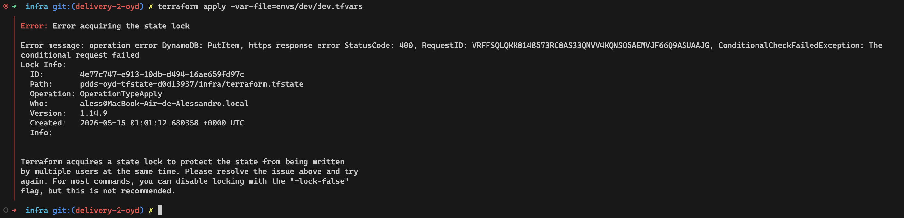

# Workspace Terraform

Workspace raíz de Terraform del proyecto. Contiene la configuración de provider, las variables, los outputs, los recursos y la documentación técnica que sostienen el pipeline de CI/CD definido en `.github/workflows/`.

## Equipo — Grupo 3

| Nombre | Carnet |
|--------|--------|
| Joaquín Marroquin | 20004254 |
| Alessandro Alecio | 21001224 |
| David García | 2600160 |

## Selección de track

Conforme al §2.4 del spec del curso *Optimizations and Performance*:

- **Compute / Kubernetes:** track estándar (serverless / managed compute). El track opcional EKS no se usa.
- **CI tooling:** GitHub Actions, default del curso. No se usa un proveedor de CI externo.

Esta selección es estable para los cinco deliveries del proyecto.

## Layout del workspace

```
infra/
├── backend.tf             # Bloque backend "s3" con valores hardcoded (incluye DynamoDB lock)
├── provider.tf            # Provider AWS + pinning de versiones (terraform, aws, random, archive)
├── variables.tf           # Variables de entrada con description, type y validation
├── outputs.tf             # Outputs cableados desde los outputs de los módulos
├── main.tf                # Llamadas a los tres módulos (compute, storage, database)
├── bootstrap/             # Workspace independiente: bucket S3 + tabla DynamoDB del state backend
│   ├── provider.tf        # SIN backend block — bootstrap usa state local committeado
│   ├── main.tf            # S3 bucket y DynamoDB table con prevent_destroy=true
│   ├── variables.tf       # region, project_name, environment, state_bucket_name_prefix, lock_table_name
│   ├── outputs.tf         # state_bucket_name, lock_table_name, region
│   └── terraform.tfstate  # Whitelisted en .gitignore — el bootstrap usa local state intencionalmente
├── modules/
│   ├── compute/           # Lambda function + IAM execution role + CloudWatch log group
│   ├── storage/           # S3 bucket con versioning, SSE, lifecycle scoped y bucket policy SSL-only
│   └── database/          # DynamoDB table con SSE, PITR, GSI por status y TTL
├── envs/
│   ├── dev/dev.tfvars     # Valores no-sensibles del ambiente dev (versionado)
│   └── prod/              # Reservado para overrides de prod en deliveries posteriores
├── evidence/              # Evidencia de CLI/UI capturada para los criterios del rubric
│   ├── compute-deployed.txt
│   └── state-lock-contention.png
└── docs/                  # Resúmenes de cada delivery (delivery-N-summary.md)
```

La separación en archivos (`provider.tf`, `variables.tf`, `outputs.tf`, `main.tf`) responde al criterio de Code Quality del spec: cualquier consolidación en un único `main.tf` reduce la nota.

## Recursos provisionados

A partir de Delivery 2 el workspace raíz instancia tres módulos reutilizables — `compute`, `storage` y `database`. La infraestructura sostiene el sistema **Ticke-T** descrito en `cloud/` (rama `cloud-delivery-1`): plataforma de tickets con widget de chat en vivo embebido en la página web de la empresa.

| Módulo | Recurso principal | Hardening |
|--------|-------------------|-----------|
| `modules/compute` | `aws_lambda_function` `chat-message-handler-${env}` (Node.js 22.x, 128 MB) | IAM role con policy scoped al ARN exacto del CloudWatch log group (sin wildcards en `Resource`); log group precreado con retención configurable |
| `modules/storage` | `aws_s3_bucket` `pdds-oyd-attachments-${env}-${random_hex}` | Versioning, SSE-S3, public access block (4 switches), bucket policy con Deny sobre `aws:SecureTransport=false`, lifecycle rule scoped al prefijo `attachments/` (adjuntos del chat) |
| `modules/database` | `aws_dynamodb_table` `tickets-${env}` (single-table, PK `ticket_id` + SK `sk`) | `server_side_encryption.enabled=true` (AWS-owned KMS), `point_in_time_recovery.enabled=true`, `billing_mode=PAY_PER_REQUEST`, GSI `status-updated-at-index`, bloque `ttl` sobre el atributo `ttl`; sin endpoint público (acceso IAM-only) |

El workspace separado `infra/bootstrap/` provisiona los recursos del state backend con `prevent_destroy=true`:

| Recurso | Nombre | Propósito |
|---------|--------|-----------|
| `aws_s3_bucket.tfstate` | `pdds-oyd-tfstate-d0d13937` | Bucket del state remoto (versioning + SSE + public access block) |
| `aws_dynamodb_table.tflock` | `pdds-oyd-tflock` | Tabla de lock para `terraform apply` concurrentes (`PAY_PER_REQUEST`, `hash_key="LockID"`) |

El bucket S3 de bootstrap de Delivery 1 fue reemplazado por estos recursos; el state que vivía localmente en `infra/terraform.tfstate` se migró al backend S3 en la sesión que cierra esta entrega.

## Variables

`variables.tf` agrupa las variables del workspace raíz. Las marcadas como `sensitive` no se imprimen en outputs ni en logs y no llevan default — deben proveerse en runtime.

| Nombre | Tipo | Default | Propósito |
|--------|------|---------|-----------|
| `environment` | `string` | (sin default; validado contra `["dev","prod"]`) | Discriminador de ambiente, usado en nombres y tags |
| `project_name` | `string` | `"pdds-oyd"` | Identificador corto del proyecto, presente como tag y prefijo |
| `region` | `string` | `"us-east-1"` | Región AWS donde se provisionan los recursos |
| `attachments_bucket_name_prefix` | `string` | `"pdds-oyd-attachments"` | Prefijo del bucket S3 creado por el módulo storage |
| `compute_function_name` | `string` | `"chat-message-handler"` | Base name del Lambda; el sufijo de environment lo agrega el módulo |
| `compute_memory_size` | `number` | `128` | Memoria asignada al Lambda function |
| `tickets_table_name` | `string` | `"tickets"` | Base name de la tabla DynamoDB; el sufijo de environment lo agrega el módulo |
| `db_billing_mode` | `string` | `"PAY_PER_REQUEST"` | Modo de cobro de DynamoDB; on-demand para tráfico bursty, `PROVISIONED` cuando la capacity esté caracterizada |

Los valores concretos por ambiente viven en `envs/<env>/<env>.tfvars`. El pipeline de CI consume `envs/dev/dev.tfvars`. La carpeta `envs/prod/` se mantiene vacía hasta que prod tenga sus propios overrides en deliveries posteriores.

## Outputs

`outputs.tf` expone los identificadores de los recursos creados por los tres módulos, para que módulos y pipelines downstream los referencien sin tener que conocer la convención de naming:

| Output | Tipo | Origen | Consumidores esperados |
|--------|------|--------|------------------------|
| `compute_function_arn` | `string` | `module.compute` | IAM policies, event source mappings, CloudWatch alarms |
| `compute_function_name` | `string` | `module.compute` | `aws lambda invoke` y subscription filters |
| `attachments_bucket_arn` | `string` | `module.storage` | IAM policies sobre el bucket de adjuntos |
| `attachments_bucket_name` | `string` | `module.storage` | Application layer, verificaciones por CLI |
| `tickets_table_arn` | `string` | `module.database` | IAM policies scoped al ARN de la tabla (y `${arn}/index/*`) en deliveries posteriores |
| `tickets_table_name` | `string` | `module.database` | Application layer, verificaciones por CLI |

## Estrategia de credenciales

Las credenciales de AWS nunca aparecen en archivos versionados ni en el código HCL. El provider AWS las resuelve desde la cadena estándar del AWS SDK:

- **CI (mecanismo principal):** los tres valores se almacenan como GitHub Actions secrets cifrados (`AWS_ACCESS_KEY_ID`, `AWS_SECRET_ACCESS_KEY`, `AWS_REGION`) y se inyectan únicamente en el step `aws-actions/configure-aws-credentials@v4`, que los expone como variables de ambiente del runner. Ningún otro step ve las credenciales en claro y no aparecen en el YAML. Esta es la vía por la que el pipeline ejecuta plan en cada PR.
- **Local (depuración y desarrollo):** se utiliza el shared credentials file (`~/.aws/credentials`) generado por `aws configure`. Alternativamente, exportar `AWS_ACCESS_KEY_ID` / `AWS_SECRET_ACCESS_KEY` / `AWS_REGION` como variables de ambiente también es válido — el provider las recoge automáticamente y tienen prioridad sobre el shared credentials file.

En Delivery 5 las llaves de larga vida se reemplazan por federación OIDC (asunción de rol IAM desde el runner de Actions vía web identity), eliminando los secrets de larga duración del lado de CI.

## Versionado y state

- Las versiones de Terraform y providers están pinadas (`required_version = "~> 1.8"`, `aws ~> 5.0`, `random ~> 3.6`, `archive ~> 2.4`). El archivo `.terraform.lock.hcl` está versionado para reproducibilidad determinística.
- A partir de Delivery 2 el state del workspace principal vive en un backend S3 (`pdds-oyd-tfstate-d0d13937`) con locking distribuido en DynamoDB (`pdds-oyd-tflock`). El bloque `backend "s3"` en `infra/backend.tf` usa valores hardcoded porque Terraform no permite variables ni locals dentro de un backend block.
- El workspace `infra/bootstrap/` es el único que mantiene state local: gestiona el bucket y la tabla de lock que sostienen el state remoto del workspace principal, por lo que no puede vivir dentro de ese mismo state. Su `terraform.tfstate` está committeado al repo vía whitelist explícita en `.gitignore`.
- Los archivos `*.tfvars` están gitignored por defecto (pueden contener secretos), con `dev.tfvars` whitelisted explícitamente porque CI y los graders dependen de él. Hoy `dev.tfvars` no contiene secretos — la única credencial sensible que fluía por el workspace era la contraseña del RDS, y con la migración a DynamoDB el acceso a la base de datos pasó a ser IAM-only (sin master credentials).

## Setup inicial (one-time)

Pasos para llevar el proyecto de cero hasta tener el pipeline de CI corriendo verde. Hay que recorrerlos una sola vez por equipo; después solo aplica la sección de *Ejecución manual local* y el flujo normal de PRs.

### Prerrequisitos

- [Terraform](https://developer.hashicorp.com/terraform/install) `~> 1.8` (matchea `required_version` en `provider.tf`).
- [AWS CLI v2](https://docs.aws.amazon.com/cli/latest/userguide/getting-started-install.html).
- [`gh`](https://cli.github.com/) (opcional pero recomendado — los pasos de GitHub se pueden hacer también desde la web UI).
- Cuenta de AWS con permisos para crear los recursos del proyecto (S3, IAM, EC2, etc. en deliveries posteriores).
- Cuenta de GitHub con permisos para crear repos.

### 1. Clonar y configurar credenciales AWS locales

```bash
git clone <repo-url> && cd <repo>
aws configure   # ingresa access key, secret key y region (us-east-1)
aws sts get-caller-identity   # verificación rápida
```

Como alternativa al shared credentials file, exportar las tres variables (`AWS_ACCESS_KEY_ID`, `AWS_SECRET_ACCESS_KEY`, `AWS_REGION`) en el ambiente del shell también funciona — el provider las detecta automáticamente.

### 2. Crear el repo y configurar visibilidad

El repo debe ser **público** o, alternativamente, mantenerse privado con los usuarios `jatitoam` y `abner-perez` agregados como collaborators con permiso Read (requisito del spec del curso).

```bash
# Opción A: crear repo público desde cero
gh repo create <org-or-user>/<repo-name> --public --source=. --remote=origin --push

# Opción B: repo privado + invitar a los graders
gh repo create <org-or-user>/<repo-name> --private --source=. --remote=origin --push
gh api -X PUT repos/<org-or-user>/<repo-name>/collaborators/jatitoam   -f permission=pull
gh api -X PUT repos/<org-or-user>/<repo-name>/collaborators/abner-perez -f permission=pull
```

### 3. Cargar los secrets de GitHub Actions

El workflow de CI consume tres secrets cifrados. Sin ellos, el step `Configure AWS credentials` falla. Cargarlos una sola vez:

```bash
gh secret set AWS_ACCESS_KEY_ID     --body "$(aws configure get aws_access_key_id)"
gh secret set AWS_SECRET_ACCESS_KEY --body "$(aws configure get aws_secret_access_key)"
gh secret set AWS_REGION            --body "us-east-1"
gh secret list   # confirmar que aparecen los tres
```

Estos valores nunca se versionan ni se imprimen en logs — `aws-actions/configure-aws-credentials@v4` maskea las credenciales antes de exponerlas como variables de ambiente del runner.

### 4. Validar el pipeline con un PR

El workflow se dispara en `pull_request` contra `main`, no en pushes directos. Para confirmar que la cadena `fmt → init → validate → plan → comment` corre verde, abrir un PR mínimo:

```bash
git checkout -b ci/smoke-test
echo "" >> README.md   # cualquier cambio trivial
git commit -am "ci: smoke test del pipeline"
git push -u origin ci/smoke-test
gh pr create --fill --base main
```

Verificar en la pestaña *Checks* del PR que: (i) los cuatro steps bloqueantes pasan, (ii) aparece un comentario con el plan colapsable (`<details>`), (iii) el comentario incluye el plan completo de los recursos del workspace.

## Ejecución manual local

El pipeline de CI es la vía oficial de ejecución, pero el workspace soporta ejecución local para depuración y desarrollo. Desde `infra/`:

- `terraform fmt -check -recursive` — verifica el estilo HCL (mismo comando que ejecuta CI).
- `terraform init` — configura el backend remoto S3 y descarga providers usando el lock file.
- `terraform validate` — análisis estático del grafo, sin llamadas a la API.
- `terraform plan -var-file=envs/dev/dev.tfvars` — plan completo contra AWS (requiere credenciales AWS en el ambiente).
- `terraform apply -var-file=envs/dev/dev.tfvars` — aplica los cambios; el lock distribuido en DynamoDB evita corridas concurrentes.

El workspace de bootstrap (`infra/bootstrap/`) tiene su propio flujo manual one-time documentado en `docs/delivery-2-summary.md` §3.

## Pipeline de CI

`.github/workflows/terraform-ci.yml` se ejecuta en cada pull request contra `main`. Es una secuencia lineal: cualquier exit code distinto de cero en los pasos de validación bloquea el PR check.

| # | Step | Bloqueante |
|---|------|:----------:|
| 1 | `terraform fmt -check -recursive` | Sí |
| 2 | `terraform init -input=false` (con backend S3) | Sí |
| 3 | `terraform validate` | Sí |
| 4 | `terraform plan -var-file=envs/dev/dev.tfvars` | Sí |
| 5 | Comentario en el PR con el output del plan colapsable | No |

Permisos del workflow: `contents: read`, `pull-requests: write`. El último permiso es necesario únicamente para el step que postea el comentario.

## Evidence

Los artefactos exigidos por el rubric se materializan en `infra/evidence/` y se referencian inline a continuación.

### Compute module — Lambda function desplegada

Salida de `aws lambda get-function --function-name chat-message-handler-dev` capturada en `evidence/compute-deployed.txt`:

```
-------------------------------------------------------------------------------------------------
|                                          GetFunction                                          |
+------------------+----------------------------------------------------------------------------+
|  FunctionArn     |  arn:aws:lambda:us-east-1:544341949288:function:chat-message-handler-dev   |
|  Handler         |  index.handler                                                             |
|  LastUpdateStatus|  Successful                                                                |
|  MemorySize      |  128                                                                       |
|  Runtime         |  nodejs22.x                                                                |
|  State           |  Active                                                                    |
+------------------+----------------------------------------------------------------------------+
```

### Remote state — lock contention

Captura del error `Error: Error acquiring the state lock` que dispara DynamoDB cuando dos ejecuciones de `terraform apply` intentan adquirir el mismo lock simultáneamente. La evidencia se generó siguiendo la *Option A — Two terminals* del spec.



## Resúmenes de delivery

- [Delivery 1 — IaC Workspace Bootstrap & CI Pipeline](docs/delivery-1-summary.md)
- [Delivery 2 — Compute, Storage, Database & Remote State](docs/delivery-2-summary.md)
